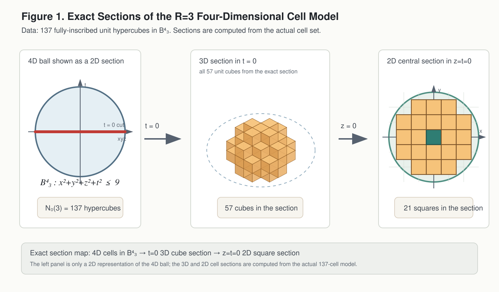
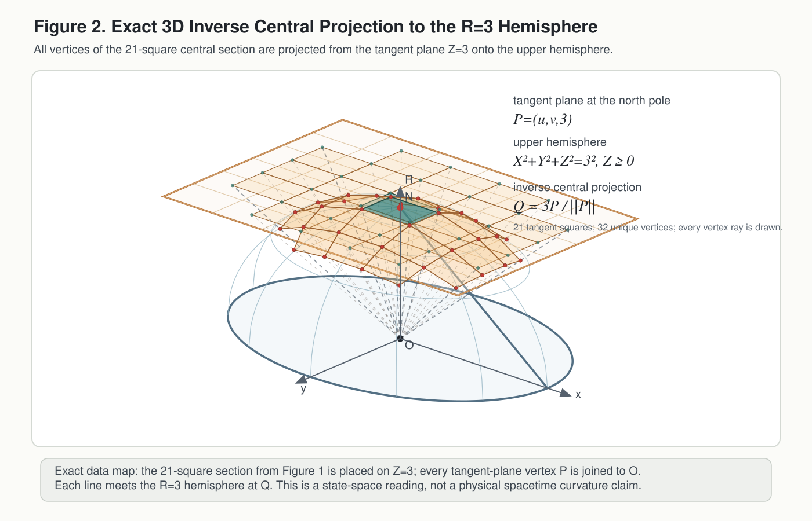
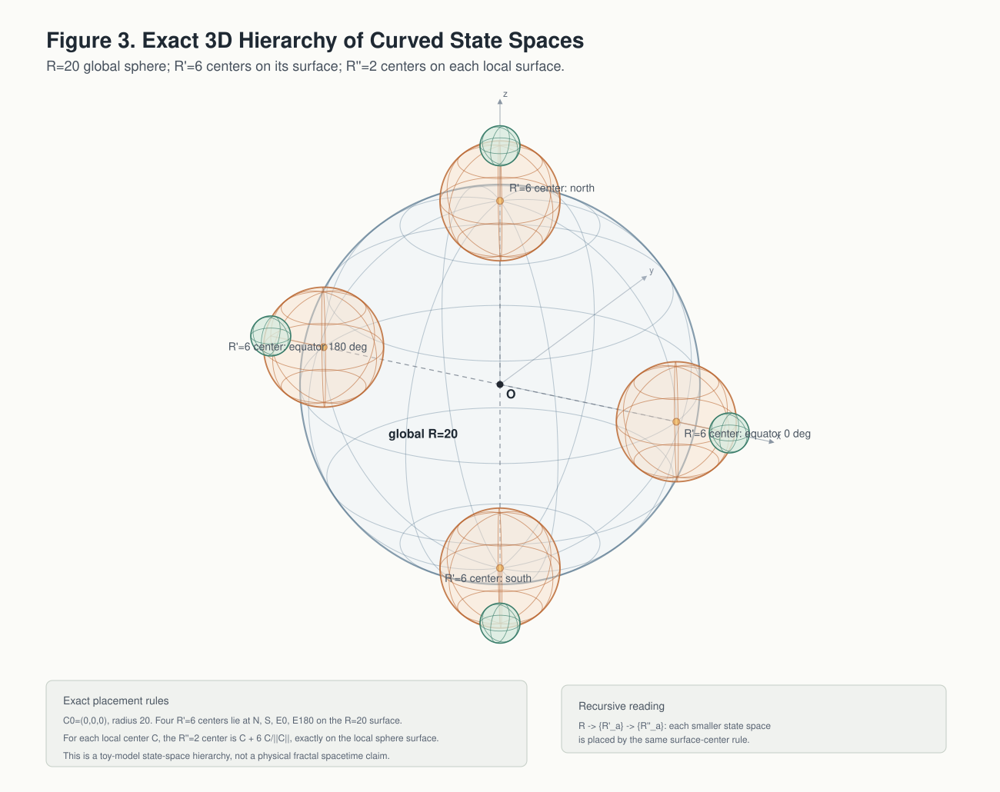

# 論文4：逆数双対セルの分裂と階層的状態構造

## $\nu\lambda=1$ から見た内部状態容量・体積ギャップ・双対性破れに関する最小観察モデル

著者: 木原 範昭 (Noriaki Kihara)  
所属: WF System Co., Ltd.  
ORCID: 0009-0004-6753-4020  
版: v1.0  
日付: 2026 年 6 月  
DOI（本版）: 10.5281/zenodo.20638963  
Concept DOI: 10.5281/zenodo.20638962  
ライセンス: CC BY 4.0  

* * *

## 要旨

本稿では、波長成分 $\lambda_n$ と周波数成分 $\nu_n$ の間に置かれる最小の逆数双対条件

$$
\lambda_n\nu_n=1
$$

を出発点として、先行する三つの観察論文で扱った波長空間・周波数空間・4次元格子セル数え上げ・閉じた4次元構造を、ひとつの最小観察モデルとして再構成する。

本稿の目的は、標準物理理論、一般相対論、量子論、素粒子論、宇宙論を置き換えることではない。また、本稿は時空、質量、エネルギー、相互作用、標準模型、量子重力、あるいは大統一理論を導出したと主張するものではない。本稿で扱う $\lambda_n$ および $\nu_n$ は、波長空間と周波数空間の双対的な幾何構造を観察するためのモデル変数である。

本稿では、逆数双対条件に最小共役幅 $\delta_{\min}$ の存在可能性を加えると、状態は数学的な点ではなく、最小幅を持つ共役セルとして扱われることを示す。このとき、合成周波数半径

$$
R^2=\sum_n \nu_n^2
$$

は、外部から与えられる実体的半径ではなく、内部周波数成分から定まるエネルギー様スケールとして読める。$R=1$ は最小共役セル、$R=2$ は8個の第一隣接準基底状態、$R=3$ は128個の追加状態を含む大規模な内部状態殻として観察される。

さらに、4次元超球体積

$$
V_4(R)=\frac{\pi^2}{2}R^4
$$

と、完全内接セル体積 $N_0(R)$ を比較することで、充填率は局所的な揺らぎを伴いながら漸近的には増加傾向を示し、一方で絶対量としての体積ギャップ

$$
\Delta V(R)=V_4(R)-N_0(R)
$$

は拡大することを確認する。この観察から、高い $R$ を持つ単一状態を、多数の有限 $R'$ 状態への分解として読む toy model を導入する。

最後に、初期状態では $\nu$ と $\lambda$ の役割が未分化であり、有限 $R'$ セルへの分裂と最小共役幅によって、周波数側は高密度な内部状態、波長側は希薄な外延として分化する、という双対性破れの観察を述べる。この観察は、時間と空間の分化を導出するものではない。しかし、$\nu$ 側を内部更新・状態密度、$\lambda$ 側を外延・広がりとして読む toy model にはなる。

本稿の結論は、$\nu\lambda=1$ という最小の逆数双対仮定から、最小共役セル、内部状態容量、体積ギャップ、有限 $R'$ 分解、双対性破れ、曲率付き階層構造を、同一の観察モデル内で連鎖的に読める、というものである。

* * *

## キーワード

波長空間、周波数空間、逆数双対、$\nu\lambda=1$、共役セル、最小揺らぎ幅、4次元格子、4次元超球、内部状態容量、体積ギャップ、分裂表現、双対性破れ、中心投影、曲率付き状態空間、自己相似的階層、toy model

* * *

## 1. はじめに

先行論文1では、波長空間と周波数空間の間に

$$
\lambda_n=\frac{1}{\nu_n}
$$

という逆数双対条件を置き、さらに波長空間および周波数空間に二乗和一定条件を課したときに、5成分1制約の系では4自由度が残ることを観察した。また、逆数双対条件は対数変数

$$
q_n=\log\lambda_n,\qquad p_n=\log\nu_n
$$

により、

$$
p_n=-q_n
$$

という符号反転対称として表されることを確認した。

先行論文2では、4次元整数格子上の単位セル数え上げを定式化し、半径 $R$ の4次元超球体に完全内接する単位セル数 $N_0(R)$ を計算した。特に、

$$
N_0(1)=1,\qquad N_0(2)=9,\qquad N_0(3)=137
$$

という値が得られることを確認した。

先行論文3では、この4次元格子数え上げを、閉じた4次元構造および中心投影的な観察と接続する補足を行った。

本稿では、これら三つの観察を、より小さい仮定から再構成する。中心となる仮定は、成分ごとの逆数双対

$$
\lambda_n\nu_n=1
$$

である。本稿ではこの条件を、単なる代数関係ではなく、波長空間と周波数空間のあいだに置かれる最小の双対構造として読む。

本稿の問いは次のように表せる。

> $\nu\lambda=1$ という最小の双対条件に、最小共役幅、4次元セル数え上げ、合成半径 $R^2=\sum_n\nu_n^2$ を加えると、どのような内部状態構造、体積ギャップ、分裂表現、双対性破れが観察されるか。

本稿では、これらを物理理論としてではなく、観察モデルとして扱う。したがって、本稿における「エネルギー様」「基底」「準基底」「分裂」「真空」「対称性破れ」などの語は、標準物理での同名概念と同一視されない。これらは、波長・周波数双対セルの幾何学的振る舞いを記述するための限定的な用語である。

* * *

## 2. 関連研究と本稿の位置づけ

本稿の問題意識は、時空を最初から与えられた背景と見なさず、より基本的な離散構造、関係構造、量子状態、あるいは前幾何学的構造から、時空や幾何が現れる可能性を考える研究群と、問題設定の一部において連想上の接点を持つ。

Causal set theory では、時空連続体の代わりに局所有限な半順序集合を基礎に置き、順序関係を原始的因果関係、局所有限性を離散性として扱う [Surya 2019]。Quantum Graphity では、高エネルギー相では高結合で置換対称性を持つグラフ状態が、低エネルギー相では対称性を破って低次元・局所的な構造を示す可能性が検討されている [Konopka and Markopoulou 2006; Konopka, Markopoulou and Severini 2008]。Group Field Theory condensate cosmology では、非時空的な量子構成要素の凝縮状態から連続的な宇宙論的ダイナミクスが現れる可能性が議論されている [Oriti 2021; Pithis and Sakellariadou 2019]。また、pregeometry の文脈では、時間と空間の差異があらかじめ組み込まれるのではなく、自発的対称性破れの結果として現れる可能性も議論されている [Wetterich 2021]。量子真空を凝縮系的な媒質として読む立場も、真空を無構造な空白ではなく内部自由度を持つ状態として考える上で参考になる [Volovik 2003]。

ただし、本稿はこれらの既存理論を拡張、修正、統合するものではない。本稿の構造は、より限定的である。すなわち、

$$
\lambda_n\nu_n=1
$$

という逆数双対条件から出発し、そこに最小共役幅、4次元格子セル数え上げ、体積ギャップ、有限半径セルへの分解可能性を加えたとき、どのような観察構造が現れるかを調べる。

したがって、本稿の位置づけは、既存の量子重力理論や統一理論の候補ではなく、**波長・周波数双対に基づく最小 toy observation model** である。

* * *

## 3. 基本仮定

### 3.1 逆数双対条件

本稿では、各成分について

$$
\lambda_n\nu_n=1
$$

を置く。ここで $\lambda_n$ は波長空間側の成分、$\nu_n$ は周波数空間側の成分である。

本稿では、$\lambda_n$ および $\nu_n$ を標準物理における空間座標、時間周波数、エネルギー、運動量などと同一視しない。これらは、互いに逆数関係を持つ二つの双対変数である。

### 3.2 合成周波数半径

周波数空間側に、合成半径

$$
R^2=\sum_{n=1}^{d}\nu_n^2
$$

を定義する。ここで $d$ は周波数成分の数であり、本稿では先行論文1の5成分1制約系が残す4自由度に対応させて $d=4$ を扱う（§4.1）。

本稿では、$R$ を外部から与えられた実体的半径ではなく、内部周波数成分の二乗和から定まる合成量として扱う。この意味で、$R$ はエネルギー様スケール、あるいは内部周波数状態の大きさを表すモデル上のラベルとして読むことができる。

ただし、本稿では $R$ を物理的エネルギー、質量、曲率半径、宇宙半径などと同一視しない。

### 3.3 最小共役幅

理想的には

$$
\lambda_n\nu_n=1
$$

であるが、観察状態を完全な数学的点として扱うと、4次元格子セル数え上げや分裂表現を扱う余地が失われる。そこで、本稿では最小共役幅の存在可能性を仮定する。

$$
\delta^2\ge \delta_{\min}^2
$$

ここで $\delta$ は、波長・周波数双対セルが持つ観察上または構成上の幅を表すモデル量である。本稿では $\delta_{\min}$ の値を導出しない。必要に応じて $\delta_{\min}^2=1/2$ を例示値として用いるが、これは物理定数ではなく、議論のスケールを示すための仮置きである。

### 3.4 状態は点ではなく共役セルである

以上より、本稿では状態を点

$$
(\lambda,\nu)
$$

ではなく、逆数双対条件を中心に持ち、最小幅 $\delta_{\min}$ を持つ共役セルとして扱う。

したがって、$R=1$ の状態も、単なる一点

$$
\nu=1,\qquad \lambda=1
$$

ではなく、$\nu=1,\lambda=1$ を中心とする最小共役セルである。

* * *

## 4. $R=1,2,3$ の状態容量

### 4.1 4次元完全内接セル数

先行論文1および3では、5成分1制約の系が4自由度を持つ閉じた構造として読めることを確認した。本節では、その4自由度に対応する数え上げ領域として、先行論文2と同じ4次元整数格子

$$
k=(k_1,k_2,k_3,k_4)\in\mathbb{Z}^4
$$

を考える。一辺1の4次元単位セルを各格子点 $k$ に対応させる。この単位セルの各軸半幅は $1/2$ であり、これは前節の $\delta_{\min}$ の値を導出するものではなく、論文2の単位セル規格化を用いるという意味である。この単位セルが半径 $R$ の4次元超球体に完全内接する条件は、

$$
\sum_{i=1}^{4}\left(|k_i|+\frac12\right)^2\le R^2
$$

である。したがって、完全内接セル数を

$$
N_0(R)=\#\left\{k\in\mathbb{Z}^4\mid
\sum_{i=1}^{4}\left(|k_i|+\frac12\right)^2\le R^2
\right\}
$$

と定義する。

ここで $N_0(R)$ は粒子数ではない。また、実空間に物質セルが充填される数でもない。$N_0(R)$ は、半径 $R$ のモデル状態空間内に、単位セルを非重複に配置できる幾何学的容量である。

### 4.2 小さい半径での状態容量

先行論文2の数え上げに基づくと、整数半径 $R=1,2,3$ では、

$$
N_0(1)=1,
$$

$$
N_0(2)=9,
$$

$$
N_0(3)=137
$$

を得る。

したがって殻差分は、

$$
\Delta N_0(2)=N_0(2)-N_0(1)=8,
$$

$$
\Delta N_0(3)=N_0(3)-N_0(2)=128
$$

である。

この数列は、本稿の toy model において次のように読める。

- $R=1$ は、最小共役セル1個に対応する基底的状態である。
- $R=2$ は、中心セルに加えて、4次元格子の正負8方向に第一隣接セルが現れる状態である。
- $R=3$ は、さらに128個のセルが加わり、単純な第一隣接殻を超えた大規模な内部状態殻が現れる状態である。



**図1. $R=3$ の4次元セルモデルの厳密な断面。** 半径 $R=3$ の4次元超球 $B^4_3$ に完全内接する一辺1の4次元超立方体137個をまず列挙し、そのセル集合を $t=0$ で切断すると57個の3次元立方体断面が得られる。さらに $z=0$ で切断すると、中心2次元平面上に21個の単位正方形断面が得られる。右端の2次元図は模式的な殻図ではなく、137個の4次元セル集合から実際に得られる中心断面である。

### 4.3 状態容量表

| $R$ | $N_0(R)$ | 殻差分 $\Delta N_0(R)=N_0(R)-N_0(R-1)$ | 読み方 |
|---:|---:|---:|---|
| 1 | 1 | 1 | 最小共役セル、基底的状態 |
| 2 | 9 | 8 | 第一隣接殻、8個の準基底的方向状態 |
| 3 | 137 | 128 | 大規模な内部状態殻、128状態の追加 |
| 4 | 473 | 336 | 複合方向を含む高次殻 |
| 5 | 1,545 | 1,072 | 内部状態容量の増大 |
| 6 | 3,457 | 1,912 | 高次内部状態容量 |
| 7 | 7,281 | 3,824 | 高次内部状態容量 |
| 8 | 12,833 | 5,552 | 高次内部状態容量 |
| 9 | 22,409 | 9,576 | 高次内部状態容量 |
| 10 | 34,569 | 12,160 | 高次内部状態容量 |


この表から分かることは、$R$ の増大に伴って内部状態容量が急速に増大する、ということである。ただし、各状態を物理的な同一点に重ねて解釈するのではなく、モデル状態空間上の異なる位置ラベルまたは位相ラベルを持つ単位セルとして読む。

### 4.4 古典論的読みと状態論的読み

古典論的には、$R=2$ で増える8個の状態は、中心状態の周囲に現れる最小軌道候補として読める。4次元格子では、これは4つの軸それぞれの正負方向に対応する。

状態論的には、同じ8個は、基底セルに隣接する第一殻の準基底状態として読める。

$R=3$ で増える128個の状態は、単一軸方向だけでなく、複数軸にまたがる組合せ状態を含む大規模な内部状態殻として読める。ただし、本稿ではこれを物理粒子の多重項、スピン、ゲージ自由度、標準模型の粒子種などと同一視しない。

* * *

## 5. 体積ギャップと整合性

### 5.1 4次元超球体積

4次元超球体の体積は

$$
V_4(R)=\frac{\pi^2}{2}R^4
$$

である。

一方、完全内接セルは一辺1の4次元単位セルであるため、積み上げられたセル体積は

$$
V_{\mathrm{cell}}(R)=N_0(R)
$$

である。

したがって、連続4次元超球体積と離散セル体積の差を

$$
\Delta V(R)=V_4(R)-N_0(R)
$$

と定義する。また、充填率を

$$
\eta(R)=\frac{N_0(R)}{V_4(R)}
$$

と定義する。

### 5.2 体積比較表

| $R$ | $N_0(R)$ | $V_4(R)=\frac{\pi^2}{2}R^4$ | $\Delta V(R)=V_4(R)-N_0(R)$ | $\eta(R)=N_0(R)/V_4(R)$ |
|---:|---:|---:|---:|---:|
| 1 | 1 | 4.9348 | 3.9348 | 0.2026 |
| 2 | 9 | 78.9568 | 69.9568 | 0.1140 |
| 3 | 137 | 399.7190 | 262.7190 | 0.3427 |
| 4 | 473 | 1263.3094 | 790.3094 | 0.3744 |
| 5 | 1,545 | 3084.2514 | 1539.2514 | 0.5009 |
| 6 | 3,457 | 6395.5037 | 2938.5037 | 0.5405 |
| 7 | 7,281 | 11848.4601 | 4567.4601 | 0.6145 |
| 8 | 12,833 | 20212.9498 | 7379.9498 | 0.6349 |
| 9 | 22,409 | 32377.2372 | 9968.2372 | 0.6921 |
| 10 | 34,569 | 49348.0220 | 14779.0220 | 0.7005 |


この表から、次の二つの観察が得られる。

第一に、充填率 $\eta(R)$ は局所的な増減を伴うが、先行論文2の半径スイープでは、十分大きな $R$ において連続4次元超球体積へ近づく傾向を示す。

第二に、絶対量としての体積ギャップ $\Delta V(R)$ は増大する。これは、完全内接セル数え上げで残る未充填領域が4次元超球の境界層に対応し、その主スケールが4次元球の表面積、すなわち $R^3$ オーダで与えられるためである。したがって、相対的には連続体へ近づいて見える一方で、絶対的な未整合量は境界層スケールとして残る。

この観察は重要である。なぜなら、高い $R$ を持つ単一状態として読む場合、内部状態容量は大きくなる一方で、連続超球体積と離散セル体積の差も大きくなるからである。

### 5.3 境界層と漸近次数について

本稿で定義する $\Delta V(R)$ は、同じ半径 $R$ の4次元超球体積と、完全内接セル体積を直接比較した差である。この直接差には、境界近傍の未充填層が含まれる。半径 $R$ の4次元球における境界層体積は、厚さを単位セル幅程度に固定すれば、4次元球の表面積スケールに比例する。4次元球の表面積は

$$
\frac{d}{dR}V_4(R)=\frac{d}{dR}\left(\frac{\pi^2}{2}R^4\right)=2\pi^2R^3
$$

であるため、体積ギャップの主スケールは $R^3$ オーダである。

本稿では、$\Delta V(R)$ の漸近定数や格子的揺らぎの詳細評価までは扱わない。ここで必要な観察は、充填率が増大しても、絶対量としての体積ギャップが境界層に由来する $R^3$ オーダの量として残る、という点である。

### 5.4 体積ギャップを未整合指標として読む

本稿では、試みに $\Delta V(R)$ を未整合量、あるいは幾何学的な整合性を測るための指標として読む。

この読みでは、$R$ が大きくなるほど状態容量は増えるが、同時に単一の高 $R$ 状態として見たときの未整合量も増える。したがって、本指標だけを見る限り、高い $R$ を持つ単一状態よりも、多数の低い $R'$ 状態へ分解した表現の方が未整合量は小さくなる場合がある。

ただし、この整合性は熱力学的安定性、量子力学的安定性、場の理論における真空安定性とは同一視されない。あくまで本モデル内の幾何学的な比較指標である。

* * *

## 6. 有限 $R'$ 状態への分裂

### 6.1 保存量としての $R^2$

本稿では、分裂前後で保存される量として、$R$ ではなく $R^2$ を考える。すなわち、単一状態 $R$ が複数の有限状態 $R'_a$ へ分解されるとき、

$$
R^2=\sum_a {R'_a}^2
$$

を仮定する。

これは、$R^2$ が

$$
R^2=\sum_n\nu_n^2
$$

として定義されるためである。すなわち、$R^2$ は周波数成分の二乗和であり、分配可能なエネルギー様量として読むのが自然である。

### 6.2 分裂有利条件

単一状態の未整合量を $\Delta V(R)$ とし、分裂後の未整合量を

$$
\sum_a \Delta V(R'_a)
$$

とする。

このとき、

$$
\Delta V(R)>\sum_a\Delta V(R'_a)
$$

であれば、体積ギャップの観点では分裂後の方が未整合量は小さい。

たとえば、$R=2$ の単一状態を考えると、

$$
\Delta V(2)=\frac{\pi^2}{2}2^4-9\approx69.9568
$$

である。一方、$2^2=1^2+1^2+1^2+1^2$ として4個の $R'=1$ 状態へ分裂すると、

$$
4\Delta V(1)=4\left(\frac{\pi^2}{2}-1\right)\approx15.7392
$$

である。

この単純な体積ギャップ指標では、$R=2$ の単一状態よりも、4個の $R'=1$ 状態へ分裂した表現の方が未整合量は小さい。

同様に、$R=3$ の場合、

$$
\Delta V(3)\approx262.7190
$$

であり、9個の $R'=1$ 状態へ分裂すると、

$$
9\Delta V(1)\approx35.4132
$$

である。

したがって、体積ギャップ最小化という単純指標に限れば、高い $R$ 状態は複数の低い $R'$ 状態へ分解した表現の方が整合的に見える。

### 6.3 最小共役幅の効果

$\delta^2$ に最低値が存在するなら、状態は完全な点には潰れない。高い $R$ 状態は多数の内部セルを含むが、各セルは最小共役幅を持つため、全体を単一状態として完全に整合させることは難しくなる。

このため、単一の高 $R$ 状態よりも、有限で小さい $R'$ 状態群へ分解した表現の方が、局所的な共役条件を満たしやすい場合がある。

この観察は、標準物理における崩壊、相転移、粒子生成、真空分解を導出するものではない。しかし、toy model としては、高 $R$ の未分化状態から有限 $R'$ の局所基底状態群が現れる構造を示している。

* * *

## 7. 大域 $R=\infty$ と有限 $R'$ 内部構造

### 7.1 単一の無限半径状態ではない

本モデルでは、系全体を大域的に見ると、

$$
R_{\mathrm{global}}\to\infty
$$

のような極限を考えることができる。この極限では、外部的または大域的には、状態空間はほぼ平坦で連続的に見える。

しかし、前節の体積ギャップ比較によれば、単一の巨大な $R$ 状態として読むと大きな未整合量を抱える。したがって、大域 $R=\infty$ 状態は、単一の無限半径セルとしてではなく、多数の有限 $R'_a$ 状態の集合として読む方が自然である。

すなわち、

$$
R_{\mathrm{global}}^2=\sum_a {R'_a}^2
$$

であり、各 $R'_a$ は有限で、しばしば小さい値を持つ局所共役セルである。

### 7.2 真空的状態としての有限セル集合

この読みでは、本稿でいう真空的状態は無構造な空白ではない。大域的には平坦または無限半径に見えるが、内部的には有限 $R'$ の共役セル群として読むことができる。

ただし、本稿ではこの構造を宇宙論的真空や物理的真空と同一視しない。ここでいう「真空的状態」とは、観測空間に局所励起として現れる前の、内部状態容量を持つ基底的な状態空間を指す。

### 7.3 状態空間の充填と観測空間の希薄性

ここで注意すべき点は、$N_0(R)$ が実空間の物質密度を表すものではないことである。$N_0(R)$ は、波長・周波数双対状態空間における最小共役セルの配置可能数である。

したがって、有限 $R'$ 状態が多数存在しても、それは観測空間が物質セルで隙間なく満たされることを意味しない。むしろ、観測空間に現れるのは、これらの基底セルそのものではなく、相対位相の不整合、境界ギャップ、局所的な励起、または双対性破れによって投影される外延である。

* * *

## 8. $\nu$-$\lambda$ 双対性破れ

### 8.1 未分化な双対相

本稿の最小仮定は、

$$
\lambda\nu=1
$$

である。この段階では、どちらを「波長」と呼び、どちらを「周波数」と呼ぶかは、まだ完全には区別されていないと読むこともできる。

すなわち、初期状態では、二つの双対変数の間に逆数関係だけがあり、一方が内部状態密度を担い、他方が外延を担うという役割分化はまだ生じていない。

### 8.2 分裂による役割分化

有限 $R'$ セルへの分裂を考えると、周波数側では多数の内部状態が高密度に配置される。一方、逆数双対により、波長側では対応する状態が広がりまたは外延として現れる。

したがって、同じ状態を見ていても、

$$
\nu\text{側}
$$

では高密度な内部状態充填として見え、

$$
\lambda\text{側}
$$

では希薄な外延として見える。

すなわち、

$$
\nu\text{側の状態密度}\ne\lambda\text{側の空間密度}
$$

である。

この非対称性により、状態空間は周波数側から見ると高密度に見えるが、波長側から見るとスカスカに見える。

### 8.3 時間・空間との関係についての限定

$\nu$ は振動数として、内部更新、周期、状態密度に関わる量として読める。一方、$\lambda$ は波長として、外延、広がり、配置可能性に関わる量として読める。

このため、本モデルは、未分化な双対状態から「更新的側面」と「外延的側面」が分化する toy model として読める。

しかし、本稿では $\nu$ を時間、$\lambda$ を空間と同一視しない。また、時間と空間の起源を導出したとも主張しない。本稿で述べるのは、あくまで、逆数双対と分裂表現を考慮すると、双対変数の役割分化が観察される、という点である。

### 8.4 自発的対称性破れとの関係

本稿でいう双対性破れは、標準模型における自発的対称性破れを導出するものではない。ここでいうのは、未分化な双対相において等価に見えた二つの変数が、分裂後の状態構造において、異なる役割を担うようになるという、幾何学的・状態論的な役割分化である。

したがって、本稿の表現としては、「自発的対称性破れそのもの」ではなく、「自発的対称性破れに類似した役割分化」と呼ぶのが適切である。

* * *

## 9. 中心投影・曲率・階層構造

### 9.1 $R$ は内部振動数から定まる

本稿では、

$$
R^2=\sum_n\nu_n^2
$$

であるため、$R$ は外部背景として先にあるのではなく、内部振動数成分から定まる。

この立場では、より基本的なのは $R$ ではなく $\nu$ である。$R$ は $\nu$ の分解構造から合成される。

### 9.2 曲率付き状態空間

先行論文3で扱った中心投影的な観察と接続すると、$R$ は状態空間の半径または曲率スケールとして読める。ただし、本稿ではこれを物理的時空の曲率とは同一視しない。

重要なのは、本モデルが最初から平坦な背景空間にセルを置いているのではなく、$R$ によって定義される曲率付き状態空間の中で、セル容量、体積ギャップ、分裂表現を扱っている点である。



**図2. 接平面から半球面への厳密な3次元逆中心投影。** 図1右端の21個の単位正方形断面を、半径 $R=3$ の3次元半球の北極に接する $xy$ 平面上のセル集合として読む。接平面上の各頂点 $P=(u,v,3)$ を中心 $O$ と結ぶ直線は、半径3の半球面と一点 $Q=3P/\|P\|$ で交わる。図では、21個の正方形から得られる32個の頂点すべてにこの写像を適用している。本稿でいう曲率付き状態空間への読み替えは、この意味での中心投影の逆写像として模式化される。ただし、これは物理的時空の曲率を表すものではない。

### 9.3 自己相似的階層

ある半径 $R$ の状態が、有限半径 $R'_a$ の状態群へ分解されるとき、各 $R'_a$ もまた

$$
{R'_a}^2=\sum_i \nu_{a,i}^2
$$

という同じ形式で内部構造を持ちうる。

したがって、

$$
R\longrightarrow\{R'_a\}\longrightarrow\{R''_{a,b}\}\longrightarrow\cdots
$$

という階層が自然に現れる。

この階層は、厳密なフラクタル次元を持つ図形であると主張するものではない。しかし、同じ双対条件と同じ合成半径条件がスケールを変えて再帰的に現れるという意味で、自己相似的、あるいはフラクタル様の構造を持つ。



**図3. 階層的な曲率付き状態空間の厳密な3次元投影図。** 半径 $R=20$ の大域球を置き、その北極、南極、赤道上の $0^\circ$、$180^\circ$ の4点を中心として、半径 $R'=6$ の局所球を配置する。さらに各局所球について、中心 $C$ から外向き法線方向に $6C/\|C\|$ だけ進んだ表面点を中心として、半径 $R''=2$ の二次球を配置する。したがって各 $R'=6$ 球の中心は $R=20$ 球面上にあり、各 $R''=2$ 球の中心は対応する $R'=6$ 球面上にある。この図は階層的な配置規則を示す toy model の3次元投影であり、物理的時空がフラクタルであると主張するものではない。

### 9.4 曲率付き階層としての観察

以上より、本モデルの状態空間は、平坦な背景上に置かれた単純な格子セル集合ではない。むしろ、曲率を持つ状態空間が、より小さな曲率付き状態空間を内包し、それらがさらに同じ形式で内部構造を持つ、という階層的構造として観察される。

* * *

## 10. 本稿の主張範囲

本稿で主張することは、次の範囲に限られる。

1. $\lambda_n\nu_n=1$ という逆数双対条件から、波長空間と周波数空間の双対構造が定義できる。
2. 最小共役幅 $\delta_{\min}$ を仮定すると、状態は点ではなく最小共役セルとして扱える。
3. $R^2=\sum_n\nu_n^2$ により、$R$ は内部周波数成分から定まる合成半径として読める。
4. 4次元完全内接セル数え上げでは、$N_0(1)=1$、$N_0(2)=9$、$N_0(3)=137$ が現れる。
5. $R=1$ は最小共役セル、$R=2$ は8個の第一隣接準基底状態、$R=3$ は128個の追加状態を含む大規模内部状態殻として読める。
6. 4次元超球体積 $V_4(R)$ とセル体積 $N_0(R)$ の差 $\Delta V(R)$ は、境界層体積に対応するため、主として $R^3$ オーダで増大する。
7. 体積ギャップを未整合量として読むと、高 $R$ 状態は有限 $R'$ 状態群へ分解した表現の方が整合的に見える場合がある。
8. 分裂後、$\nu$ 側は内部状態密度、$\lambda$ 側は外延・広がりとして役割分化するように見える。
9. 中心投影的な観察と接続すると、曲率付き状態空間が階層的・自己相似的に現れる。

本稿で主張しないことは、次の通りである。

1. 本稿は標準物理を修正しない。
2. 本稿は一般相対論、量子論、場の量子論、標準模型を導出しない。
3. 本稿は時間や空間の起源を証明しない。
4. 本稿は物理定数、素粒子スペクトル、相互作用、ゲージ場、重力を導出しない。
5. 本稿は $137$ を微細構造定数と同一視しない。
6. 本稿は $\delta_{\min}$ の値を導出しない。
7. 本稿は体積ギャップの厳密な漸近展開を与えない。
8. 本稿は宇宙論的実在を主張しない。

* * *

## 11. 考察

### 11.1 最小仮説から複雑構造が現れる理由

本稿の仮定は非常に少ない。中心となるのは

$$
\lambda\nu=1
$$

であり、これに最小共役幅と4次元セル数え上げを加えるだけである。

にもかかわらず、次の構造が連鎖的に現れる。

- 最小共役セル
- 内部状態容量
- 殻構造
- 体積ギャップ
- 分裂表現における整合性
- 大域無限半径と局所有限半径の二重性
- $\nu$ 側と $\lambda$ 側の役割分化
- 曲率付き階層構造
- 自己相似的な分解

このことは、逆数双対条件が単なる代数式ではなく、状態空間の構成原理として非常に強い制約を持つことを示している。

### 11.2 なぜスカスカに見えるのか

状態空間の内部では、有限 $R'$ セルが多数存在しうる。周波数側から見ると、これは高密度の内部状態として見える。

しかし、波長側では逆数双対によって、それらは広がりとして現れる。したがって、同じ構造が、$\nu$ 側では詰まって見え、$\lambda$ 側では希薄に見える。

この観察は、真空を「何もない空間」と見るのではなく、「内部状態は存在するが、波長側には希薄な外延として現れる状態」と読む toy model を与える。

### 11.3 なぜ論文として慎重に書く必要があるか

本稿の構造は、時間と空間の分化、真空構造、時空創発、自己相似的宇宙像などを連想させる。しかし、それらを直接主張すれば、モデルの検証範囲を超える。

そのため、本稿では、あくまで最小逆数双対条件から現れる観察構造だけを述べる。読者が物理的対応可能性を検討する余地は残すが、本稿自身は物理的同一視を行わない。

この慎重さは、モデルの弱さではなく、再利用可能性を高めるための条件である。

* * *

## 12. 結論

本稿では、波長成分 $\lambda_n$ と周波数成分 $\nu_n$ の間に置かれる最小の逆数双対条件

$$
\lambda_n\nu_n=1
$$

から出発し、最小共役幅、4次元完全内接セル数え上げ、体積ギャップ、有限 $R'$ 分解、双対性破れ、曲率付き階層構造を同一の観察モデルとして整理した。

主要な結論は次の通りである。

第一に、状態は点ではなく、$\nu=1,\lambda=1$ を中心とする最小共役セルとして扱える。$R=1$ はこの最小共役セルに対応する基底的状態として読める。

第二に、$R=2$ では8個の第一隣接準基底状態が現れ、$R=3$ では128個の追加状態が現れる。これは、内部状態容量が $R$ とともに急速に増えることを示す。

第三に、4次元超球体積と完全内接セル体積の比較により、充填率は局所的な揺らぎを伴いながら漸近的に増加傾向を示す一方、絶対量としての体積ギャップは境界層に由来する $R^3$ オーダの量として残る。この体積ギャップを未整合量として読むと、高い $R$ 状態は有限で小さい $R'$ 状態群へ分解した表現の方が整合的に見える場合がある。

第四に、分裂後の状態は、$\nu$ 側では高密度の内部状態として、$\lambda$ 側では希薄な外延として観察される。このことは、波長・周波数双対の役割分化、すなわち自発的対称性破れに類似した構造として読める。

第五に、$R$ は外部から与えられる半径ではなく、内部周波数成分から定まる合成量である。そのため、ある $R$ 状態は有限 $R'$ 状態へ分解され、各 $R'$ 状態も同じ形式で内部構造を持ちうる。この意味で、本モデルは曲率付きの自己相似的階層構造を持つ。

本稿は物理的統一理論を主張するものではない。しかし、$\nu\lambda=1$ という最小仮定から、内部状態容量、体積ギャップ、分裂表現、双対性破れ、曲率付き階層構造を連鎖的に読めることを示す、再利用可能な toy observation model である。

* * *

## 付録A：完全内接セル数え上げの定義

4次元格子点

$$
k=(k_1,k_2,k_3,k_4)\in\mathbb{Z}^4
$$

に対応する一辺1の単位セルを考える。各方向の半幅は $1/2$ である。単位セル全体が半径 $R$ の4次元超球に完全内接するには、セルの最も遠い頂点が半径 $R$ 以内に入ればよい。

したがって条件は

$$
\sum_{i=1}^{4}\left(|k_i|+\frac12\right)^2\le R^2
$$

である。

完全内接セル数は

$$
N_0(R)=\#\left\{k\in\mathbb{Z}^4\mid
\sum_{i=1}^{4}\left(|k_i|+\frac12\right)^2\le R^2
\right\}
$$

で定義される。

* * *

## 付録B：再現用Pythonコード

以下は、整数半径 $R=1$ から $R=10$ までの $N_0(R)$、4次元超球体積、体積ギャップ、充填率を計算する最小コードである。

```python
import math
import itertools

def N0(R):
    M = int(math.ceil(R))
    count = 0
    for k in itertools.product(range(-M, M + 1), repeat=4):
        s = sum((abs(x) + 0.5)**2 for x in k)
        if s <= R*R + 1e-12:
            count += 1
    return count

prev = 0
for R in range(1, 11):
    n = N0(R)
    shell = n - prev
    V4 = (math.pi**2 / 2.0) * R**4
    gap = V4 - n
    eta = n / V4
    print(R, n, shell, V4, gap, eta)
    prev = n
```

* * *

## 参考文献

[1] 木原 範昭, 「論文1：波長空間と周波数空間の双対幾何 — 逆数条件・対数表現・不確定性付き数え上げに関する幾何学的・位相的観察モデル」, v0.3, 2026. DOI: 10.5281/zenodo.20588037. Concept DOI: 10.5281/zenodo.20588036.

[2] 木原 範昭, 「論文2：4次元格子における単位セル完全内接数の半径スイープ — 半径0.5から10.0までの数え上げ表と再現可能な定式化」, v0.2, 2026. DOI: 10.5281/zenodo.20607574. Concept DOI: 10.5281/zenodo.20588038.

[3] 木原 範昭, 「論文3：閉じた4次元構造と格子数え上げ補足 — 中心投影・閉構造・4次元セル容量に関する観察モデル」, v0.3, 2026. DOI: 10.5281/zenodo.20589515. Concept DOI: 10.5281/zenodo.20589261.

[4] Sumati Surya, “The causal set approach to quantum gravity,” Living Reviews in Relativity 22, 5 (2019). arXiv:1903.11544.

[5] Tomasz Konopka, Fotini Markopoulou, Simone Severini, “Quantum Graphity: a model of emergent locality,” Physical Review D 77, 104029 (2008). arXiv:0801.0861.

[6] Tomasz Konopka, Fotini Markopoulou, “Quantum Graphity,” arXiv:hep-th/0611197 (2006).

[7] Daniele Oriti, “Tensorial Group Field Theory condensate cosmology as an example of spacetime emergence in quantum gravity,” arXiv:2112.02585 (2021).

[8] A. G. A. Pithis, M. Sakellariadou, “Group field theory condensate cosmology: An appetizer,” Universe 5(6), 147 (2019). arXiv:1904.00598.

[9] Christof Wetterich, “Pregeometry and spontaneous time-space asymmetry,” arXiv:2101.11519 (2021).

[10] G. E. Volovik, *The Universe in a Helium Droplet*, Oxford University Press, 2003.

* * *

## ライセンス

本稿は CC BY 4.0 に基づき公開する。  
再利用、翻案、翻訳、引用を許可する。ただし、著者名、版、公開日、出典を明示すること。
