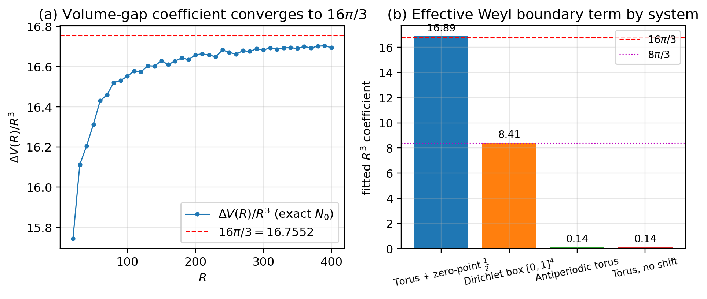
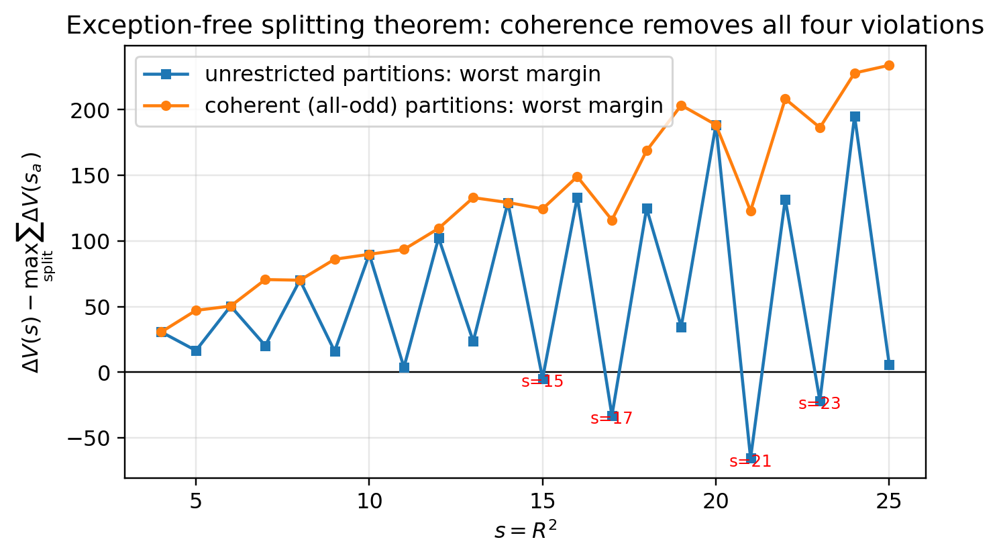
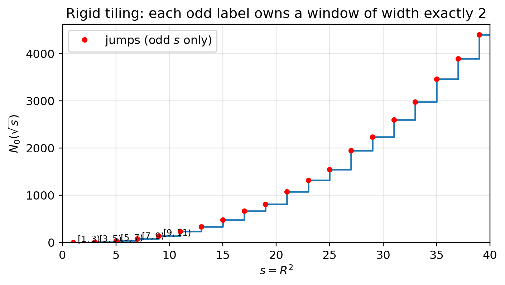

# 論文5：セル＝定在波辞書と半径の量子化

## 4次元格子数え上げの波動的正体・零点の構造的同定・整合条件・$R^2$ の分類定理

著者: 木原 範昭 (Noriaki Kihara)
所属: WF System Co., Ltd.
ORCID: 0009-0004-6753-4020
版: v0.1（草稿）
日付: 2026 年 6 月
DOI（本版）: 未付与
Concept DOI: 未付与
ライセンス: CC BY 4.0

* * *

## 要旨

先行論文1–4で扱った4次元格子の完全内接セル数 $N_0(R)$（$N_0(1)=1$, $N_0(2)=9$, $N_0(3)=137$）に対し、本稿は三つの厳密結果を与える。

第一に、**辞書定理**：単位4トーラス $T^4$ 上の実スカラー定在波基底に各軸零点シフト $+1/2$ を加えた合成周波数カットオフは、$N_0(R)$ と**厳密に一致**する。すなわち格子セル数え上げと定在波モード数え上げは、別個の説明機構ではなく同一構造の双対表現である。この同定により、論文4で例示値とされた最小共役幅 $\delta_{\min}^2=1/2$ は、**零点量子**として構造的に同定される。さらに、体積ギャップの主項係数 $16\pi/3$ は、零点シフトが生成する**有効境界の Weyl 不足量**（単位箱 Dirichlet 境界のちょうど2倍）として定量的に閉じる。

第二に、**整合条件**：セルの代表値 $r_{\max}^2$ は奇数整数のみを取り（mod 8 算術と Jacobi の四平方定理による）、分裂が数え上げに参加できる条件は全部分が奇数であることに帰着する。この条件の下で、体積ギャップ指標に基づく分裂の優位性は、無制限分割で存在した4つの例外を**すべて排除**し、例外なしの定理となる（奇数分割890通りの全数検査）。あわせて断片数の偶奇が $R^2$ の偶奇と一致する $Z_2$ 選択則が従う。

第三に、**$R^2$ の分類定理**：実現可能な $R^2$ は、単一状態では奇数整数のみ、複合状態では正整数のみ（$Z_2$ 選択則つき）であり、非整数は実現不可能である。この量子化を認めると、$N_0(3)=137$ が依存する閉不等式（境界殻の全数包含）は規格化の選択ではなく内在的に強制され、対称平滑化極限で現れる値 105 は「連続体埋め込みの診断値」として位置づけが確定する。

加えて、セルの非重複が $L^2$ 直交性と同一の事実であること、殻数列が Jacobi の約数和関数に接続する閉形式を持つことを示す。本稿の結果はすべて計算機による全数検証または機械精度の数値検証を伴い、再現スクリプトを公開リポジトリで提供する。

* * *

## キーワード

4次元格子、完全内接セル数、定在波、零点エネルギー、Weyl 漸近、直交性、整数分割、Jacobi の四平方定理、量子化、境界臨界性

* * *

## 1. はじめに

先行論文1–4 [1–4] では、波長成分 $\lambda_n$ と周波数成分 $\nu_n$ の逆数双対条件 $\lambda_n\nu_n=1$ を出発点に、4次元整数格子 $\mathbb{Z}^4$ 上の完全内接セル数

$$
N_0(R)=\#\left\{k\in\mathbb{Z}^4\;\middle|\;\sum_{i=1}^4\Bigl(|k_i|+\tfrac12\Bigr)^2\le R^2\right\}
$$

を定義し、$N_0(1)=1$, $N_0(2)=9$, $N_0(3)=137$ をはじめとする数列、4次元超球体積との体積ギャップ、および高 $R$ 状態の有限 $R'$ 状態群への分裂表現を観察した。

論文4の段階では、三つの基礎的な問いが開いたままであった。

1. $\delta_{\min}^2=1/2$ という最小共役幅は例示値か、それとも構造的な量か。
2. 「分裂が単一状態より整合的」という観察は定理か（無制限分割では反例が存在する）。
3. $N_0(3)=137$ は閉不等式（境界殻の包含）に依存するが、この選択は恣意的か。

本稿はこの三問に、それぞれ辞書定理（§3–4）、整合条件（§6）、分類定理（§7）として答える。鍵となるのは、格子数え上げを定在波モード数え上げとして読み直す視点である：周波数側の整数格子と「単位の広がりに波長が整数本収まる」という条件は、離散スペクトル⟺コンパクト領域というフーリエ双対の同一文の二つの書き方にほかならない。

本稿は先行論文と同じく観察モデルの立場を取り、物理的同一視は行わない。「零点」「モード」「量子化」等の語は、波動方程式と格子数え上げの数学的文脈に限定して用いる。

* * *

## 2. 関連研究

有界領域上のラプラシアン固有値の数え上げ漸近は Weyl [5] に始まり、主項（体積項）と境界項の構造は古典的に確立している（概説として Kac [6]）。本稿 §4 の結果は、境界を持たないトーラス上の数え上げに零点シフトを入れると Dirichlet 型境界項のちょうど2倍が**有効境界**として生成される、という Weyl 漸近の一変種である。

整数格子上の数え上げと数論の接続では、4平方和の表現数に関する Jacobi の定理（Hardy & Wright [7]）を用いる。格子・球充填・点群の一般論は Conway & Sloane [8] を参照する。定在波基底と境界条件の対応は Courant & Hilbert [9] の古典的設定に従う。

本稿の新規性はこれらの数学を組み合わせる点ではなく、(i) 完全内接という特殊な数え上げが零点シフトつき実モード計数と**厳密一致**すること、(ii) その帰結として分裂定理の例外消去と $R^2$ の分類が**連鎖的に**閉じること、の2点にある。

* * *

## 3. 辞書定理：数え上げ＝零点つき実定在波計数

### 3.1 主結果

単位4トーラス $T^4=(\mathbb{R}/\mathbb{Z})^4$ 上の実スカラー場の定在波基底

$$
\{\,1;\ \sqrt2\cos 2\pi m x,\ \sqrt2\sin 2\pi m x\ (m\ge1)\,\}^{\otimes 4}
$$

に対し、各軸の周波数 $m_i$ に零点シフト $+\tfrac12$ を加えた合成周波数ノルムでカットオフすると、

$$
N_0(R)\;=\;\#\Bigl\{\text{実モード}\ \Bigm|\ \sum_{i=1}^4\Bigl(m_i+\tfrac12\Bigr)^2\le R^2\Bigr\}
$$

が**厳密に成立**する。セル↔モードの全単射は次の通りである。

| セル成分 $k_i\in\mathbb{Z}$ | モード（軸 $i$） | 多重度 |
|---|---|---:|
| $k_i=0$ | 定数 $1$（周波数 $0$、零点 $\tfrac12$ のみ） | 1 |
| $k_i>0$ | $\sqrt2\cos 2\pi k_i x_i$ | 1 |
| $k_i<0$ | $\sqrt2\sin 2\pi\lvert k_i\rvert x_i$ | 1 |

軸ごとの多重度パターン $\{1,2,2,\ldots\}$ は実フーリエ基底そのものである。**境界条件は周期的、場は実、零点は $+\tfrac12$/軸** — これが先行論文の数え上げの波動的正体である。

### 3.2 零点の構造的同定

$R=1$ の最小共役セル（$k=0$）は4軸すべて零点のみのモード（$r_{\max}=\sqrt{4\cdot\tfrac14}=1$）である。したがって論文4 §3.3 の $\delta_{\min}$（各軸半幅 $\tfrac12$）の正体は**零点量子**と同定される。$\delta_{\min}^2=\tfrac12$ は例示値ではなく、半幅 $\tfrac12$＝零点 $\tfrac12$ という構造的同定である。

### 3.3 境界条件の候補比較

辞書の一意性を確認するため、$R=3$ で候補系を比較する。

| 波動系 | モード数 |
|---|---:|
| **トーラス実モード＋零点 $\tfrac12$/軸** | **137** |
| トーラス反周期・複素モード | 512 |
| Dirichlet 箱 $[0,1]^4$ | 219 |
| トーラス整数周波数（零点なし） | 425 |

規格化の変種は、波動側では「境界条件と零点の有無の選択」として読み直される。

* * *

## 4. 体積ギャップ＝有効境界の Weyl 不足量

### 4.1 主項係数 $16\pi/3$

完全内接条件は $|k|^2+\|k\|_1+1\le R^2$ と書ける。境界層の有効厚 $\|u\|_1/2$（$u\in S^3$）の一様平均 $\mathbb{E}[\|u\|_1]=16/(3\pi)$ と表面積 $2\pi^2R^3$ から、一次近似で

$$
\Delta V(R)=\frac{\pi^2}{2}R^4-N_0(R)\;\sim\;\frac{16\pi}{3}R^3\approx16.7552\,R^3
$$

を得る。整数演算による厳密 $N_0$ の数値検証（$R\le2000$）：

| $R$ | $\mathrm{gap}/R^3$ |
|---:|---:|
| 100 | 16.5529 |
| 500 | 16.7144 |
| 2000 | 16.7456 |

$16\pi/3=16.7552$ へ単調収束する。

**図1. 体積ギャップ係数の収束（左：厳密 $N_0$ による $\Delta V/R^3\to16\pi/3$、右：4境界系のフィット済み $R^3$ 係数）。零点シフトは Dirichlet 単位箱のちょうど2倍の有効境界を生む。**

### 4.2 零点シフト＝有効境界

不足量 $(\pi^2/2)R^4-N(R)$ を $aR^3$ でフィット（$R=50$–$320$）すると：

| 系 | $a$（数値） | 理論値 |
|---|---:|---|
| トーラス実＋零点 | 16.798 | $16\pi/3=16.755$ |
| 反周期 | 0.042 | $0$（$R^3$ 項なし） |
| Dirichlet 箱 | 8.364 | $8\pi/3=8.378$ |
| トーラス零点なし | 0.041 | $0$ |

境界のないトーラスは本来 $R^3$ 項を持たない。零点半シフトは、単位箱 Dirichlet 境界の**ちょうど2倍**（$16\pi/3=2\times8\pi/3$）の Weyl 境界項を生成する。すなわち体積ギャップは、**零点量子が「両向きの Dirichlet 壁」相当の有効境界として働くこと**の Weyl 不足量である。

* * *

## 5. 非重複＝直交、疎性の定量化

### 5.1 グラム行列

§3.1 の辞書でセル $k$ に対応するモードを $\Phi_k(x)=\prod_i\varphi_{k_i}(x_i)$ とすると、1次元実フーリエ基底の直交性と Fubini の定理より $\langle\Phi_k,\Phi_{k'}\rangle_{L^2(T^4)}=\delta_{kk'}$。$R=3$ の137モードのグラム行列を数値計算すると

$$
\max_{k,k'}\bigl|G_{kk'}-\delta_{kk'}\bigr| = 6.9\times10^{-16}
$$

であり、機械精度で単位行列である。**セル非重複と $L^2$ 直交は同一の文**である：断片が「接しないで離れて存在する」ことの実体は、壁による隔離ではなく直交性である。

### 5.2 スペックル統計

137直交モードの位相ランダムな重ね合わせの強度 $I=|\psi|^2$ について、$I>\kappa\bar I$ の体積比は理論値 $e^{-\kappa}$ と一致する（$\kappa=1$: 測定 0.3691 対 理論 0.3679 等）。建設的干渉の占める体積は強度閾値に対して**指数的に疎**である。

* * *

## 6. 整合条件と分裂定理の完成

### 6.1 奇数則

代表値は $r_{\max}^2=\sum(\lvert k_i\rvert+\tfrac12)^2\in\{1,3,5,7,\ldots\}$ であり、**すべての奇数が実現され、偶数は実現されない**。実現性は Jacobi の四平方定理（全奇数 $m$ で $16\sigma(m)>0$）[7] により、奇数性は $(2k+1)^2\equiv1\pmod 8$ の mod 8 算術による。したがって：

> **整合条件**: 断片が親レベルの数え上げに参加できるのは、代表値 $R'^2$ が奇数の整数である場合に限る。

「波長が整数分の1でないと安定しない」という Bohr 型の整合は、力学的安定条件ではなく**数え上げへの参加資格**として再定義される。

### 6.2 $Z_2$ 選択則

$n$ 個の奇数の和は $n\pmod 2$ に合同であるから、$R^2=\sum_a R_a'^2$ より：

> **選択則**: 整合分裂における断片数の偶奇 $=$ $R^2$ の偶奇。

### 6.3 例外なし分裂定理

無制限の整数分割に対しては、「分裂が体積ギャップ指標を減少させる」には4つの例外（$(14,1),(16,1),(20,1),(22,1)$）が存在する（$g(s)$ の殻ジャンプによる非単調性）。**これらはすべて偶数部分を含み、整合条件で全部排除される。** 奇数部分のみの分割 $s\le25$ の890通りを全数検査した結果、違反はゼロである：

> **定理**: $R^2$ の任意の整合分裂（全部分が奇数、2部分以上）は、体積ギャップ指標を厳密に減少させる。全1分割は唯一の大域最小である。

干渉波の整合条件と積み上げの数え上げは、独立な説明ではなく、**前者が後者の分裂定理から例外を除去する正にその条件**であった。

**図2. 例外なし分裂定理：無制限分割では4つの違反（$s=15,17,21,23$）が存在するが、整合（全奇数）分割では全消去される（$s\le25$ 全数）。**

### 6.4 自己相似スペクトル

整合ラベル $m$ における断片の内部容量 $N_0(\sqrt m)$ は $m=1,3,5,7,9,\ldots$ に対し $1,9,33,73,137,\ldots$ であり、代表値スペクトルと容量列は**全階層で同一**である。論文4 §9.3 の自己相似的階層は、ラベル集合のレベルで厳密化される。

**図3. 剛体タイル化：$N_0(\sqrt s)$ のジャンプは奇数 $s$ でのみ生起し、各奇数ラベルが幅ちょうど2の窓を所有する。**

* * *

## 7. $R^2$ の分類定理と境界臨界性の解消

### 7.1 分類定理

> **定理（実現可能スペクトル）**:
> (i) 単一状態の代表値は奇数整数のみを取り、すべての奇数が実現される。
> (ii) 複合状態の合成値 $R^2=\sum_a s_a$（$s_a$ 奇数）は正整数のみを取り、$Z_2$ 選択則に従う。
> (iii) 非整数の $R^2$ は実現不可能である。

系として、論文2の半径スイープのうち状態論的に実現可能なのは整数 $s=R^2$ の点のみであり、半整数 $R$ の点は数学的補間値である（論文2 v0.3 への注記事項）。

### 7.2 境界臨界性の解消

$N_0(3)=137$ は閉不等式 $\le$（境界殻 $m=9$ の64セル全数包含）に依存し、対称重み関数の平滑化極限は $73+64/2=105$ である。分類定理を認めると、三つの独立な論拠が閉不等式を強制する。

1. **連続ダイヤルの不在**: 平滑化極限はカットオフ半径を $R=3$ 近傍で連続的に動かせることを前提とするが、実現可能な $R^2$ が奇数格子に量子化されているなら、その極限操作は体系の内側に存在しない。
2. **タイル化の窓構造**: 各奇数ラベル $m$ は $s$ 軸上の窓 $[m,m+2)$ をちょうど幅2で所有し、エネルギー軸は隙間なくタイル化される（ジャンプは奇数 $s$ のみで生起することを $s\le40$ で確認）。窓は左端を含む。
3. **自己充足**: 厳密不等式 $<$ を採るとラベル $S$ の状態が自分自身の容量に収まらず、「状態は自分の殻を所有する」という最小要件が破れる。

> **再評価**: 「137 か 105 か」は規格化の恣意性の問題ではなく、$R$ を連続と見るか（埋め込みの診断値 105）、組立て可能な離散値と見るか（内在値 137）の違いに帰着する。

* * *

## 8. 殻数列の閉形式

殻個数 $c(4m)$（$m$ 奇数）は、$u_j(n)$ を正の奇数平方 $j$ 個の順序付き和の表現数として

$$
c(4m) = 16\,\sigma(m) - 32\,u_3(4m-1) + 24\,u_2(4m-2) - 8\,u_1(4m-3) + [m{=}1]
$$

で与えられる（母関数 $(2\theta-q)^4$ の展開。奇数 $m\le199$ で直接数え上げと厳密一致）。$N_0(R)$ は数の幾何だけでなく、約数和関数を介して古典的数論の対象として位置づけられる。

* * *

## 9. 本稿の主張範囲

本稿で主張すること：(1) 辞書定理（厳密一致）。(2) $\delta_{\min}$＝零点量子の構造的同定。(3) 体積ギャップ主項 $16\pi/3$＝有効境界の Weyl 不足量（数値的に強く支持された予想。解析的厳密証明は今後の課題）。(4) 非重複＝直交（機械精度）。(5) 整合条件・$Z_2$ 選択則・例外なし分裂定理（全数検査）。(6) $R^2$ の分類定理と境界臨界性の内在的解消。(7) 殻数列の閉形式。

本稿で主張しないこと：(1) 物理的時空・粒子・真空の導出。(2) $\lambda,\nu$ と物理量の同一視。(3) $137$ と微細構造定数の同一視。(4) Weyl 項の厳密な漸近展開。(5) スペックル疎性による宇宙論的数値の説明。

* * *

## 10. 結論

論文1–4の格子数え上げは、零点シフトつき実定在波の計数と厳密に同一である。この同定から、最小共役幅の正体（零点量子）、体積ギャップの正体（有効境界の Weyl 不足量）、分裂定理の完成（整合条件による例外消去）、$R^2$ の分類定理（単一状態＝奇数整数）、境界臨界性の解消（閉不等式の内在的強制）が、追加仮定なしに連鎖的に従う。

$$
\text{零点}\tfrac12\;\to\;\text{セル=実定在波}\;\to\;\text{非重複=直交}\;\to\;\text{奇数則整合}\;\to\;\text{例外なし分裂}\;\to\;R^2\text{の量子化}
$$

この連鎖が、以降の論文（凝縮と膨張、配置統計、安定性）の数学的土台となる。

* * *

## 付録：再現手順の要点

数値検証はすべて整数演算または倍精度演算で再現可能である。モード数比較は軸ごとの（値, 重み）リストの畳み込み、Weyl フィットは $R=50$–$320$ の最小二乗、グラム行列は離散直交格子（8点/軸）、整合分割検査は $s\le25$ の奇数分割890通りの全数列挙による。スクリプトおよび研究ノートは公開リポジトリ（https://github.com/WurabeSeiji/ai-chat-logs-open 、「波長空間と周波数空間の双対幾何」フォルダ）で提供する。

* * *

## 参考文献

[1] 木原 範昭, 「論文1：波長空間と周波数空間の双対幾何」, v0.3, 2026. Concept DOI: 10.5281/zenodo.20588036.

[2] 木原 範昭, 「論文2：4次元格子における単位セル完全内接数の半径スイープ」, v0.2, 2026. Concept DOI: 10.5281/zenodo.20588038.

[3] 木原 範昭, 「論文3：閉じた4次元構造と格子数え上げ補足」, v0.3, 2026. Concept DOI: 10.5281/zenodo.20589261.

[4] 木原 範昭, 「論文4：逆数双対セルの分裂と階層的状態構造」, v1.0, 2026. Concept DOI: 10.5281/zenodo.20638962.

[5] H. Weyl, "Über die asymptotische Verteilung der Eigenwerte," Nachr. Königl. Ges. Wiss. Göttingen (1911), 110–117.

[6] M. Kac, "Can one hear the shape of a drum?," American Mathematical Monthly 73(4) (1966), 1–23.

[7] G. H. Hardy and E. M. Wright, *An Introduction to the Theory of Numbers*, 6th ed., Oxford University Press, 2008.

[8] J. H. Conway and N. J. A. Sloane, *Sphere Packings, Lattices and Groups*, 3rd ed., Springer, 1999.

[9] R. Courant and D. Hilbert, *Methods of Mathematical Physics*, Vol. I, Interscience, 1953.

* * *

## ライセンス

本稿は CC BY 4.0 に基づき公開する。再利用、翻案、翻訳、引用を許可する。ただし、著者名、版、公開日、出典を明示すること。
