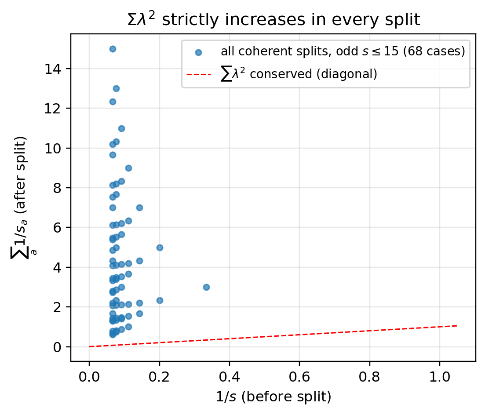
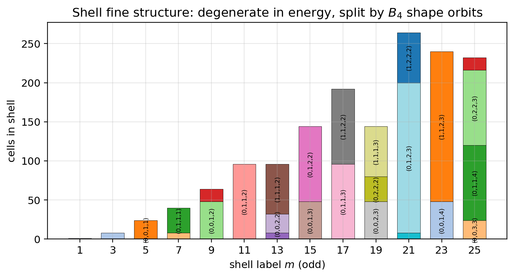
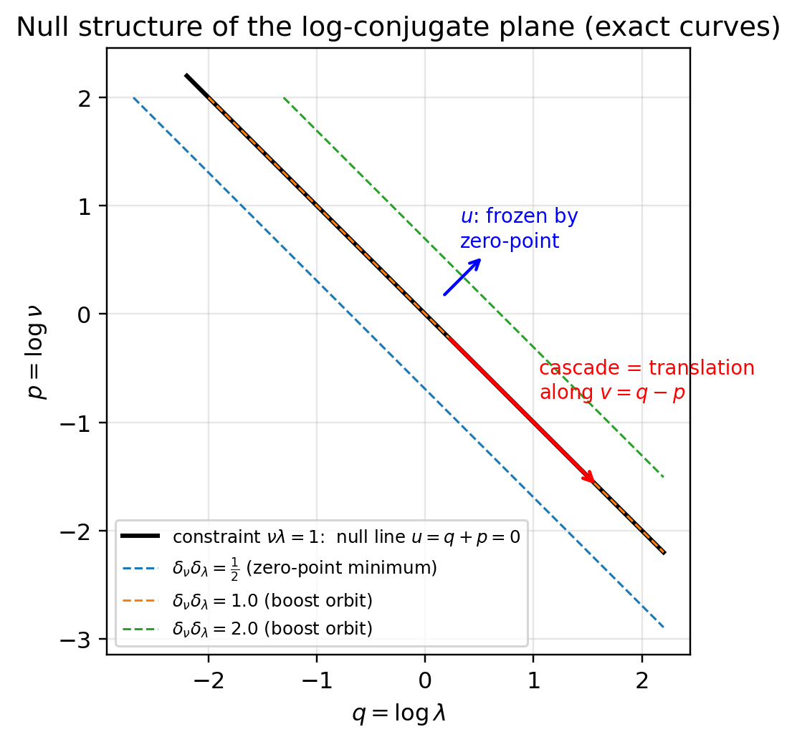

# 論文6：保存則・記録・時間様構造

## $\Sigma\lambda^2$ 非保存定理・凍結定理・$B_4$ ゲージ・$1{+}3$ 極分解・記録定理・ヌル構造

著者: 木原 範昭 (Noriaki Kihara)
所属: WF System Co., Ltd.
ORCID: 0009-0004-6753-4020
版: v0.2
日付: 2026 年 6 月
DOI（本版）: 10.5281/zenodo.20640457
Concept DOI: 10.5281/zenodo.20640456
ライセンス: CC BY 4.0

* * *

## 要旨

本稿は、逆数双対モデル（論文1–5）の運動学的中核を確立する。仮定はわずか三つ — (1) 逆数双対 $\nu\lambda=1$、(2) 零点 $1/2$、(3) 保存則が一方の帳簿にのみ乗るという非対称1ビット — であり、本稿はこの在庫からどれだけの構造が従うかを定理として整理する。

第一に、**凍結定理**：$\sum\nu^2$ 保存の下で、任意の非自明な分裂は $\sum\lambda^2$ を厳密に増加させる（Cauchy–Schwarz による一行証明）。系として、両方の二乗和が同時に保存されるなら非自明な分裂は存在せず、カスケード・時間様構造は生じない。**非対称1ビットの存在が、時間様構造の存在条件そのものである。**

第二に、**ゲージ構造**：数え上げ条件の厳密な対称群は超八面体群 $B_4$（位数384）であり、各エネルギー殻内で軸への配分・符号・向きは純粋なゲージである。加法的保存則は $\sum\nu^2$ と $Z_2$ パリティの2本で帳簿が閉じる。副産物として、エネルギーで縮重し形で分かれる殻の微細構造（$R=3$ で 137 状態 → ゲージ不変 7 クラス）が露わになる。

第三に、**$1{+}3$ 極分解**：4軸のうちの1本が時間になるのではない。4次元周波数空間の極座標分解 $\mathbb{R}^4\cong\mathbb{R}_+\times S^3$ において、非対称ビットの発現が集中する動径方向が時間様、双対が触れない角度方向（$B_4$ ゲージ）が空間様として現れる。虚数単位もミンコフスキー負符号も導入せずに、$1{+}3$ の役割分化が得られる。あわせて、階層の頂点を内側から判定する方法は存在しないこと（階層相対性）を示す。

第四に、**記録定理とヌル構造**：測定とは記録であり、記録とは蓄積である。蓄積できるのは非保存の単調帳簿に限るため、あらゆる記録は $\lambda$ 側の配置として残り、$\nu$ は直接の読み出し対象になりえない。整数格子は仮定ではなく**単位記録の分解能構造**として再解釈される（仮定在庫の格下げ）。さらに、対数共役平面 $(q,p)=(\log\lambda,\log\nu)$ において制約 $\nu\lambda=1$ は**ヌル直線**であり、共役幅の配分自由度は $SO(1,1)$ ブースト（スクイーズ）、不確定性はブースト不変な最小面積として内蔵される。負符号は公理ではなく双曲線である — ただし4対の $(1,1)$ 構造から単一の $(1,3)$ 符号への集約は明示的な構成課題として残る。

本稿は物理的時間・空間・測定を導出したと主張しない。主張するのは、三仮定の在庫から、時間様・空間様・記録・不確定性・ヌル構造の役割分化が定理として従う、という点である。

* * *

## キーワード

保存則、時間の矢、記録、関係的時間、超八面体群、ゲージ冗長性、極分解、ヌル構造、スクイーズ、不確定性、階層相対性

* * *

## 1. はじめに

論文5 [3] までで、逆数双対モデル（論文1 [1]、論文4 [2]）の数学的土台（辞書・整合条件・$R^2$ の分類）が確立した。本稿の問いは次である。

> このモデルにおいて「時間が流れ、空間が広がり、記録が残る」ように見える構造は、どの仮定から、どこまで定理として従うか。

時間を基本量と見なさず関係や記録から構成する立場には長い系譜がある。量子重力の正準形式における「凍結した形式論」（DeWitt [5]）、条件付き確率としての時間（Page & Wootters [6]）、関係的量子力学（Rovelli [7]）、力学からの時間の除去（Barbour [8]）、決定論的基礎の上の量子論（'t Hooft [9]）などである。本稿はこれらの理論を拡張するものではないが、「時間は基本的でない」という問題意識を、**有限の格子模型の中で全数検証可能な定理群**として実装する点に特色がある。

本稿の構成：§3 で凍結定理、§4 で $B_4$ ゲージと微細構造、§5 で $1{+}3$ 極分解と階層相対性、§6 で記録定理、§7 でヌル構造と不確定性を扱う。

* * *

## 2. 仮定の在庫

本稿で用いる仮定は次の三つである（運用原理として配置読み・記録原理を併用する）。

1. **逆数双対** $\nu_n\lambda_n=1$。
2. **零点** $1/2$（論文5で零点量子として構造同定済み）。
3. **非対称1ビット**：加法的保存則 $\sum\nu^2=S$ は一方の側（$\nu$ 側）にのみ乗る。

重要な注意：仮定3における $\nu/\lambda$ のラベルは固有名詞ではなく**役割の符牒**である。保存して見える側を観測者が「周波数」と呼ぶ、という命名規約に還元され、残る物理的内容は「非対称が一つ存在する」という1ビットのみである。鏡像モデル（$\sum\lambda^2$ を保存と呼ぶ）は同一構造のラベル替えにすぎない。

* * *

## 3. 凍結定理：非対称が時間様構造の存在条件である

### 3.1 $\Sigma\lambda^2$ 非保存定理

> **定理**: $\sum\nu^2$ 保存（$s=\sum_a s_a$、$s_a\ge1$）の下で、任意の非自明な分裂（$n\ge2$ 部分）は $\sum\lambda^2=\sum 1/s_a$ を厳密に増加させる。

**証明**: Cauchy–Schwarz より $(\sum s_a)(\sum 1/s_a)\ge n^2$、すなわち $\sum 1/s_a\ge n^2/s>1/s$（$n\ge2$）。∎

奇数 $s\le15$ の全整合分割68通りでの数値確認でも例外はない。

**図1. $\Sigma\lambda^2$ 単調増加定理：奇数 $s\le15$ の全整合分割68通りはすべて対角線の上にある（厳密計算）。**

### 3.2 凍結定理

> **系（凍結定理）**: $\sum\nu^2$ と $\sum\lambda^2$ が両方保存則であれば、非自明な分裂は一切存在せず、カスケード・時間様構造・膨張様構造は生じない（系は凍結する）。

すなわち、$\sum\lambda^2$ が保存**でない**こと — 非対称1ビットの存在 — が、時間様構造が存在できる条件そのものである。$\lambda$ 側帳簿はこのモデルにおける唯一の単調量であり、その単調増加が「時間の矢」の役割を担う。なお、対称性と保存則の古典的対応（Noether [4]）が「何が保存するか」を定めるのに対し、ここでの非対称1ビットは「保存則がどちらの双対側に乗るか」という、それとは独立な選択である。

### 3.3 双対読み替え不変性

対数空間では双対は $p=-q$ の点対称であり、分裂カスケードの運動学的内容（比・指数・無次元量）は $\nu\leftrightarrow\lambda$ の読み替えで不変である。読み替えで消えない唯一の要素は「どちらの側が加法的か」の1ビットであり、これが §2 の仮定3の正確な内容である。

* * *

## 4. $B_4$ ゲージ構造と殻の微細構造

### 4.1 対称性群と軌道分解

数え上げ条件 $\sum(|k_i|+\tfrac12)^2\le R^2$ の厳密な対称群は超八面体群 $B_4$（座標の符号付き置換、位数 $2^4\cdot4!=384$。一般論は Humphreys [10]）である。殻 $m$ の $B_4$ 軌道は形（$|k_i|$ の多重集合）でラベルされ、軌道サイズは

$$
|\mathcal{O}(\text{shape})|=\frac{4!}{\prod_v m_v!}\times 2^{\#\{i:|k_i|>0\}}
$$

で与えられる（$m\le25$ の全殻で殻数との一致を検証済み）。

### 4.2 ゲージ性と帳簿の閉鎖

各軌道内で $B_4$ は推移的に作用する。したがって軸への配分・符号・どの軸が励起しているかは格子回転で互いに移り合う**純粋なゲージ**であり、保存則による固定を必要としない。

> **帳簿の閉鎖**: 状態の非ゲージ的中身は $(m,\text{shape})$ の二つ。加法的保存則は $\sum\nu^2$ と $Z_2$ パリティ（論文5）の計2本で、自由度の帳簿は閉じる。

### 4.3 殻の微細構造

エネルギー（$m$）で縮重し形で分かれる構造は $m=7$ で初めて現れる（$40=32+8$）。ゲージ還元後の状態数は $R=3$ で 7、$R=5$ で 27 であり、名目容量（137, 1545）より劇的に小さい。この「形多重項」は、後続論文で物理量子数の役割を担う。

**図2. $B_4$ 殻微細構造（$m\le25$ 全数）：エネルギーで縮重した殻が形軌道に分かれる（$m=7$ で初分裂）。**

* * *

## 5. $1{+}3$ 極分解と階層相対性

### 5.1 動径＝時間様、角度＝空間様

4次元周波数空間の極座標分解 $\mathbb{R}^4_\nu\cong\mathbb{R}_+\times S^3$ において：

- **動径方向**：内部時計 $\tau=1/R'$ は半径のみの関数であり、分裂カスケードの運動は純粋に動径的である。非対称ビットの階層内での発現は動径量 $R'$ に集中する。ゆえに時間様。
- **角度方向**：殻の縮重は離散化された $S^3$ であり、角度自由度は $B_4$ ゲージ（§4）であってエネルギーでも時計でもない。対数空間の双対 $p=-q$ は動径線の構造を保ち角度に触れない。ゆえに空間様。

> 4軸の $B_4$ 対称性は一度も破れていない。「破れた」のは軸ではなく、動径/角度という別の切り方である。複素位相の役割は実定在波辞書の cos/sin 二重化が、ミンコフスキー負符号の役割は §7 のヌル構造が、それぞれ肩代わりする — **虚数も負符号も導入されない**。

### 5.2 内在歪み

零点 $1/2$ は計量的平坦性を厳密に破る：境界のないトーラスに有効境界（Weyl 項、論文5 §4）を生み、各状態の周りに必ず未充填層を作る。完全に平坦な状態空間は零点なしの極限であり、そこに状態は存在できない。**存在することと歪んでいることは同じ条件である。**

### 5.3 階層相対性

系全体は一階層上から見ると、同一スペクトル（奇数、論文5）・同一零点・代表ラベル1個を持つ通常のセルと区別不能である。したがって：

> 自分が階層の頂点にいることを内側から判定する方法は存在しない。「全体」と「部分」の区別は階層指標語であり、構造的属性ではない。

唯一の絶対スケールは零点 $1/2$＝最小セルであり、これは階層の最下段が単位を定義するという形で自己言及的に閉じている。内部観測者の可観測量はすべて比であり、構造は完全に関係論的である。

* * *

## 6. 記録定理

### 6.1 定理

測定とは記録であり、記録とは蓄積である。蓄積できるのは非保存の単調な帳簿に限る。§3 の定理により：

- $\sum\nu^2$：全分裂で不変（交換のみ可能、蓄積不能）。
- $\sum\lambda^2$：全分裂で厳密に増加する唯一の単調帳簿。

> **系（記録定理）**: あらゆる測定記録は $\lambda$ 側の配置として残るしかない。$\nu$ は交換と計数を介してのみ推定可能であり、直接の読み出し対象になりえない。

実測定がすべて位置読み（指針・乾板・検出器の場所）に終端するという von Neumann 型の観察 [11] の理由が、本モデルでは定理として現れる。

### 6.2 整数格子＝分解能構造（仮定の格下げ）

周波数差 $\Delta\nu$ を観測窓 $T$ で識別する重なりは $|\mathrm{sinc}(\pi\Delta\nu T)|$ であり、分解能は $\delta\nu=1/T$ である。$\nu$ はスナップショットでは読めず、対価は持続時間である。単位記録窓 $T=1$ で識別が厳密になるのは**ちょうど整数差**であるから：

> 整数 $\nu$ 格子は $\nu$ についての仮定ではなく、**単位記録が分解できるものの構造**として再解釈される。

* * *

## 7. ヌル構造：$\nu\lambda=1$ は対数共役平面の光円錐である

### 7.1 ヌル直線とブースト

共役対ごとに $(q,p)=(\log\lambda,\log\nu)$ を取ると、$\nu\lambda=1\iff u\equiv q+p=0$。**制約はヌル直線である。** カスケード＝時間様運動はこのヌル線に沿う並進（$v=q-p$ 方向）であり、円錐から外れる方向（$u$）は零点で凍結し、不確定性として支払われるのみである。

共役幅の配分自由度 $S_\eta:(\delta_\nu,\delta_\lambda)\to(e^{-\eta}\delta_\nu,e^{\eta}\delta_\lambda)$ は面積 $\delta_\nu\delta_\lambda$ を厳密に保ち、これは $(u,v)$ 平面の $SO(1,1)$ 双曲回転＝**ブースト**そのものである。

### 7.2 不確定性＝ブースト不変な最小面積

ブースト不変量は面積であり、その最小値は零点 $1/2$ である。

> 不確定性原理に対応する構造は、$(1,1)$ 幾何の**ブースト不変な最小セル**として内蔵される。負符号は公理ではなく双曲線である。

**図3. 対数共役平面のヌル構造（厳密曲線）：制約 $\nu\lambda=1$ はヌル直線、配分自由度はブースト軌道（双曲線）、最小面積は零点 $1/2$。**

### 7.3 明示すべき未構成

§7 で導出された $(1,1)$ ヌル/ブースト構造は**共役対ごと**に存在する（$(1,1)^{\times4}$）。単一の $(1,3)$ ミンコフスキー符号への組み立てには、4対から単一の時間方向を集約する指定が必要であり、自然な候補は動径方向（§5）だが、集約写像の明示的構成は本稿の範囲外である。なお特殊相対論においても $(1,3)$ の符号と次元自体は導出物ではなく経験的入力であることを付記する。

* * *

## 8. 本稿の主張範囲

主張すること：(1) $\Sigma\lambda^2$ 非保存定理と凍結定理（証明つき）。(2) 非対称1ビット＝時間様構造の存在条件。(3) $B_4$ ゲージ性・帳簿の閉鎖・殻の微細構造（全数検証）。(4) $1{+}3$ 極分解（動径＝時間様、角度＝空間様）と階層相対性。(5) 記録定理と整数格子の分解能構造としての再解釈。(6) ヌル構造・ブースト・不変面積（対ごと）。

主張しないこと：(1) 物理的時間・空間・測定の導出。(2) $(1,3)$ ミンコフスキー計量の構成。(3) ローレンツ群の連続作用。(4) 関係的時間の諸理論 [5–9] の拡張や修正。「時間様」「空間様」の語はモデル内の役割分化の記述に限定する。

* * *

## 9. 結論

三仮定（$\nu\lambda=1$・零点 $1/2$・非対称1ビット）から、(i) 時間様構造の存在条件（凍結定理）、(ii) 空間様自由度のゲージ性（$B_4$）、(iii) $1{+}3$ の役割分化（極分解）、(iv) 記録の非対称（記録定理）、(v) 不確定性の幾何（ヌル構造・不変面積）が、追加仮定なしに定理として従う。時間の向き・記録の蓄積・計量可能性の非対称は、すべて同一の1ビットの異なる顔である。

整数格子が仮定から分解能構造へ格下げされたことで、モデルの仮定在庫はさらに軽くなった。以降の論文では、この運動学的中核の上に、配置統計（論文7）、二つの会計（論文8）、複合体の安定性（論文9）を構築する。

* * *

## 付録：再現手順の要点

$\Sigma\lambda^2$ 非保存の数値確認は奇数 $s\le15$ の全整合分割68通り、$B_4$ 軌道分解は $|k_i|\le6$ の全セル分類と軌道サイズ公式の照合（$m\le25$）、sinc 識別表は $\Delta\nu, T\in\{0.25,\ldots,4\}$ の格子評価、スクイーズ不変性は乱択5組の機械精度確認による。スクリプトおよび研究ノートは公開リポジトリ（https://github.com/WurabeSeiji/ai-chat-logs-open）で提供する。

* * *

## 参考文献

[1] 木原 範昭, 論文1, v0.3, 2026. Concept DOI: 10.5281/zenodo.20588036.

[2] 木原 範昭, 論文4, v1.0, 2026. Concept DOI: 10.5281/zenodo.20638962.

[3] 木原 範昭, 「論文5：セル＝定在波辞書と半径の量子化」, v0.2, 2026. Concept DOI: 10.5281/zenodo.20640454.

[4] E. Noether, "Invariante Variationsprobleme," Nachr. Königl. Ges. Wiss. Göttingen (1918), 235–257.

[5] B. S. DeWitt, "Quantum theory of gravity. I. The canonical theory," Physical Review 160 (1967), 1113–1148.

[6] D. N. Page and W. K. Wootters, "Evolution without evolution: Dynamics described by stationary observables," Physical Review D 27 (1983), 2885–2892.

[7] C. Rovelli, "Relational quantum mechanics," International Journal of Theoretical Physics 35 (1996), 1637–1678.

[8] J. Barbour, *The End of Time*, Oxford University Press, 1999.

[9] G. 't Hooft, *The Cellular Automaton Interpretation of Quantum Mechanics*, Springer, 2016.

[10] J. E. Humphreys, *Reflection Groups and Coxeter Groups*, Cambridge University Press, 1990.

[11] J. von Neumann, *Mathematische Grundlagen der Quantenmechanik*, Springer, 1932.

* * *

## ライセンス

本稿は CC BY 4.0 に基づき公開する。再利用、翻案、翻訳、引用を許可する。ただし、著者名、版、公開日、出典を明示すること。
