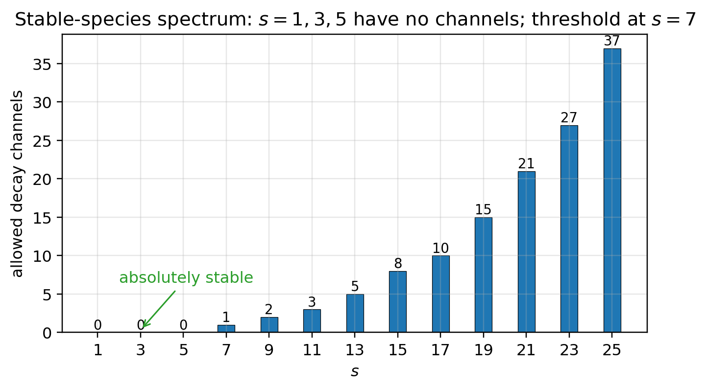
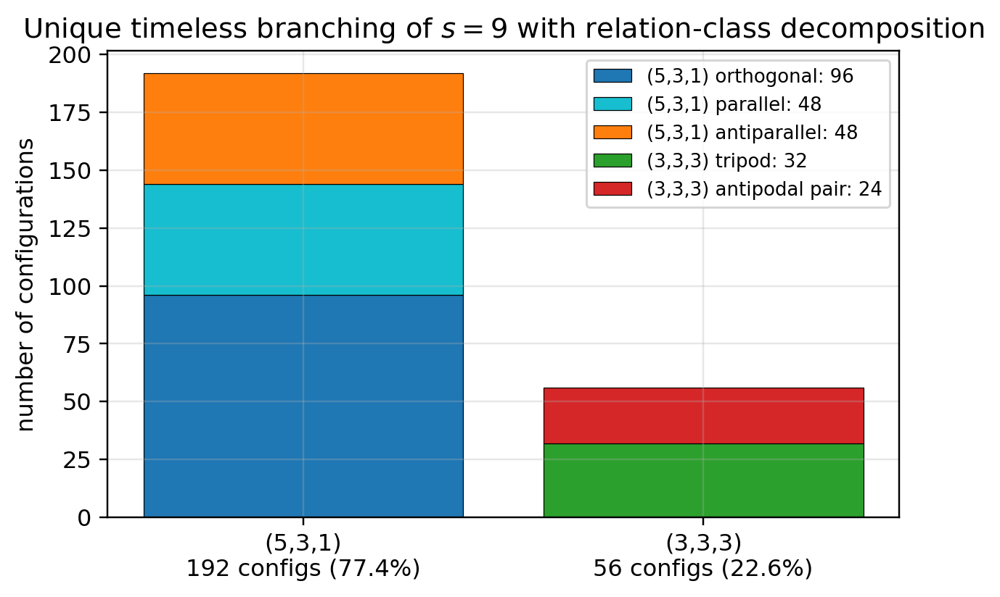
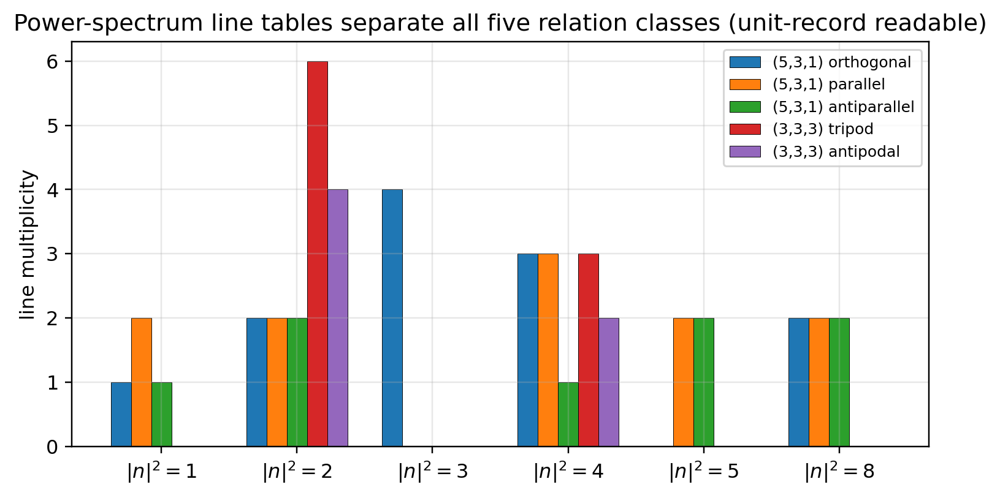

# Paper 7: Configuration Statistics and Relational Readout

## Derivation of Exclusion Statistics, the Stable-Species Spectrum, Timeless Branching Ratios, and the Birth of Relational Geometry with Its Holographic Readout

Author: Noriaki Kihara  
Affiliation: WF System Co., Ltd.  
ORCID: 0009-0004-6753-4020  
Version: v0.2  
Date: June 2026  
DOI (this version): 10.5281/zenodo.20640459  
Concept DOI: 10.5281/zenodo.20640458  
License: CC BY 4.0  

* * *

## Abstract

This paper introduces a **configuration reading** into the reciprocal dual model (Papers 1–6): the fragments after splitting are occupied cells of a shared parent lattice, and a state is the **set** of occupied cells. From this minimal embedding hypothesis, the following are derived.

First, **exclusion statistics**: since a state is a set, no label of "which fragment is which" exists, and double occupancy of the same cell is impossible by the non-overlap = orthogonality theorem (Paper 5). Indistinguishability and the exclusion principle become theorem-like consequences, not assumptions.

Second, the **stable-species spectrum**: from exclusion follows the shell capacity law $n_m\le c(m)$, and an exhaustive scan ($s\le25$) of the allowed decay channels under odd partitions and the capacity law establishes that $s=1,3,5$ are **absolutely stable** (no channel exists) and that the decay threshold is $s=7$. For the first time the model possesses a spectrum of stable states.

Third, **timeless branching ratios**: the question "when, and triggered by what, does decay occur" is ill-posed in this model, where time = a sequence of events; the absence of a trigger (spontaneity) is a constitutive principle of time. What can be predicted are the relative weights among channels (branching ratios), and at $s=9$ the configuration counting of the two allowed channels yields the unique ratio $(5,3,1):(3,3,3)=192:56$ (77.4% : 22.6%).

Fourth, the **birth and readout of relational geometry**: the configuration of a single fragment is a non-observable under the $B_4$ gauge, but with two or more fragments, for the first time, the inner products = angles between occupied cells become gauge invariants. We show that this relational data can be read out completely from the $\lambda$-side record (the intensity of the interference pattern) alone: the five relation classes of the $s=9$ final decay configurations are completely separated by the multiplicity-weighted power spectrum alone (a theorem over all 248 configurations), and the entirety of the data required for identification is obtained exactly from **a single unit record** (the unit-record sufficiency theorem). The amplitudes lie on a discrete alphabet of powers of $\sqrt2$, and the readout is digital decoding. Channels containing the minimal fragment (the zero mode) are of **holographic type**, permitting complete reconstruction of the configuration; channels without it are of **interferometric type**, yielding relations only.

Finally, as consequences of the exclusion rule, we show that within a shared lattice the existing occupancy blocks the decay channels of other fragments — a **blocking effect** (environment dependence of decay channels) — and that the timeless state space of small systems can be enumerated completely as a finite closed set.

* * *

## Keywords

exclusion principle, indistinguishability, configuration space, stable spectrum, branching ratio, gauge invariant, relational geometry, holography, digital decoding, selection rule

* * *

## 1. Introduction

The kinematics established in Paper 6 [3] (the freezing theorem, the $B_4$ gauge, and the record theorem) is the preparation for treating systems in which multiple fragments coexist. This paper asks two questions:

1. What statistics do multiple fragments obey — are they distinguishable, and can they share the same cell?
2. Are the relations among fragments (distances, angles) observables — and if so, from which records can they be read?

Quantum statistics (the Pauli exclusion principle [5], Fermi–Dirac statistics [6,7]) is introduced in standard theory as an empirical rule or as a consequence of field quantization. The equal a priori probability of statistical mechanics is a postulate (for foundational discussion, see Jaynes [8]). The viewpoint that only relative quantities are observable in the absence of a reference frame has been systematized in the quantum-information context (Bartlett, Rudolph & Spekkens [9]). This paper reconstructs these results **in a form exhaustively verifiable within a finite lattice model**: the statistics are derived from the configuration reading, the equal-weight rule is made explicit as the counting principle of the model, the observability of relations only follows from the record theorem (Paper 6), and the concrete readout procedure is given by a mechanism structurally isomorphic to holography (Gabor [10]).

* * *

## 2. The Configuration Reading (Minimal Embedding Hypothesis)

> **Hypothesis (configuration reading)**: The fragments after splitting are occupied cells of a shared parent lattice. The representative value of a fragment is the $r_{\max}(k)^2$ of its occupied cell, i.e., an energy-like quantity = the radial position within frequency space. A state = the **set** of occupied cells.

All components used are pre-existing: the lattice (Paper 2 [4]), representativization (Paper 5 [2] §6.4), non-overlap = orthogonality (Paper 5 §5), and binary occupancy. It is a concretization of the finite-$R'$ splitting representation of Paper 4 [1] as occupancy of a shared parent lattice. It is a minimal construction with zero new components, but we make explicit that it is a **choice** of embedding (independent verification is provided by the readout theorems of §6).

### 2.1 Derivation of exclusion statistics

Since a state is a set of occupied cells, (i) fragments carry no individual labels (a set contains no duplicates), and (ii) double occupancy of the same cell is impossible by the orthogonality theorem.

> **Consequence**: Fragments are indistinguishable occupancies and obey the exclusion principle. The statistics are not an assumption but a theorem-like consequence of binary occupancy + orthogonality.

* * *

## 3. The Shell Capacity Law and the Stable-Species Spectrum

### 3.1 The capacity law

The number of cells in each shell $m$ is $c(m)=1,8,24,40,64,96,96,144,\ldots$ (Paper 5 §8). From exclusion,

$$
n_m\le c(m)
$$

(the number of fragments with label $m$ is at most the shell capacity). In particular $c(1)=1$: **at most one fragment with label 1 in the system**.

### 3.2 The stable-species spectrum

Exhaustive scan of allowed channels under odd partitions (the consistency condition of Paper 5) + the capacity law:

| $s$ | Number of allowed channels | Remark |
|---:|---|---|
| 1, 3, 5 | **0 (absolutely stable)** | |
| 7 | 1 (only (3,3,1)) | decay threshold |
| 9 | 2 ((5,3,1), (3,3,3)) | |
| 11 | 3 | |
| 13 | 5 | includes the smallest 5-body channel |
| 25 | 37 | the number of channels grows rapidly with $s$ |

> **Main result**: For $s=1,3,5$ no channel exists kinematically, so they are absolutely stable. The decay threshold is $s=7$. The capacity law eliminates 5 of the naive 7 channels at $s=9$ (those containing multiple $s=1$, etc.).

**Figure 1. Stable-species spectrum: the number of allowed decay channels (odd partitions + capacity law, exhaustive). $s=1,3,5$ have zero channels (absolutely stable); the threshold is $s=7$.**

### 3.3 The terminal system

The final step of the cascade, $3\to(1,1,1)$, is forbidden by $c(1)=1$. Hence **the all-1 state is unreachable**, and the terminal population of the splitting cascade is a mixture of the stable species $\{1,3,5\}$. Moreover, the maximally dispersed configuration within a single lattice is the one that "fills one cell at a time from the lowest shell" (Fermi-sea type, $n_{\max}\sim S^{2/3}$).

* * *

## 4. Timeless Branching Ratios

### 4.1 Reformulating the question

If "why does a stable state decay spontaneously" is read as "when, and triggered by what," a background time flowing before the decay is required. In this model time = a sequence of events (Paper 6), and there is no time before an event. **The absence of a trigger = spontaneity is an expression of the fact that time is constructed from events.** The well-posed question decomposes into two: (i) which channels are open (completed in §3), and (ii) what are the relative weights among channels — and (ii) is predictable by static counting.

### 4.2 The unique branching ratio at $s=9$

The configuration counts of the two surviving channels ($c(1)=1$, $c(3)=8$, $c(5)=24$):

$$
W(5,3,1)=24\times8\times1=192\;(77.4\%),\qquad
W(3,3,3)=\binom{8}{3}=56\;(22.6\%)
$$

> Under equal weights on configurations (the counting principle), the branching ratio is unique. The status of the equal-weight rule itself is discussed in §8.

**Figure 2. The unique timeless branching ratio of $s=9$ (192:56 = 77.4%:22.6%) and the decomposition into the 5 relation classes (breakdown of the 248 configurations).**

### 4.3 The blocking effect (environment dependence of decay channels)

In a shared lattice, existing occupancy blocks the channels of other fragments. Example: in the fragment set $\{7,3,1\}$, the unique channel $(3,3,1)$ of $7$ is **blocked** because the origin ($c(1)=1$) is already occupied, so $7$ is stabilized by its environment. In $\{9,3,1\}$, the $(5,3,1)$ channel of $9$ is blocked, and the branching ratio is modified by the environment to 100% $(3,3,3)$. **Stability and branching ratios are not attributes of an isolated system but attributes of the configuration.**

### 4.4 The state space as a finite closed set

The reachable configurations for small $S$ can be enumerated completely (example: $S_0=9$ gives the 3 configurations $\{9\},\{5,3,1\},\{3,3,3\}$, with $1+3+2=6$ gauge-invariant states). That the timeless state space can be held in one's hand as a finite transition system is the core of the verifiability of this model.

* * *

## 5. The Birth of Relational Geometry

The configuration of a single fragment (its position on a shell) is a purely non-observable under the $B_4$ gauge (Paper 6 §4). Since $B_4\subset O(4)$ preserves inner products, **with two or more fragments, for the first time, the inner products = angles between occupied cells become observable as gauge invariants.**

The 248 final decay configurations of $s=9$ ($(5,3,1)$: 192, $(3,3,3)$: 56) split into 5 relation classes under the $B_4$ orbit decomposition:

| Class | Invariant | Configurations | Fraction |
|---|---|---:|---:|
| $(5,3,1)$ orthogonal type | $\langle v_5,v_3\rangle=0$ | 96 | 38.7% |
| $(5,3,1)$ parallel type | $+1$ | 48 | 19.4% |
| $(5,3,1)$ antiparallel type | $-1$ | 48 | 19.4% |
| $(3,3,3)$ tripod type | 3 mutually orthogonal axes | 32 | 12.9% |
| $(3,3,3)$ antipodal-pair type | contains an antipodal pair | 24 | 9.7% |

A single fragment has no position; **the relative structure of the configuration is the first intrinsic geometric observable.**

* * *

## 6. $\lambda$-Side Readout: Holographic Identification of the Relation Classes

### 6.1 The readout model and the structure of the record

By the record theorem (Paper 6), every observable must be readable as a $\lambda$-side record. To each occupied cell we associate the real standing wave $\Phi_k$ of the dictionary (Paper 5), and take as the $\lambda$-side record of a configuration the intensity $I(x)=\Psi(x)^2$, $\Psi=\sum_{k}\Phi_k$. By the product-to-sum formula, **the $\lambda$-side record = the autocorrelation spectrum of the configuration**, and the cross terms lie on the pairwise sum and difference vectors of the occupied cells.

### 6.2 Complete separation of the 5 classes (a theorem over all 248 configurations)

The (norm²: line count) data of the multiplicity- and amplitude-weighted power spectrum alone completely separates the 5 classes: orthogonal $(1{:}1,\,3{:}4)$, parallel $(1{:}2,\,5{:}2)$, antiparallel $(1{:}1,\,5{:}2)$, tripod $(2{:}6)$, antipodal-pair $(2{:}4)$. The peak intensities ($19.49/19.49/11.90/18/11.66$) are an independent consistency check. By closed forms independent of the choice of branch, axis, and sign, **within-class constancy over all 248 configurations** holds as a theorem.

**Figure 3. Complete line tables of the 5 relation classes: complete separation by the multiplicity-weighted power spectrum (norm²: line count) alone — all the data readable from a single unit record.**

### 6.3 The unit-record sufficiency theorem

The spectral lines of the interference intensity — cross terms and self terms alike — lie on integer frequency vectors, and integer frequency modes are exactly orthogonal on the unit cell. Therefore:

> **From the $\lambda$ record of a single unit cell, the amplitudes of all spectral lines can be determined exactly.** What is needed is not super-resolution but exactly the resolution of the unit record.

Since $I(x)$ is a trigonometric polynomial of degree $\le 2$ per axis, it can be reconstructed exactly from a lattice sample of 5 equally spaced points per axis, $5^4=625$ points in total (a finite, constructive readout procedure).

### 6.4 The digital amplitude alphabet

The amplitudes of all lines lie on the discrete set $\{\tfrac12,1,\sqrt2,2,2\sqrt2\}=(\sqrt2)^j$. The readout is **digital decoding**, for which a relative precision of about ±20% suffices.

### 6.5 Holographic type and interferometric type

A line of amplitude $2\sqrt2$ is $2\Phi_0\Phi_k=2\Phi_k$, i.e., a linear transcription of a component wave, and it appears only when an $s=1$ fragment (the zero mode = the constant wave) is present.

- **$(5,3,1)$ type (with reference) = holographic**: from the linear transcription, the configuration can be completely reconstructed down to the cell and branch of each fragment. This is the same structure as Gabor's holography with a reference beam [10] (a structural correspondence, not an identification).
- **$(3,3,3)$ type (no reference) = interferometric**: only the pairwise relations can be read.

The presence or absence of the minimal fragment divides the **information class** of the record. Moreover, the DC component of the intensity equals the fragment number $n$, so the count and the $Z_2$ parity are directly readable on the $\lambda$ side.

* * *

## 7. Scope of Claims of This Paper

What this paper claims: (1) The derivation of exclusion statistics from the configuration reading. (2) The shell capacity law, the stable species $\{1,3,5\}$, and the threshold $s=7$ (exhaustive scan). (3) The unique branching ratio at $s=9$ (under equal weights). (4) The blocking effect and the finite closed state space. (5) The complete $\lambda$-side readout of the relation classes (the theorem over all 248 configurations, unit-record sufficiency, the digital alphabet, and the two information classes).

What this paper does not claim: (1) Identification with physical particles or matter fields ("exclusion," "statistics," and "branching ratio" are descriptions of counting structures within the model). (2) Absolute values of transition rates or lifetimes (dynamics is out of scope; predictions are limited to ratios). (3) A first-principles derivation of the equal-weight rule (§8). (4) Exclusion of embeddings other than the configuration reading (the readout theorems constitute passing an independent test of the configuration reading, not a proof of uniqueness).

* * *

## 8. Discussion

**The status of the equal-weight rule.** In standard statistical mechanics the equal a priori probability is a postulate [8]. In this model, equal weights on allowed configurations are the expression of minimality — "introduce no weighting principle other than counting" — and in a subsequent paper we will show that no weight other than configuration counting is generated by the kinematics (an impossibility theorem for weight derivation).

**Observability of relations only.** The constraint that "only relative quantities are meaningful," discussed in a general framework by the theory of reference frames [9], is realized in this model from the record theorem + the $B_4$ gauge, complete with a concrete readout procedure (§6). In particular, the mechanism by which the presence or absence of a reference (the zero mode) switches the class of readable information reproduces, inside a counting model, the structure of holography and heterodyne detection.

**The origin of the statistics.** The Pauli exclusion principle [5] has been reduced in this model to "being a set + orthogonality." This is not an explanation of physical fermions, but it provides one example of "what minimal structure can generate exclusion."

* * *

## 9. Conclusion

From the minimal embedding hypothesis of the configuration reading, exclusion statistics, the stable-species spectrum, the unique timeless branching ratio, and the blocking effect have been derived; relational geometry (angles) is born; and it has been established as a theorem that all of its information can be read out by digital decoding of a unit record. In particular, the exact match — "the resolution required for identification = the resolution of the unit record," with nothing to spare and nothing lacking — is independent evidence that the configuration reading is consistent with the record structure.

Paper 8 will construct on top of these statistics the two accountings (condensation and expansion), and Paper 9 the wave-theoretic derivation of the stability of composites.

* * *

## Appendix: Essentials of the Reproduction Procedure

The stable-species scan is the full enumeration of odd partitions + the capacity filter ($s\le25$); the branching ratios come from direct enumeration of shell cells ($c(1),c(3),c(5)=1,8,24$); the relation classes come from canonicalization under $B_4$ (384 elements) and orbit counting (verification of $96+48+48+32+24=248$); the readout rests on the closed forms of the product-to-sum expansion and numerical cross-checking. The scripts and research notes are provided in the public repository (https://github.com/WurabeSeiji/ai-chat-logs-open).

* * *

## References

[1] Noriaki Kihara, Paper 4, v1.0, 2026. Concept DOI: 10.5281/zenodo.20638962.

[2] Noriaki Kihara, Paper 5, v0.2, 2026. Concept DOI: 10.5281/zenodo.20640454.

[3] Noriaki Kihara, Paper 6, v0.2, 2026. Concept DOI: 10.5281/zenodo.20640456.

[4] Noriaki Kihara, Paper 2, v0.2, 2026. Concept DOI: 10.5281/zenodo.20588038.

[5] W. Pauli, "Über den Zusammenhang des Abschlusses der Elektronengruppen im Atom mit der Komplexstruktur der Spektren," Zeitschrift für Physik 31 (1925), 765–783.

[6] E. Fermi, "Zur Quantelung des idealen einatomigen Gases," Zeitschrift für Physik 36 (1926), 902–912.

[7] P. A. M. Dirac, "On the theory of quantum mechanics," Proceedings of the Royal Society A 112 (1926), 661–677.

[8] E. T. Jaynes, "Information theory and statistical mechanics," Physical Review 106 (1957), 620–630.

[9] S. D. Bartlett, T. Rudolph, and R. W. Spekkens, "Reference frames, superselection rules, and quantum information," Reviews of Modern Physics 79 (2007), 555–609.

[10] D. Gabor, "A new microscopic principle," Nature 161 (1948), 777–778.

* * *

## License

This paper is published under CC BY 4.0.  
Reuse, adaptation, translation, and citation are permitted, provided that the author name, version, publication date, and source are clearly indicated.
