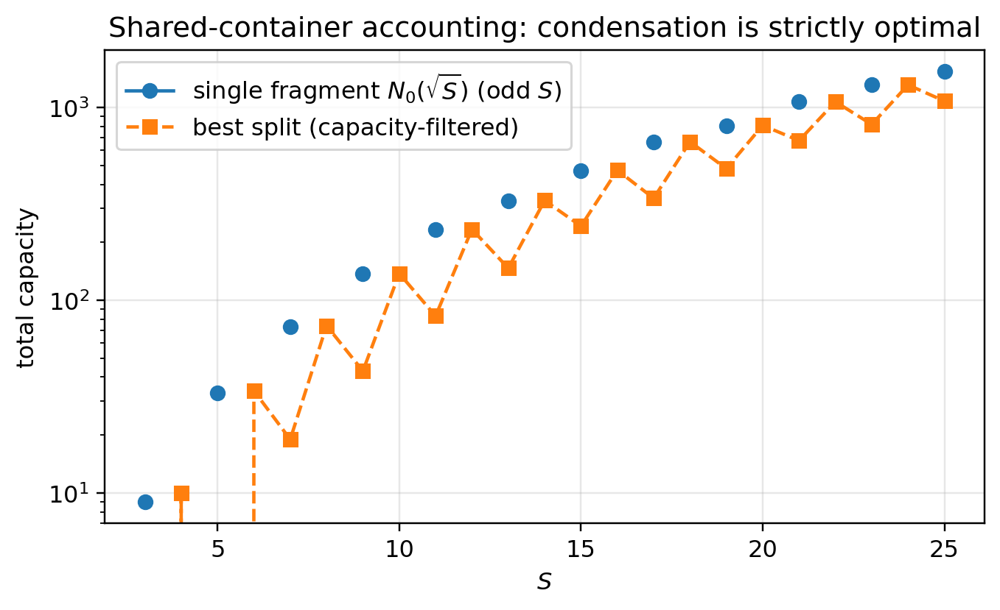
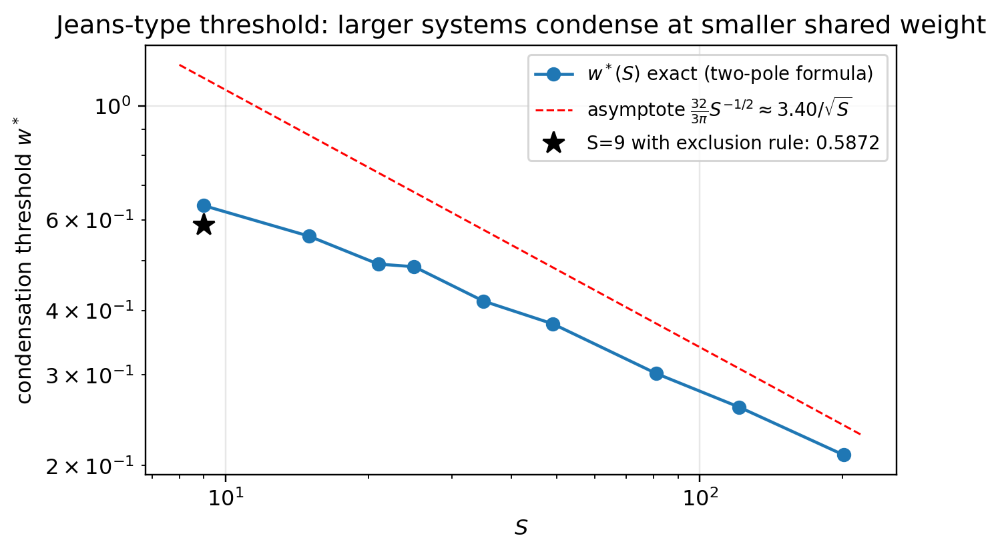
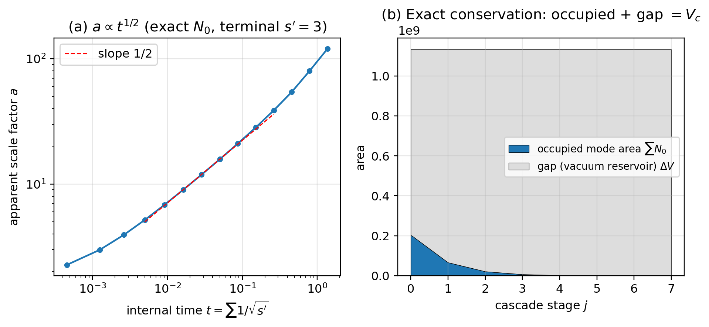

# 論文8：二つの会計 — 凝縮・内部膨張・面積法則

## 共有曲率会計による分裂定理の反転・Jeans 型閾値・内部時計と $a\propto t^{1/2}$・貯水池としての真空

著者: 木原 範昭 (Noriaki Kihara)
所属: WF System Co., Ltd.
ORCID: 0009-0004-6753-4020
版: v0.2（草稿・査読反映）
日付: 2026 年 6 月
DOI（本版）: 未付与
Concept DOI: 未付与
ライセンス: CC BY 4.0

* * *

## 要旨

論文5の例外なし分裂定理は、各断片が自分の容器を持つ**局所会計**に基づき、結論は完全分散であった。しかし本モデルの中核は $R^2=\sum\nu^2$ が曲率様スケールを定めることであり、平坦背景上の局所会計はモデル自身の主張と整合しない。本稿は曲率を会計に入れ、三つの結果を得る。

第一に、**分裂定理の反転**：全断片が総内容 $S$ で自己無撞着に決まる一つの共有容器に乗るとき、未充填量の最小化は総容量の最大化と同値になり、$S\le25$ の全数検査で**凝縮（単一断片）が厳密に最適**となる。局所会計（表面項 $s^{3/2}$、劣加法）→分散、共有会計（容量項 $s^2$、優加法）→凝縮 — 分かれ目は指数一つであり、物理的には「容器＝曲率が断片のものか、共有か」の選択である。両会計を混合した一径数族では、凝縮開始閾値が $w^*(S)\approx 3.40/\sqrt S\to0$ と振る舞う：**系が大きいほど、わずかな幾何の共有で凝縮が支配する**（Jeans 条件と同型のスケーリング。構造対応であり同一視ではない）。排他則（論文7）の下では、分散側の競合者が全1分割からフェルミ海型配置に変わるため、閾値はさらに低下する（$S=9$ で $0.6397\to0.5872$）。

第二に、**内部膨張則**：閉じた状態空間（容器固定、外部なし）の内部分割カスケードを、内部観測者（自分の断片を物差しとし、双対時計 $\tau=1/R'$ を持つ）の比で読むと、見かけのスケール因子は厳密な恒等式 $a^4 f=\pi^2/2$（$f$ は占有率）を満たし、主項で

$$
a\propto t^{1/2}
$$

に従う（分岐数に依存しない普遍則。深い3進カスケードの中央窓でフィット指数 0.507）。$f\propto a^{-4}$ は保存数の4次元希釈であり、内容が振動のみの系で輻射型の希釈則が出ることは整合性の確認である。膨張に外部も容器の成長も不要であり、**内向きに細分化する系を自身も縮む物差しで測ると膨張して見える**。排他則による終端の訂正（カスケードは $s'=3$ で終端し、全1状態は到達不能）込みで数値を与える。

第三に、**面積法則と貯水池**：状態あたりの位相空間面積はちょうど 2（$=4\delta_{\min}^2$）の剛体であり、総面積保存はエネルギー保存の双対読みと同一の法則である。一方、モード面積の厳密保存を課すとカスケードは0段で凍結する。実際に成立する厳密保存則は「占有面積＋ギャップ＝容器体積」であり、分裂とは占有面積をギャップへ移す過程である。**真空的状態（ギャップ）は無構造な空白ではなく、進化を可能にする面積の貯水池である。**

* * *

## キーワード

凝縮、分散、共有容器、Jeans 型閾値、内部観測者、スケール因子、輻射型希釈、面積法則、剛体タイル化、貯水池、占有率

* * *

## 1. はじめに

重力下の自己集積に関する古典的洞察は、一様媒質の不安定性がスケールに依存する（大スケールほど重力支配）という Jeans の判定条件 [5] に遡る。一方、縮退圧による支持（Chandrasekhar [6]）は、排他統計が集積に対抗する構造の古典例である。また、幾何・熱力学・情報の会計が表裏であるという視点は Jacobson [7] の熱力学的時空導出に代表される。

本稿はこれらの物理理論を拡張するものではない。行うのは、**数え上げモデルの内部で**、(i) 会計の取り方（局所か共有か）が分散/凝縮を切り替えること、(ii) 内部観測者の読みで膨張様の冪則が出ること、(iii) 面積の帳簿が真空様領域を貯水池として要請すること、の三点を全数検査と厳密恒等式で確立することである。標準宇宙論との対応（スケール因子・輻射優勢期の冪則 [8]）はすべて構造対応として警報つきで記録し、同一視は行わない。

* * *

## 2. 二つの会計と分裂定理の反転

### 2.1 局所会計（復習）

論文5 [2] の分裂定理は、各断片 $a$ が自分の外接容器 $V_4(R_a)$ を持つ局所会計 $\Delta_{\mathrm{loc}}=\sum_a[V_4(R_a)-N_0(R_a)]$ に基づく。体積ギャップの主項は表面項 $\propto s^{3/2}$ であり、冪 $3/2>1$ の劣加法性から、整合分裂は例外なくギャップを減らす — 結論は完全分散である。

### 2.2 共有容器（大域会計）

本モデル（論文4 [1]）では $R^2=\sum\nu^2$ が曲率様スケールを定める（$\Lambda_{\mathrm{model}}=3/R_c^2$ の形で書ける）。そこで全断片が総内容 $S=\sum_a s_a$ で自己無撞着に決まる一つの容器 $S^4(R_c)$、$R_c^2=S$ に乗るとする。固定された $S$ の下で容器体積は分割によらず一定なので、大域不整合の最小化は**総容量 $\sum_a N_0(\sqrt{s_a})$ の最大化**と同値である（この同値により結論は容器定数の選択に依存しない）。

$S\le25$ の整合分割の全数検査の結果：

1. **奇数 $S$**: 単一断片 $(S)$ が例外なく唯一の最適。
2. **偶数 $S$**: 単一スロットがないため、最適は常に $(S-1,1)$ — 最大断片＋最小衛星。対称分割ではなく**最大非対称**が勝つ（容量の凸性による「富めるものが富む」降着型構造）。

**図1. 共有容器会計（$S\le25$ 全数、容量則込み）：単一断片の容量が任意の分割を厳密に上回る。**

### 2.3 $Z_2$ 選択則による合体チャネルの制限

整合断片は奇数ラベルであるから、奇＋奇＝偶には親スロットがなく、**2体合体は禁止**される。排他則（論文7 [4]、$c(1)=1$）まで含めた最小の許容合体は $(3,3,1)\to7$ である。

### 2.4 Jeans 型閾値

容器を「局所 $(1-w)$＋共有 $w$」で混合した一径数族の全数検査により、凝縮開始閾値は

$$
w^*(S)\;\approx\;\frac{32}{3\pi}\,S^{-1/2}\;\approx\;\frac{3.40}{\sqrt S}\;\longrightarrow\;0
$$

と振る舞う（厳密式 $w^*=1-(N_0(\sqrt S)-S)/[\tfrac{\pi^2}2 S(S-1)]$ と二分法の照合済み）。**大スケールほど凝縮側** — Jeans 条件 [5] と同型のスケーリングである。

**図2. Jeans 型閾値 $w^*(S)$：厳密式と漸近形 $3.40/\sqrt S$。星印は排他則による $S=9$ の改訂値 0.5872。**

### 2.5 排他則による改訂

論文7の容量則の下では、一つの格子内の最大分散は全1分割ではなく**フェルミ海型**（最下殻から1セルずつ占有、$n_{\max}\approx\tfrac{\pi^2}2 M_F^2\sim S^{2/3}$、$M_F\approx(3S/\pi^2)^{1/3}$）である。分散側の競合者が弱体化するため凝縮閾値は低下し、$S=9$ では $w^*=0.6397\to0.5872$ となる。排他統計が縮退圧型の構造（Chandrasekhar [6] と同型）として分散側に現れることは特筆に値する（構造対応）。

### 2.6 占有率の二つのアトラクタ

自己無撞着容器上の占有率は、分散状態で $f_{\mathrm{disp}}\approx0.0848\,S^{-4/3}\propto\Lambda_{\mathrm{model}}^{4/3}$（フェルミ海、排他則込みの改訂値）、凝縮状態で $f_{\mathrm{cond}}\to3/16$（普遍値）となる。希薄な大域＋詰まった局所塊の二相共存は、定性的観察として記録する（観測量への写像は警報つきで付録に隔離）。

* * *

## 3. 内部膨張則：$a\propto t^{1/2}$

### 3.1 設定

閉じた状態空間（$R_c^2=S$ 固定、外部なし）の内部分割カスケードを考える。断片が代表値 $s'$ を持ち $n=S/s'$ 個あるとき、見かけのスケール因子を断片間平均距離と断片サイズの比 $a=d/R'$ で定義すると、占有率との間に主項で厳密な恒等式

$$
a^4\,f=\frac{\pi^2}{2}
$$

が成り立つ。**見かけの膨張とスカスカ化は同一の量の二つの読み**であり、$f\propto a^{-4}$ は4次元での保存数希釈（輻射型）と同型である。

### 3.2 内部時計と主結果

各断片の固有周期は $\tau=1/R'=\lambda'$ — **双対関係 $\nu\lambda=1$ 自体が時計**である（論文6 [3]）。$Z_2$ 選択則により2分木は禁止され、最小カスケードは3分木となる。$k$ 分木自己相似カスケードについて：

- 段数に対して：1段あたりの e-fold は $\ln k/4$（指数成長）。
- **内部時間に対して**：$a^4\propto1/s'$、$t\propto1/\sqrt{s'}$ より、主項で

$$
\boxed{\;a\propto t^{1/2}\;}
$$

**分岐数 $k$ に依存しない**（任意の幾何的スケジュールで成立）。深い3進カスケード（$S=3^{14}$）の中央窓でのフィット指数は 0.507 である。

### 3.3 整合性チェックとしての輻射則

$f\propto a^{-4}$ は輻射の希釈則であり、本モデルの内容は $\nu$（振動）のみである。**輻射期の法則が出るのは正しい答えであって、物質期や定数項期が出たら矛盾であった。** これはフィットではなく整合性の確認である（宇宙論との対応は構造対応 [8]）。

### 3.4 排他則による終端の訂正と時計の固有性

容量則により最終段 $3\to(1,1,1)$ は禁止され、**カスケードは $s'=3$ で終端する**（総 e-fold 数は $\tfrac14\ln(S/3)+\tfrac14\ln(\pi^2/2)$）。終端補正因子は $N_0(\sqrt3)=9=3^2$ により偶然厳密に $\pi^2/2$ のまま不変である。

時計の選択に対する頑健性も検査した：$a\propto t^{1/2}$ は**双対時計に固有**の法則である。面積時計（累積放出面積）では時間が天井に飽和して冪則は出ず、段数時計では指数則になる。「$\nu\lambda=1$ を時計に選んだ場合の輻射期則」というのが正確な地位である。

**図3. (a) 内部膨張則 $a\propto t^{1/2}$（厳密 $N_0$、終端 $s'=3$）。(b) 厳密保存則：占有面積＋ギャップ＝容器体積（真空＝貯水池）。**

### 3.5 解釈上の含意（モデル内、限定的）

(i) 膨張に外部も容器の成長も不要 — 膨張は物差しの細分化の別名である。(ii) 見かけ上遠い領域は階層を遡れば同一親セルの内部分割であり、初期の因果接触を別途仮定する必要がない（モデル内の観察。地平線問題の解決を主張するものではない）。(iii) 「開始」は最高振動数の未分化単一セルからの分割カスケード開始として、爆発なしに読める。

* * *

## 4. 面積法則と貯水池としての真空

### 4.1 剛体タイル化

$N_0(\sqrt s)$ のジャンプは奇数 $s$ でのみ生起し、各整合ラベル $m$ は $s$ 軸上の窓 $[m,m+2)$ をちょうど幅2で所有する。状態あたりの面積は

$$
\Delta s=2=4\,\delta_{\min}^2
$$

の**剛体**であり（上限＝下限）、総面積保存 $\sum\delta_a^2=S/2$ はエネルギー保存 $\sum\nu_a^2=S$ の双対読みと同一の法則である。対数面積と $(\nu,\lambda)$ 面積は制約上で厳密に一致し（ヤコビアン $1/\nu\lambda=1$）、分裂が面積保存写像（区分的シンプレクティック）として実現できる必要十分条件は面積の合算可能性である（Moser 型の存在定理）。

### 4.2 強い保存は進化を凍結する

面積をモード数 $\sum N_0$ と読み、貯水池なしの厳密保存を課すと、$s\le25$ の全整合分割で例外なくモード面積は減少する（$N_0$ の厳密な優加法性）。したがって**貯水池なしの面積保存則の下ではカスケードは0段で凍結する**。

### 4.3 真の保存則と貯水池

実際に成立する厳密保存則は

$$
\text{占有面積}\ \textstyle\sum N_0\;+\;\text{ギャップ}\ \Delta V\;=\;V_c\;=\;\text{一定}
$$

である（3進カスケード全段で恒等成立を確認）。分裂とは占有モード面積をギャップへ移す過程であり、放出は前傾型（第1分裂で容量の $1-1/k$ を放出）である。

> **真空的状態（ギャップ）は無構造な空白ではなく、進化を可能にする面積の貯水池である。** 凝縮（§2）はこの貯水池からの面積の引き出し（逆過程）として読める。

* * *

## 5. 本稿の主張範囲

主張すること：(1) 共有会計での凝縮最適性（全数検査）と局所/共有の指数による分かれ目。(2) $Z_2$ と排他則による合体チャネルの制限。(3) Jeans 型閾値 $w^*\propto S^{-1/2}$（厳密式つき）。(4) 恒等式 $a^4f=\pi^2/2$ と $a\propto t^{1/2}$（双対時計に固有、分岐数非依存、終端訂正込み）。(5) 剛体タイル化・面積保存＝エネルギー保存の双対読み・占有＋ギャップ＝一定・貯水池構造。

主張しないこと：(1) 重力・宇宙膨張・真空エネルギーの導出（「凝縮」「膨張」「真空」はモデル内の配置比較・数え上げ比の記述である）。(2) 距離の関数としての力（本稿が示すのは配置選好であって力ではない。$\lambda$ 側の位置の量化は論文7の関係幾何が最初の一歩である）。(3) 混合径数 $w$ のモデル内導出。(4) 観測宇宙論の数値の説明（付録の写像は警報つき記録であり、独立な裏づけを持たない）。

* * *

## 6. 結論

会計の取り方一つ — 容器＝曲率が断片のものか共有か — が、分散と凝縮を切り替える。共有曲率は凝縮を、内部分割は膨張様の冪則 $a\propto t^{1/2}$ を、面積の帳簿は貯水池としての真空を、それぞれ追加機構なしに与える。モデルは分散傾向と凝縮傾向の両方を内蔵し、競合の分かれ目はスケール依存の閾値として定量化される。

「希薄な大域と凝縮した局所塊の共存」「輻射型の希釈則」「進化の燃料としての真空」という三つの様相が、$\nu\lambda=1$・零点・非対称1ビットという在庫だけから出ることが、本稿の中心的観察である。

* * *

## 付録A：観測量への写像（警報つき記録）

分散状態の恒等式に観測占有率 $f_{\mathrm{obs}}\sim1.6\times10^{-31}$（1 m³ あたり水素原子 0.25 個の無次元化）を代入すると $S\approx2\times10^{22}$、単一階層のスケール幅は約11桁となり、観測されるスケール幅（36–61桁）には届かない。**単一階層での写像は棄却される**（健全な否定的結果として記録）。階層の入れ子で幅が乗算される場合の交差検証は未実施であり、検証可能性の回復には独立な第三の無次元観測量が必要である。

## 付録B：再現手順の要点

整合分割の全数列挙（$S\le25$）、混合会計の二分法（40反復）、カスケード数表（$k=3,m=14$、厳密 $N_0$）、タイル化検査（$s\le40$）、貯水池恒等式の全段確認による。スクリプトおよび研究ノートは公開リポジトリ（https://github.com/WurabeSeiji/ai-chat-logs-open）で提供する。

* * *

## 参考文献

[1] 木原 範昭, 論文4, v1.0, 2026. Concept DOI: 10.5281/zenodo.20638962.

[2] 木原 範昭, 論文5, v0.2, 2026.

[3] 木原 範昭, 論文6, v0.2, 2026.

[4] 木原 範昭, 論文7, v0.2, 2026.

[5] J. H. Jeans, "The stability of a spherical nebula," Philosophical Transactions of the Royal Society A 199 (1902), 1–53.

[6] S. Chandrasekhar, *An Introduction to the Study of Stellar Structure*, University of Chicago Press, 1939.

[7] T. Jacobson, "Thermodynamics of spacetime: The Einstein equation of state," Physical Review Letters 75 (1995), 1260–1263.

[8] S. Weinberg, *Cosmology*, Oxford University Press, 2008.

* * *

## ライセンス

本稿は CC BY 4.0 に基づき公開する。再利用、翻案、翻訳、引用を許可する。ただし、著者名、版、公開日、出典を明示すること。
