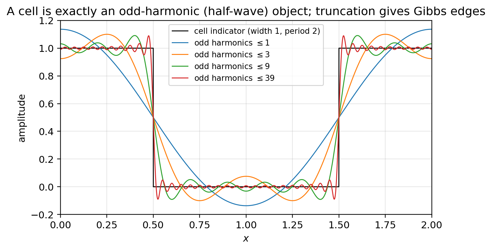
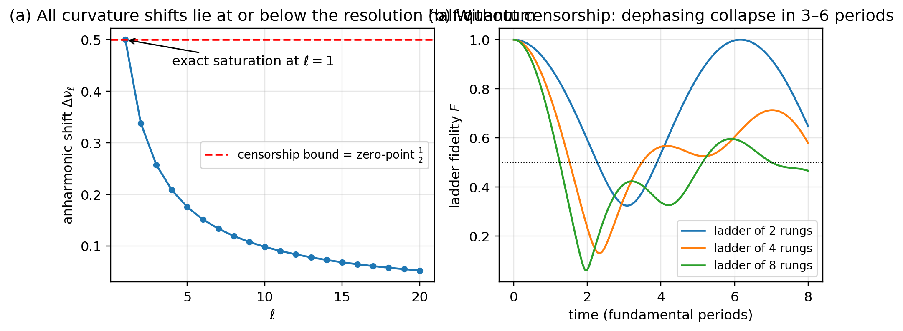
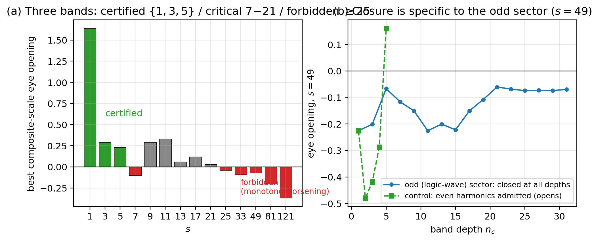

# 論文9：論理波と半波長検閲

## 奇数倍音梯子・振幅なしの整合条件・複合体の運動学的安定性・単一実体の存在上限

著者: 木原 範昭 (Noriaki Kihara)
所属: WF System Co., Ltd.
ORCID: 0009-0004-6753-4020
版: v0.2
日付: 2026 年 6 月
DOI（本版）: 10.5281/zenodo.20640463
Concept DOI: 10.5281/zenodo.20640462
ライセンス: CC BY 4.0

* * *

## 要旨

本稿は、逆数双対モデルにおける複合状態（多数のセルからなる塊）の**存在条件と安定性**を、干渉パターンの明示的構成によって検証する。

第一に、**論理波仮説の整備**：数え上げ条件の軸あたりの値 $|k_i|+1/2$ は零点 $1/2$ を基底とする奇数倍音列であり、奇数倍音のみのスペクトルは2値対称信号（矩形波・論理波）の指紋である。位相波が振幅を持たないことは近似ではなく、定理層（整数分割構造）と曲率整合の双方が要求する**整合条件**である。情報はエッジ位置＝倍音梯子の相対位相に宿り、矩形パルスの平行移動は係数への線形位相乗算と厳密に同値である（位置＝位相）。

第二に、**半波長検閲による運動学的安定化**：曲率に由来する梯子の非調和シフトの最大値は厳密に $1/2$（最下モード、有理数演算で確認）であり、検閲条件「シフト ≤ 分解能の半分」は**限界ちょうどで**満たされる。検閲なしではシフトを実在の力学とみなすと複合体は3–6基本周期で脱位相崩壊するが、検閲下では連続崩壊チャネルが運動学的に閉じ、残る崩壊は離散チャネル（論文7）のみとなる。複合粒子の安定性は力学的偶然ではなく**変形空間の量子化**である。副産物として、この保護が成立する最大次元が $d=4$ であることを観察する（規格化の固定は論文11）。

第三に、**干渉閉合テストと存在上限**：単一セルは奇数倍音のみで厳密に構成できる（幅/周期＝1/2 は偶数倍音が恒等的に消える唯一の充填率）。奇数倍音梯子が入れ子になる条件はスケール比が奇数であること（**奇数入れ子定理** — 系譜の奇数 $k$ 則の波動的再導出）。占有構造を自分の波だけで証明できるか（基本波帯域のアイ開口）を奇数 $s$ 梯子全体で厳密フーリエ計算した結果、安定種 $s=1,3,5$ は強い余裕（$\ge+0.22$）で自己証明でき、崩壊敷居 $s=7$ は証明不能、$s\ge9$ は臨界的、そして **$s\ge25$ では複合体スケールの証明が消滅、$s\ge49$ では奇数セクターのどの帯域でも証明不能**（帯域深さ31まで検証、余裕は $s$ と共に単調悪化）であることが確定した。対照実験により、偶数倍音を許せば回復することから、**閉鎖は論理波（奇数・2値）構造に固有**である。

帰結として、大きい内容 $S$ は平坦な単一実体としては存在できず、証明可能な小実体の入れ子としてのみ存在できる — **階層化は選択ではなく強制である**。

* * *

## キーワード

矩形波、奇数倍音、Gibbs 現象、Nyquist 直交、半波長検閲、運動学的安定性、ソリトン的波束、存在上限、階層化、自己証明

* * *

## 1. はじめに

論文7 [4] で確立した安定種 $\{1,3,5\}$ と崩壊敷居 $s=7$ は、チャネルの**数え上げ**から得られた。本稿の問いは、その安定性が波のレベルで支えられているか、である：

> エッジの立った奇数倍音の波で、(1) 安定した4次元セルの干渉パターンは実際に描けるか。(2) それが 9 個、137 個と積み上がったとき、安定した干渉パターンは描けるか。これを検討しなければ、安定でいられる**限界**と安定である**理由**は説明できない。

道具立ては信号理論の古典に負う：矩形波の奇数倍音展開と打ち切りに伴う Gibbs 現象 [5]、帯域制限信号の標本化と記号間干渉のない伝送（Nyquist/Shannon [6]）。安定性の構図は、連続崩壊チャネルが量子化によって閉じるという原子の安定化（Bohr [7]）と論理構造を共有し、形状を保つ局在波という様相はソリトン（Zabusky & Kruskal [8]）と構造的に対応する。いずれも構造対応であり同一視ではない。

* * *

## 2. 論理波仮説

### 2.1 奇数倍音は格子の中にいる

数え上げ条件の軸あたりの値は $|k_i|+\tfrac12=(2|k_i|+1)/2\in\{\tfrac12,\tfrac32,\tfrac52,\ldots\}$、すなわち**零点 $1/2$ を基底とする奇数倍音列**である（偶数倍は出現しない）。半波対称 $f(t+T/2)=-f(t)$ を持つ信号は偶数倍音を厳密に持たないから、奇数倍音スペクトルは**2値対称信号（論理波）の指紋**である。

### 2.2 倍音梯子＝階層系譜

カスケードの親子関係は代表振動数で 親 $\nu=k\times$ 子 $\nu'$（$k$ 奇数）。したがって、ある断片の奇数倍音列とはその断片の**祖先鎖**のことである。混合 $k$ カスケードの閉包はちょうど完全な奇数倍音列を実現する（奇数＝奇素数の積）。

### 2.3 振幅なしは整合条件である

位相波が振幅を持たないことは、二つの独立な要求から従う。

1. **定理層の整数性**：論文5–8の定理群（分裂定理・凍結定理・$Z_2$・タイル化）はすべて「$S$ の奇数分割」という整数組合せ構造の上に立つ。連続振幅が自由度なら収支は連続体に溶け、定理は一つも生き残らない。
2. **曲率整合**：振幅は伝播方向の外への変位であり、その二乗の局所エネルギー密度が局所曲率と結合して自己相互作用する。位相のみの波（±1 値）は局所エネルギー密度が一様であり、線形位相計算が厳密のまま生き残る。なお 0/1 論理波は冪等性 $\chi^2=\chi$ により二乗密度が自分自身に局在するため、曲率の影響は不可避であり、その帰結（非調和性）が §3 の主題である。

### 2.4 位置＝位相

矩形波の全情報はエッジ位置（零交差）にあり、高さは情報を運ばない。フーリエのシフト定理により、矩形パルスの平行移動は係数への線形位相乗算と厳密に同値である。**「位置」という情報は振幅ではなく倍音梯子の相対位相に住む。** 梯子を $\nu_{\max}$ で切断するとエッジ幅は $\sim1/(2\nu_{\max})$、リンギングは約9%で切断次数に依らず不滅である（Gibbs [5]）。最小エッジ幅＝分解能限界として零点 $\delta_{\min}$ が再登場する。

**図1. セル＝奇数倍音の固有の住人：幅1・周期2の指示関数（偶数倍音は厳密にゼロ）と奇数打ち切り部分和の Gibbs エッジ。**

* * *

## 3. 半波長検閲：複合体の運動学的安定化

### 3.1 非調和シフトの厳密限界

複合体の容器上の梯子は曲率により非調和になる。最大シフトは恒等式 $(\ell+\tfrac32)^2-\ell(\ell+3)=\tfrac94$ から

$$
\Delta\nu_\ell=\frac{9/4}{(\ell+\tfrac32)+\sqrt{\ell(\ell+3)}},\qquad
\Delta\nu_1=\frac{9/4}{9/2}=\boxed{\tfrac12}
$$

であり、$\ell$ について厳密単調減少、**最大値は最下モードでちょうど零点 $1/2$ に一致する**（有理数演算で確認）。検閲条件「歪みシフト ≤ 分解能の半分」は近似的にではなく**限界ちょうどで**満たされる。

### 3.2 検閲なしの崩壊時間（背理法）

シフトを実在の力学的位相ドリフトとみなすと、矩形波型重みの梯子の忠実度は **3–6 基本周期で 50% を切る**（梯子本数 2–8 で確認）。古典電子が連続放射で $10^{-11}$ 秒で核に落ちるのと同じく、連続チャネルが開いていれば複合体は一瞬で崩壊する。

**図2. (a) 非調和シフトの厳密限界：全シフトは零点 $1/2$ 以下、等号は $\ell=1$ のみ。(b) 検閲なしの脱位相崩壊（3–6基本周期）。**

### 3.3 検閲下の安定性

シフトはすべて分解能（単位記録、論文6 [3]）の半分以下であり、記録されない差異には事実がない（記録定理）。したがって連続崩壊チャネルは**運動学的に閉じ**、残る崩壊は離散チャネル — 整合分裂（奇数分割＋$Z_2$＋容量則、論文7）のみとなる。

| | 原子（実物理） | 本モデルの複合体 |
|---|---|---|
| 連続崩壊チャネル | 古典電子の連続放射 | 曲率脱位相（3–6周期） |
| チャネルを閉じる量子 | $\hbar/2$ | $\delta_{\min}^2=1/2$ |
| 残る遷移 | 離散スペクトル間の量子遷移 | 離散チャネル（論文7で列挙） |

複合体の安定性は力学的偶然ではなく**変形空間の量子化**である（Bohr 模型との構造対応 [7]。同一視はしない）。

### 3.4 複合体の雲と三層記述

帯域構造から、複合体の内部に複合体より速く振動するものは存在しない（複合体は自分自身の紫外カットオフである）。内部配置は $B_4$ ゲージ（論文6）であり、観測可能な内容はゲージ不変多重項と代表ラベルに尽きる（$R=3$：セル基底137 → 多重項7 → 代表1）。個々のセルの崩壊はゲージ非不変であり、物理的事象として定義されない — 攻撃面は名目容量よりはるかに小さい。

### 3.5 次元についての観察

$S^d$ 梯子の最大シフトは $\Delta\nu_1(d)=(\sqrt d-1)^2/2$ に厳密簡約され、検閲条件 $\le1/2$ は $d\in[0,4]$ と同値、飽和は両端のみである。**$d=4$ はこの保護が成立する最大次元**である。この観察の地位（規格化・結合の固定）は論文11で扱う。

* * *

## 4. 干渉閉合テスト：存在の上限

### 4.1 単一セルの厳密閉合

幅1のセルを周期2に置いた指示関数は偶数倍音をゼロ（機械精度）にする — 幅/周期＝1/2 は半波対称が厳密に成立する**唯一の充填率**であり、セルは奇数倍音の固有の住人である。最小の構成（基本波1本/軸）で既にエッジ幅 0.43 と零点幅 $1/2$ の内側に収まる。

### 4.2 奇数入れ子定理

セルの梯子（周波数 $m/2$、$m$ 奇数）が複合体の梯子（$n/2R$、$n$ 奇数）に乗る条件は $n=mR$、すなわち**スケール比 $R$ が奇数であること**（保持率は $R$ 奇数で 100%、偶数で厳密に 0%）。系譜の奇数 $k$ 則（§2.2）が、波の閉合だけから再導出される。偶数 $R$ の複合体は単一のコヒーレントな論理波面を持てない — $R^2$ の分類定理（論文5 [2]：単一状態は奇数）と独立な経路で同じ排除に到達する。

### 4.3 基本波証明可能性と三帯構造

複合体が「自分の波長の波だけで自分の占有構造を証明できるか」を、占有場の厳密フーリエ係数（構造因子×sinc、格子ジッタなし）と奇数帯域でのアイ開口（占有/空スロットの分離）で判定した。複合体スケール基準（証明帯域の波長 ≥ セル基本波長）での最良開口：

| $s$ | 1 | 3 | 5 | 7 | 9 | 11 | 13 | 17 | 21 | 25 | 33 | 49 | 81 | 121 |
|---|---|---|---|---|---|---|---|---|---|---|---|---|---|---|
| 最良 eye | +1.64 | +0.29 | +0.23 | **−0.10** | +0.29 | +0.33 | +0.06 | +0.12 | +0.03 | **−0.04** | −0.09 | −0.07 | −0.20 | −0.37 |

> **三帯構造**:
> - **確証帯 $s\in\{1,3,5\}$**: 基本波1本で余裕 $\ge+0.23$。論文7の絶対安定種と一致。
> - **臨界帯 $s=9$–$21$**: 証明可能だが余裕は減衰・振動。例外は $s=7$ — 複合体スケールで証明不能な唯一の小ラベル（崩壊敷居と一致）。
> - **禁止帯 $s\ge25$**: 複合体スケール証明は消滅。$s\ge49$ では奇数セクターの**全帯域**で不能（帯域深さ31・波長0.45セルまで検証、$-0.07$ で飽和）、余裕は $s$ と共に単調悪化（$s=121$ で $-0.37$）。

**図3. (a) 基本波証明可能性の三帯構造（厳密値）：確証帯 $\{1,3,5\}$／臨界帯／禁止帯。(b) $s=49$ の奇数セクターは深さ31まで閉、対照実験（偶数倍音許可）は開く — 閉鎖は論理波固有。**

### 4.4 対照実験：閉鎖は論理波固有

偶数倍音も許した全帯域では、$s=25$ は深さ4、$s=49$ は深さ5で開く。占有情報自体は存在するが、**偶数倍音にしか住めない** — 偶数倍音は2値対称信号のアルファベットの外である。大きな塊は「描けない」のではなく「**論理波としては描けない**」。

### 4.5 階層化の強制

$s=81$ は単一実体としては存在不能だが、$s=9$ の子9個の入れ子としてなら各レベルが証明可能な実体だけで構成できる。

> 大きい $S$ は平坦な塊としては存在できず、証明可能な小実体の入れ子としてのみ存在できる。**内向きの自己相似階層（論文4 [1]）は選択でも傾向でもなく、論理波存在論の下での強制である。** 「高い周波数の塊が安定に存在できない」ことは、崩壊の動力学を要せず、存在様式の運動学的不能として示される。

外部から見た安定種の姿は、間隔 $1/R'$ の奇数コムを内蔵し、広がり $2R'$ に局在し、周期ごとに自己復元する準矩形の孤立波束である（半幅×基本波＝$1/2$ の最小不確定性波束。古典ソリトン [8] が非線形性で分散を打ち消すのに対し、本モデルの波束は**検閲が分散を殺す**ことで形を保つ — 構造対応）。

* * *

## 5. 本稿の主張範囲

主張すること：(1) 格子＝奇数倍音梯子、梯子＝系譜。(2) 振幅なし＝整合条件（二つの独立な要求）。(3) 非調和シフトの厳密限界 $1/2$ と検閲による運動学的安定化（背理法込み）。(4) 単一セルの厳密閉合と奇数入れ子定理。(5) 基本波証明可能性の三帯構造と存在上限（$s\ge25/49$）、対照実験による論理波固有性、階層化の強制。

主張しないこと：(1) 実宇宙の物質・場・粒子との同一視（「論理波」「安定性」「波束」はモデル内の構成様式の記述である）。(2) 崩壊の動力学（遷移率・寿命）。(3) $d=4$ の主張の昇格（観察に留める。条件の固定は論文11）。(4) 倍音梯子の縦方向（階層間コヒーレンス）の完全な記述 — 倍音あたりのエネルギー収支（切断解か系譜解か）は未決の問題として明示する。

* * *

## 6. 結論

複合状態の安定性は二階建てで支えられている。数え上げの階（論文7：チャネルの有無）と波の階（本稿：検閲が連続崩壊を閉じ、干渉閉合が存在の上限を引く）である。両者は独立な計算でありながら、安定種 $\{1,3,5\}$ と敷居 $s=7$ で一致した。さらに波の階は数え上げに無い情報 — 存在の上限と階層化の強制 — を与えた。単一の巨大な実体という存在様式は、このモデルでは論理波構造そのものによって禁止されている。

* * *

## 付録：再現手順の要点

非調和シフトは恒等式と有理数演算、崩壊時間は梯子忠実度の数値積分、閉合テストは厳密フーリエ係数（構造因子×sinc）とアイ開口の全数評価（$s\le121$、複数解像度での頑健性確認込み）による。スクリプトおよび研究ノートは公開リポジトリ（https://github.com/WurabeSeiji/ai-chat-logs-open）で提供する。

* * *

## 参考文献

[1] 木原 範昭, 論文4, v1.0, 2026. Concept DOI: 10.5281/zenodo.20638962.

[2] 木原 範昭, 論文5, v0.2, 2026. Concept DOI: 10.5281/zenodo.20640454.

[3] 木原 範昭, 論文6, v0.2, 2026. Concept DOI: 10.5281/zenodo.20640456.

[4] 木原 範昭, 論文7, v0.2, 2026. Concept DOI: 10.5281/zenodo.20640458.

[5] E. Hewitt and R. E. Hewitt, "The Gibbs–Wilbraham phenomenon: An episode in Fourier analysis," Archive for History of Exact Sciences 21 (1979), 129–160.

[6] C. E. Shannon, "Communication in the presence of noise," Proceedings of the IRE 37 (1949), 10–21.

[7] N. Bohr, "On the constitution of atoms and molecules," Philosophical Magazine 26 (1913), 1–25.

[8] N. J. Zabusky and M. D. Kruskal, "Interaction of 'solitons' in a collisionless plasma and the recurrence of initial states," Physical Review Letters 15 (1965), 240–243.

* * *

## ライセンス

本稿は CC BY 4.0 に基づき公開する。再利用、翻案、翻訳、引用を許可する。ただし、著者名、版、公開日、出典を明示すること。
