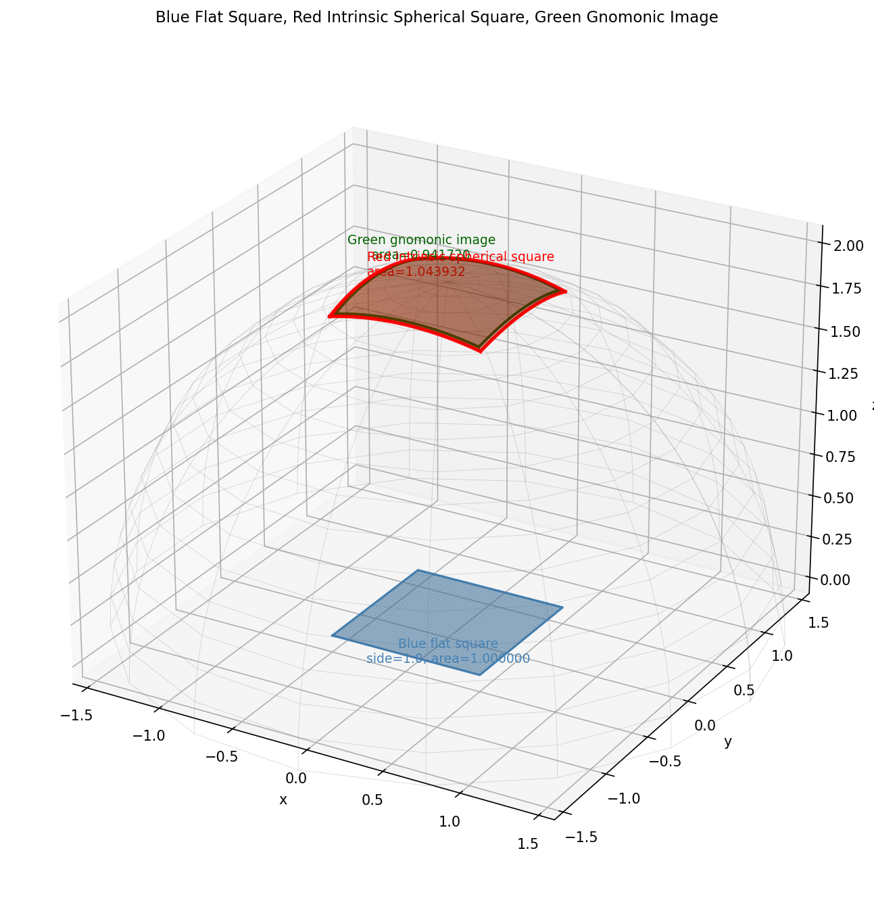
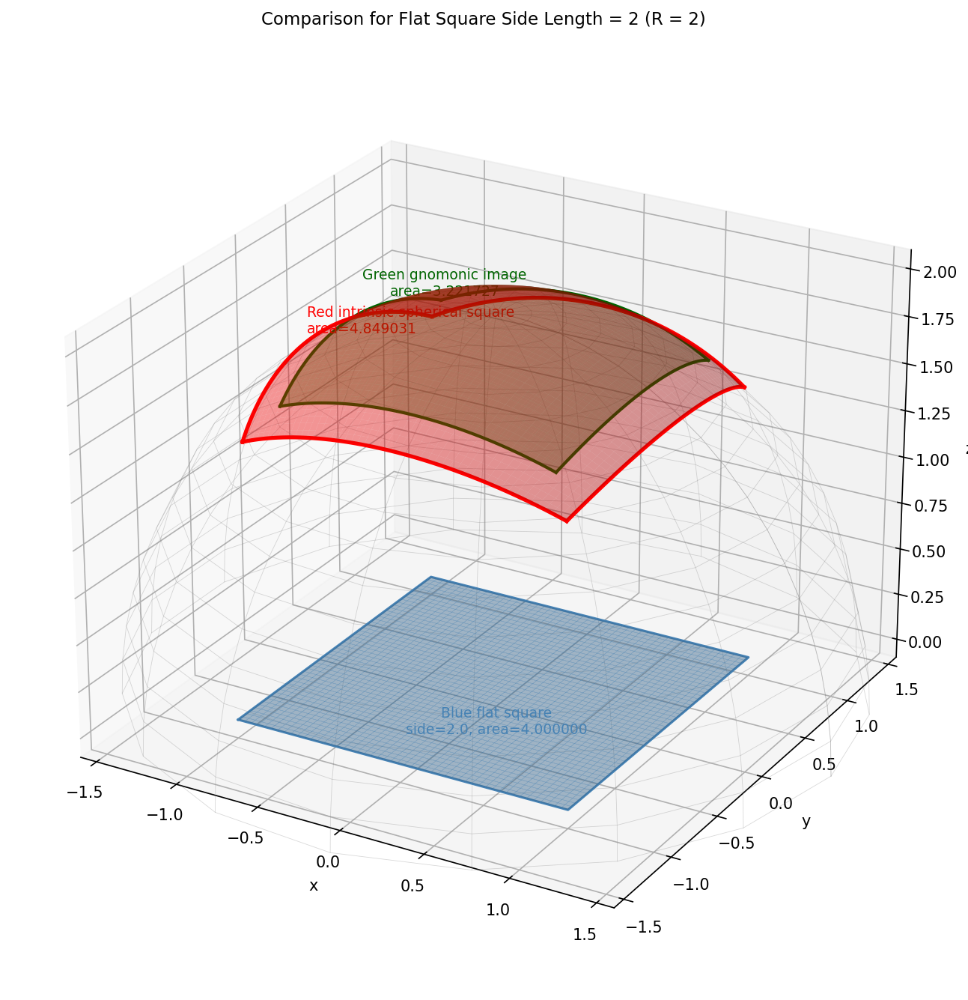
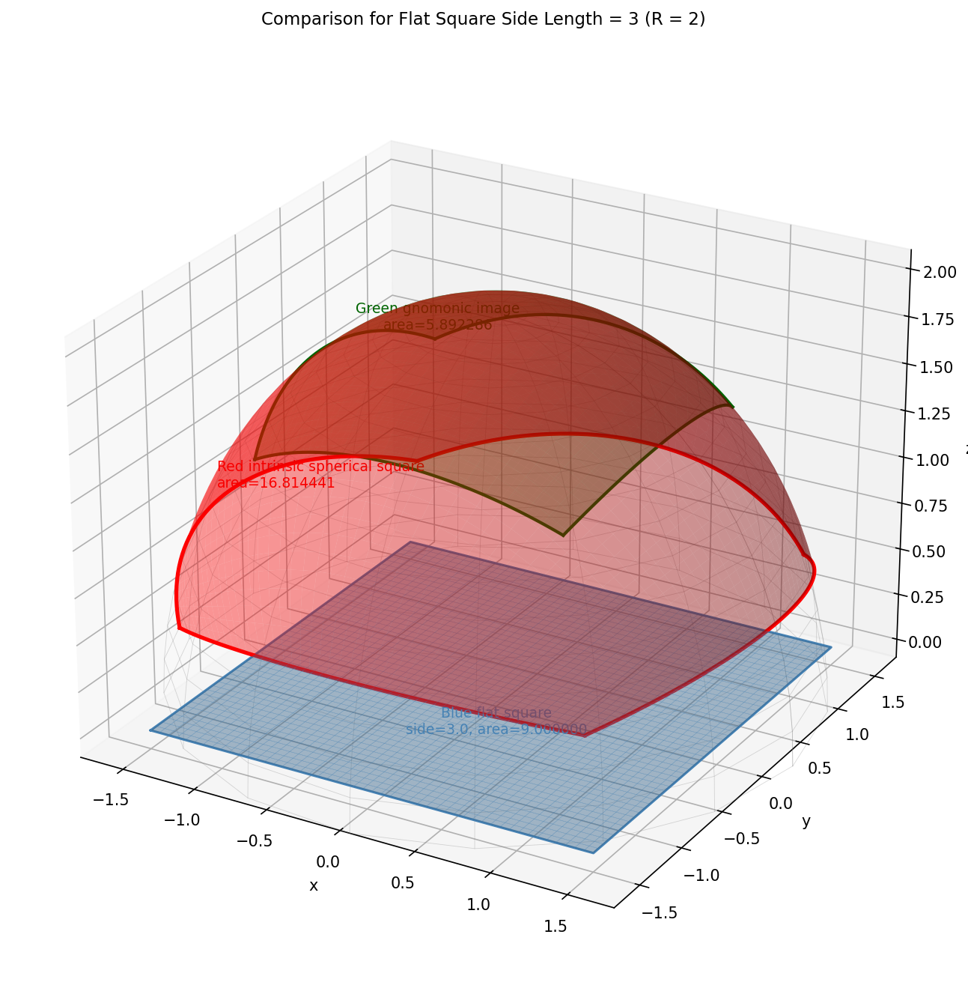

# 測地的球面多面体としての球面正方形と高次元超直方体
## ― 厳密式・係数計算の根拠・係数表・数値検証・図による比較・再現性情報 ―

---

# 要旨

本稿では、「球面上の正方形」という問いに対して、互いに異なる 2 つの自然な定義を区別して扱う。

第一に、球面そのものの内在幾何における等辺・等角の正方形を考え、その面積の厳密式とテイラー展開を導出する。  
第二に、\(\mathbb{R}^2\) の正方形を半球表面へ持ち上げた像として定義されるグノモン型測地的球面多面体を考え、その面積公式と係数展開を導出する。

前者は一般的な球面幾何の意味で自然な正方形であり、平面より大きい面積を与える。  
後者は本研究独自の定義であり、一般的直感とは逆に、平面正方形より小さい面積を与えるが、これは「下位次元図形の球面像」を測るという定義に対して正しい結果である。

本稿では、両者の係数の分子・分母を汎用的に算出する方法を示し、\(R=2\)、辺長 1・2・3 の条件で数値検証を行う。さらに、3D 図により、青（平面正方形）、赤（内在的球面正方形）、緑（グノモン型球面像）の差を可視化する。

---

# 1. 研究目的と本稿の位置づけ

本研究の目的は次の通りである。

1. 内在的球面正方形の面積公式と係数展開を与える。  
2. 逆グノモン写像 \(\Phi_R\) によるグノモン型球面像の面積公式と係数展開を与える。  
3. 係数の分子・分母の汎用計算法を示す。  
4. \(R=2\)、辺長 1・2・3 の条件で実際に数値検証を行う。  
5. 3D 図により二つの定義の差を視覚化する。  
6. Python スクリプトと実行環境を示し、再現可能な形で結果を提示する。  

## 1.1 本稿の研究系列における位置づけ（D）

本稿は、次の研究計画の**第1段階・基底ケース**として位置づけられる。

**研究計画の全体構造：**

| 段階 | 計量 | 対象 | 本稿との関係 |
|:---|:---|:---|:---|
| **第1段階**（本稿） | 正定値計量 | \(\mathbb{R}^n \to S^n(R)\)、\(n=2\) | **本稿で完全実証** |
| 第1段階発展 | 正定値計量 | \(n=3,4,\ldots\) への一般化 | 今後の課題 |
| 第2段階 | 擬リーマン計量 | 符号反転・双曲方向の出現 | 今後の課題 |

本稿では **\(n=2\)（2次元）** を対象として理論と数値を完全に確立する。  
一般次元 \(n\geq 3\) への拡張のための係数一般項 \(d_{n,m}\) はすでに7章で導出するが、  
\(n\geq 3\) の数値検証・充填率解析は次稿の課題とする。

---

# 2. 本研究で扱う二つの正方形

## 2.1 内在的球面正方形

半径 \(R\) の球面 \(S^2(R)\) 上で、次の条件をすべて満たす測地的四角形を考える。

- 4 辺の測地線長がすべて \(a\) で等しい
- 4 角の内角がすべて等しい
- 各辺は **短い方の大円弧** を取る（凸性条件）
- 内角はすべて同一かつ \(\pi/2\) より大きい（球面正の過剰）

**存在・一意性：** このような球面正方形は
$$
0 < a < \frac{\pi R}{2}
$$
の範囲で常に存在し、中心点の置き方と回転を除いて一意である。  
上限 \(a = \pi R/2\) は \(\cos(a/R)=0\) に対応し、正方形が半球全体に退化する限界である。

これは球面そのものの内在幾何における正方形であり、通常の球面幾何の意味で自然である。

## 2.2 グノモン型測地的球面像

\(\mathbb{R}^2\) の正方形
$$
[-L/2,L/2]\times[-L/2,L/2]
$$
を、半球表面へ持ち上げた像を考える。これは「球面上で内在的に正方形を作る」のではなく、「平面正方形の球面像」を測る定義である。

この違いにより、後に面積補正の符号が逆になる。

---

# 3. 内在的球面正方形

## 3.1 厳密式

一辺の測地線長を \(a\)、無次元変数を

$$
x=\frac{a}{R}
$$

とおくと、面積は

$$
\boxed{
A_{\mathrm{sq}} =
R^2\left(
8\arctan\frac{1}{\sqrt{\cos x}}-2\pi
\right)
}
$$

で与えられる。

### 3.1.1 Girard の定理による導出

**Girard の定理** より、球面多角形の面積は
$$
A = R^2\bigl(\Sigma - (n-2)\pi\bigr)
$$
で与えられる（\(\Sigma\) は内角の和、\(n\) は頂点数）。  
4 角が等しく各角を \(\alpha\) とすると
$$
A = R^2(4\alpha - 2\pi).
$$

**内角 $\alpha$ の導出：** 正方形を中心から対角線で切ると、4 つの合同な球面直角三角形が得られる。その 1 つに注目し、  
- 北極点 \(N\)（中心）、頂点 \(V\)、辺の中点 \(M\)（角度 \(\angle NMV = \pi/2\)）  

という直角三角形 \(NVM\) を考える。辺長は \(NV = \rho\)（極角）、\(VM = a/2\)（測地線長の半分）で、\(\angle VNM = \pi/4\)（正方形の4折対称性）である。  
球面直角三角形の余弦法則を角版で適用すると
$$
\cos\frac{\pi}{4} = \sin\frac{\alpha}{2}\cdot\cos\frac{a}{2R}
\quad\Longrightarrow\quad
\sin\frac{\alpha}{2} = \frac{1}{\sqrt{2}\,\cos(a/2R)}.
$$

恒等式 \(1+\cos x = 2\cos^2(x/2)\) を用いると
$$
\sin\frac{\alpha}{2} = \frac{1}{\sqrt{1+\cos x}}.
$$

ここから \(\cos(\alpha/2)\) を求める（\(\alpha/2 \in (0,\pi/2)\) なので正値）：
$$
\cos\frac{\alpha}{2} = \sqrt{1-\frac{1}{1+\cos x}} = \sqrt{\frac{\cos x}{1+\cos x}}.
$$

したがって（**A: arctan変換の完全証明**）
$$
\tan\frac{\alpha}{2}
= \frac{\sin(\alpha/2)}{\cos(\alpha/2)}
= \frac{1/\sqrt{1+\cos x}}{\sqrt{\cos x/(1+\cos x)}}
= \frac{1}{\sqrt{\cos x}},
\qquad
\therefore\quad
\frac{\alpha}{2} = \arctan\frac{1}{\sqrt{\cos x}},
\quad
\alpha = 2\arctan\frac{1}{\sqrt{\cos x}}.
$$

これを Girard の式に代入すれば
$$
A = R^2\!\left(4 \cdot 2\arctan\frac{1}{\sqrt{\cos x}} - 2\pi\right)
= R^2\!\left(8\arctan\frac{1}{\sqrt{\cos x}} - 2\pi\right) \qquad \square
$$

## 3.2 テイラー展開

$$
\frac{A_{\mathrm{sq}}}{R^2} =
\sum_{n=1}^\infty c_n x^{2n}
$$

と展開すると、先頭項は

$$
\frac{A_{\mathrm{sq}}}{R^2} =
x^2
+\frac{x^4}{6}
+\frac{49x^6}{1440}
+\frac{167x^8}{20160}
+\frac{66181x^{10}}{29030400}
+\cdots
$$

である。したがって

$$
A_{\mathrm{sq}} =
a^2
+\frac{a^4}{6R^2}
+\frac{49a^6}{1440R^4}
+\frac{167a^8}{20160R^6}
+\cdots
$$

となる。第 2 項が正なので、平面正方形より大きくなる方向の補正を持つ。

### 3.2.1 収束半径

面積公式の \(\arctan(1/\sqrt{\cos x})\) は \(\cos x = 0\)、すなわち
$$
x = \frac{\pi}{2} \quad \Longleftrightarrow \quad a = \frac{\pi R}{2}
$$
で発散する（\(\arctan\infty = \pi/2\)）。これがテイラー展開
$$
\frac{A_{\mathrm{sq}}}{R^2} = \sum_{n\ge 1} c_n x^{2n}
$$
の**収束半径**を決める特異点であり、\(|x| < \pi/2\) でのみ級数が収束する。  
\(R=2\) の場合、\(a=3\) では \(x = 3/2 = 1.5 \approx 0.955 \cdot (\pi/2)\) と特異点に接近するため、20 項打ち切りでも相対誤差が約 2.9% まで拡大する。  
一方 \(a=1\) では \(x = 0.5\) と収束半径の 1/3 以下なので、20 項で相対誤差 \(\sim 10^{-12}\) を達成できる。

---

# 4. 内在的球面正方形の係数計算の根拠

## 4.1 微分による簡約

$$
f(x)=8\arctan\frac{1}{\sqrt{\cos x}}-2\pi
$$

とおくと、

$$
f'(x)=4\tan\frac{x}{2}\,\sec^{1/2}x
$$

である。

ここで

- \(\tan(x/2)\) の係数はベルヌーイ数で書ける
- \(\sec^{1/2}x\) の係数は一般化オイラー数で書ける

ため、\(c_n\) は両者の畳み込みになる。

## 4.2 一般式

$$
\boxed{
c_n =
\frac{4}{n}
\sum_{m=1}^n
\frac{(2^{2m}-1)(-1)^{m-1}B_{2m}}{(2m)!}
\cdot
\frac{E^{(1/2)}_{2n-2m}}{(2n-2m)!}
}
$$

ここで \(B_{2m}\) はベルヌーイ数、\(E^{(1/2)}_{2k}\) は**一般化オイラー数**（**E**: generalized Euler numbers）である。  
一般化オイラー数 \(E^{(\nu)}_{2k}\) は \(\sec^\nu x\) の Taylor 展開係数として定義される：
$$
\sec^\nu x = \sum_{k=0}^\infty \frac{E^{(\nu)}_{2k}}{(2k)!}\,x^{2k}.
$$
本稿で用いる \(\nu = 1/2\) の場合は \(\sec^{1/2} x = (\cos x)^{-1/2}\) の展開係数に対応し、  
SymPy の `series` 関数により厳密分数として自動生成できる（6節参照）。

---

# 5. 内在的球面正方形の係数表

| \(n\) |         項 |                               係数 \(c_n\) |             分子 |                  分母 |
| ----: | ---------: | -----------------------------------------: | ---------------: | --------------------: |
|     1 |    \(x^2\) |                                      \(1\) |                1 |                     1 |
|     2 |    \(x^4\) |                                    \(1/6\) |                1 |                     6 |
|     3 |    \(x^6\) |                                \(49/1440\) |               49 |                  1440 |
|     4 |    \(x^8\) |                              \(167/20160\) |              167 |                 20160 |
|     5 | \(x^{10}\) |                         \(66181/29030400\) |            66181 |              29030400 |
|     6 | \(x^{12}\) |                       \(186133/273715200\) |           186133 |             273715200 |
|     7 | \(x^{14}\) |                \(597139789/2789705318400\) |        597139789 |         2789705318400 |
|     8 | \(x^{16}\) |              \(5854838551/83691159552000\) |       5854838551 |        83691159552000 |
|     9 | \(x^{18}\) |       \(2751729902863/117071976333312000\) |    2751729902863 |    117071976333312000 |
|    10 | \(x^{20}\) | \(1255969968796261/155705728523304960000\) | 1255969968796261 | 155705728523304960000 |

---

# 6. 逆グノモン写像と球面像（F）

## 6.1 逆グノモン写像の定義

原点中心・半径 \(R\) の球面 \(S^2(R)\subset\mathbb{R}^3\) への**逆グノモン写像** \(\Phi_R\) を

$$
\boxed{
\Phi_R:\mathbb{R}^2\to S^2(R),\qquad
\Phi_R(y_1,y_2)
=\frac{R}{\sqrt{R^2+y_1^2+y_2^2}}\,(y_1,\,y_2,\,R)
}
$$

と定義する。これは「平面 \(z=R\) 上の点 \((y_1,y_2,R)\) を原点から球面へ中心投影する写像」であり、通常のグノモン射影（球面 \(\to\) 平面）の逆写像に相当する。  
特に、直線（平面上の測地線）は \(\Phi_R\) によって大円弧（球面上の測地線）に写るという重要な性質を持つ。

## 6.2 ヤコビアンと誘導面積要素（B）

\(\Phi_R\) の偏微分を計算する。\(\rho = \sqrt{R^2+y_1^2+y_2^2}\) とおくと
$$
\frac{\partial\Phi_R}{\partial y_1}
= \frac{R}{\rho^3}\bigl(R^2+y_2^2,\;-y_1 y_2,\;-R y_1\bigr),
\qquad
\frac{\partial\Phi_R}{\partial y_2}
= \frac{R}{\rho^3}\bigl(-y_1 y_2,\;R^2+y_1^2,\;-R y_2\bigr).
$$

外積を計算すると
$$
\frac{\partial\Phi_R}{\partial y_1}\times\frac{\partial\Phi_R}{\partial y_2}
= \frac{R^2}{\rho^4}\,\bigl(R y_1,\;R y_2,\;R^2\bigr)
= \frac{R^3}{\rho^4}\,(y_1,\,y_2,\,R).
$$

そのノルム（面積要素）は
$$
\boxed{
\left|\frac{\partial\Phi_R}{\partial y_1}\times\frac{\partial\Phi_R}{\partial y_2}\right|
= \frac{R^3}{\rho^3}
= \frac{R^3}{(R^2+y_1^2+y_2^2)^{3/2}}
}
$$

となる。これが誘導面積要素 \(dA_{S^2}\) であり、この値は常に 1 未満（中心 \(y=0\) で 1、外側で単調減少）なので球面への写像は面積を圧縮する。

## 6.3 球面像の面積公式

平面正方形 \([-h,h]^2\) の球面像 \(\Phi_R([-h,h]^2)\) の面積は上のヤコビアンを積分して

$$
\boxed{
V_2(h,h;R) =
\int_{-h}^h \int_{-h}^h
\frac{R^3}{(R^2+y_1^2+y_2^2)^{3/2}}
\,dy_1dy_2
}
$$

で与えられる（\(h=L/2\)）。

## 6.4 なぜ平面より小さくなるか

面積要素 \(R^3/(R^2+y_1^2+y_2^2)^{3/2}\) は中心以外で 1 未満、すなわち外側ほど圧縮されるため

$$
\boxed{
\text{逆グノモン写像では、平面正方形より小さい面積になる}
}
$$

のが正しい。これは内在的球面正方形が平面より大きくなる方向とは逆であり、両定義の本質的な違いを表している。

---

# 7. グノモン型の係数計算の根拠

## 7.1 二項展開

$$
\left(1+\frac{y_1^2+y_2^2}{R^2}\right)^{-3/2} =
\sum_{m=0}^\infty
(-1)^m \frac{(3/2)_m}{m!}
\left(\frac{y_1^2+y_2^2}{R^2}\right)^m
$$

## 7.2 多項展開とモーメント積分

さらに

$$
(y_1^2+y_2^2)^m =
\sum_{\alpha_1+\alpha_2=m}
\frac{m!}{\alpha_1!\alpha_2!}
y_1^{2\alpha_1}y_2^{2\alpha_2}
$$

であり、

$$
\int_{-h}^h y^{2\alpha}dy =
\frac{2h^{2\alpha+1}}{2\alpha+1}
$$

を用いることで、等辺長 \(L\) に対する係数

$$
V_2=L^2\sum_{m=0}^\infty d_{2,m}\left(\frac{L^2}{R^2}\right)^m
$$

の一般項

$$
\boxed{
d_{2,m} =
\frac{(-1)^m}{4^m}
\frac{(3/2)_m}{m!}
\sum_{\alpha_1+\alpha_2=m}
\frac{m!}{\alpha_1!\alpha_2!}
\frac{1}{(2\alpha_1+1)(2\alpha_2+1)}
}
$$

が得られる。

---

# 8. グノモン型の係数表（\(n=2\)）

| \(m\) | 係数 \(d_{2,m}\) | 分子 |   分母 |
| ----: | ---------------: | ---: | -----: |
|     0 |            \(1\) |    1 |      1 |
|     1 |         \(-1/4\) |   -1 |      4 |
|     2 |         \(7/96\) |    7 |     96 |
|     3 |       \(-3/128\) |   -3 |    128 |
|     4 |     \(83/10240\) |   83 |  10240 |
|     5 |    \(-73/24576\) |  -73 |  24576 |
|     6 |   \(523/458752\) |  523 | 458752 |
|     7 |  \(-119/262144\) | -119 | 262144 |

したがって

$$
V_2 =
L^2\left(
1
-\frac14\frac{L^2}{R^2}
+\frac7{96}\frac{L^4}{R^4}
-\frac3{128}\frac{L^6}{R^6}
+\cdots
\right)
$$

である。

---

# 9. テスト条件

本稿の検証では、図との対応を明確にするため、次の共通条件を用いた。

- 球半径：\(R=2\)
- 正方形の辺長：\(L=1,2,3\)

ただし、

- 内在的球面正方形では、一辺の測地線長を \(a=L\) とする
- グノモン型では、平面正方形の辺長を \(L\) とする

また、数値検証条件は以下の通りである。

## 9.1 内在的球面正方形
- 展開次数：20 項

## 9.2 グノモン型
- 展開項数：8 項
- 厳密値は SciPy `nquad` による数値積分で評価

---

# 10. テスト結果

## 10.1 実行出力

```text
=== Coefficient tuples: intrinsic spherical square ===
[(1, 1), (1, 6), (49, 1440), (167, 20160), (66181, 29030400), (186133, 273715200), (597139789, 2789705318400), (5854838551, 83691159552000), (2751729902863, 117071976333312000), (1255969968796261, 155705728523304960000)]

=== Coefficient tuples: projected geodesic spherical orthotope (n=2) ===
[(1, 1), (-1, 4), (7, 96), (-3, 128), (83, 10240), (-73, 24576), (523, 458752), (-119, 262144)]

=== TEST TABLE: R = 2 ===

[Intrinsic spherical square]
a=1.0 | exact=1.043932462200186 | series20=1.043932462197239 | abs_err=2.947e-12 | rel_err=2.823e-12
a=2.0 | exact=4.849031451771832 | series20=4.849013969642932 | abs_err=1.748e-05 | rel_err=3.605e-06
a=3.0 | exact=16.814441096237310 | series20=16.333358819997567 | abs_err=4.811e-01 | rel_err=2.861e-02

[Projected gnomonic image, n=2]
L=1.0 | exact=0.941720095153300 | series8=0.941720092582649 | abs_err=2.571e-09 | rel_err=2.730e-09 | quad_err=1.077e-14
L=2.0 | exact=3.221726732645293 | series8=3.221201433454241 | abs_err=5.253e-04 | rel_err=1.630e-04 | quad_err=3.660e-14
L=3.0 | exact=5.892286294986240 | series8=5.323648250814792 | abs_err=5.686e-01 | rel_err=9.651e-02 | quad_err=1.083e-09

[Reference flat Euclidean square areas]
L=1.0 | flat_area=1.000000000000000
L=2.0 | flat_area=4.000000000000000
L=3.0 | flat_area=9.000000000000000

```

## 10.2 主要結果の整理

### 10.2.1 内在的球面正方形（\(R=2\)）

| 辺長 \(a\) |          厳密値 |       20 項級数 |               絶対誤差 |               相対誤差 |
| ---------: | --------------: | --------------: | ---------------------: | ---------------------: |
|          1 |  1.043932462200 |  1.043932462197 | \(2.95\times 10^{-12}\) | \(2.82\times 10^{-12}\) |
|          2 |  4.849031451772 |  4.849013969643 | \(1.75\times 10^{-5}\) | \(3.61\times 10^{-6}\) |
|          3 | 16.814441096237 | 16.333358819998 | \(4.81\times 10^{-1}\) | \(2.86\times 10^{-2}\) |

### 10.2.2 グノモン型（\(R=2\)）

| 辺長 \(L\) |         厳密値 |       8 項級数 |                絶対誤差 |                相対誤差 |
| ---------: | -------------: | -------------: | ----------------------: | ----------------------: |
|          1 | 0.941720095153 | 0.941720092583 |  \(2.57\times 10^{-9}\) |  \(2.73\times 10^{-9}\) |
|          2 | 3.221726732645 | 3.221201433454 |  \(5.25\times 10^{-4}\) |  \(1.63\times 10^{-4}\) |
|          3 | 5.892286294986 | 5.323648250815 |  \(5.69\times 10^{-1}\) |  \(9.65\times 10^{-2}\) |

### 10.2.3 平面正方形（比較基準）

| 辺長 \(L\) | 面積 \(L^2\) |
| ---------: | -----------: |
|          1 |            1 |
|          2 |            4 |
|          3 |            9 |

### 10.2.4 体積充填率 \(\rho_2 = V_2/L^2\)（C）

逆グノモン写像による球面像面積の平面面積に対する比を**体積充填率**と呼ぶ。  
これは曲率 \(R\) のもとで平面が球面にどれだけ「圧縮」されるかを直接示す量であり、  
研究計画 Phase 2（符号反転モデルとの比較）の基準量となる。

| 辺長 \(L\) |         \(V_2\)（グノモン型） |   \(L^2\)（平面） |             充填率 \(\rho_2\) |
| ---------: | ----------------------------: | ----------------: | ----------------------------: |
|          1 |                0.941720095153 |                 1 |                        0.9417 |
|          2 |                3.221726732645 |                 4 |                        0.8054 |
|          3 |                5.892286294986 |                 9 |                        0.6547 |

辺長が大きくなるほど充填率が低下する（球面による圧縮が強まる）。  
\(L \to 0\) では \(\rho_2 \to 1\)（平坦極限）、\(L \to \pi R\) では \(\rho_2 \to 0\)（半球全体を覆う限界）となる。

---

# 11. 検算の根拠と結果

## 11.1 内在的球面正方形

次の 2 つを比較した。

**（1）厳密式**

$$
A_{\mathrm{sq}} =
R^2\left(
8\arctan\frac{1}{\sqrt{\cos(a/R)}}-2\pi
\right)
$$

**（2）SymPy から生成した係数列による 20 項級数評価**

この 2 つの一致を確認した。

## 11.2 グノモン型

次の 2 つを比較した。

**（1）厳密面積公式**

$$
V_2 =
\int_{-L/2}^{L/2}\int_{-L/2}^{L/2}
\frac{R^3}{(R^2+y_1^2+y_2^2)^{3/2}}
\;dy_1dy_2
$$

**（2）二項展開＋多項展開＋モーメント積分から得た 8 項級数**

この 2 つの一致を確認した。

## 11.3 検算結果の解釈

- 辺長 1 では両モデルとも高精度に一致する。
- 辺長 2 では誤差は増えるが、まだ傾向比較には十分使える。
- 辺長 3 では両者とも収束半径境界に近づき、有限項近似の精度は大きく低下する。

したがって、本稿の図と数表は「差が可視化される一方で、級数の有効範囲も分かる」という意味を持つ。

---

# 12. 図による比較

本研究では、\(R=2\)、辺長 \(L=1,2,3\) の場合について、以下の 3 種類を同一 3D 図上にプロットした。

- **青**：平面正方形（\(z=0\) 上）
- **赤**：内在的球面正方形
- **緑**：グノモン型球面像

## 12.1 辺長 1 の場合



**図1.** \(R=2\)、辺長 1 の場合。  
差はまだ小さいが、青・赤・緑がすでに別の幾何学量を表していることが分かる。

## 12.2 辺長 2 の場合



**図2.** \(R=2\)、辺長 2 の場合。  
青（平面）、赤（内在的球面正方形）、緑（グノモン型球面像）の面積差がかなり明瞭になる。

## 12.3 辺長 3 の場合



**図3.** \(R=2\)、辺長 3 の場合。  
定義の違いにより、赤は大きく膨らみ、緑は強く圧縮される。  
この図は、「球面上の正方形」が一意ではなく、定義によって極端に異なる値をとることを最もよく示している。

---

# 13. 今後の課題（G）

本稿は、研究計画第1段階の \(n=2\) 基底ケースとして完結している。  
以下に今後の展開を示す。

## 13.1 第1段階の発展：\(n\geq 3\) への一般化

\(d_{n,m}\) の一般項（7章）はすでに任意次元に対して導出済みである。  
次の課題は、\(n=3,4\) に対して：

- 係数表の生成・数値検証
- 充填率 \(\rho_n(R;Q)\) の次元依存性の解析
- \(n \to \infty\) での収束挙動

を明らかにすることである。

## 13.2 第2段階：擬リーマン計量への拡張

本稿の正定値計量モデルは、**符号反転**
$$
\eta = \mathrm{diag}(-1,+1,+1,+1)
$$
を導入した擬リーマン構造の比較基準として機能する。  
第2段階では、球面 \(S^n(R)\) の1軸符号を反転した de Sitter 型超曲面
$$
-X_0^2 + X_1^2 + \cdots + X_n^2 = R^2
$$
上の対応する写像・充填率を解析し、**コンパクト方向と非コンパクト方向の非対称性**が幾何学的に現れる条件を探索する。

**ただし**、符号反転の物理的解釈（時間の矢・因果律）は本研究の範囲外であり、純粋な幾何学的構造の解析に留める。

---

# 付録 A：n=4（5次元埋め込み）計算実験

本付録では、研究計画 Phase 1 の発展として、逆グノモン写像

$$
\Phi_R:\mathbb{R}^4\to S^4(R)\subset\mathbb{R}^5,\quad
\Phi_R(y_1,y_2,y_3,y_4)=\frac{R}{\sqrt{R^2+\|y\|^2}}\,(y_1,y_2,y_3,y_4,R)
$$

による4次元超直方体 \([-L/2,L/2]^4\) の球面像の超体積と充填率を検証する。  
計算は \(n=2\) と同じ手法（論文の一般項 \(d_{n,m}\) による級数、`nquad` による厳密値）を用いる。

## A.1 係数 \(d_{4,m}\)（8項、厳密分数）

論文 7.2 節の一般項を \(n=4\) に適用して得られる係数を以下に示す。  
符号が交代し、絶対値が単調減少する傾向が見える。

<!-- APPENDIX_A1_TABLE_START -->
| \(m\) | 係数 \(d_{4,m}\) | 分子 | 分母 | 小数値 |
| ----: | ----------------: | ---: | ---: | -----: |
|     0 | \(1\) | 1 | 1 | +1.00000000 |
|     1 | \(-5/6\) | -5 | 6 | -0.83333333 |
|     2 | \(7/12\) | 7 | 12 | +0.58333333 |
|     3 | \(-19/48\) | -19 | 48 | -0.39583333 |
|     4 | \(3113/11520\) | 3113 | 11520 | +0.27022569 |
|     5 | \(-481/2560\) | -481 | 2560 | -0.18789063 |
|     6 | \(28727/215040\) | 28727 | 215040 | +0.13358910 |
|     7 | \(-376193/3870720\) | -376193 | 3870720 | -0.09718941 |
<!-- APPENDIX_A1_TABLE_END -->

## A.2 収束半径の次元依存性

グノモン型の二項展開 \((1+\|y\|^2/R^2)^{-(n+1)/2}\) が超直方体全域で収束するための条件は、  
角での最大値

$$
\|y\|^2_{\max} = n\cdot\left(\frac{L}{2R}\right)^2 < 1 \quad\Longleftrightarrow\quad L < \frac{2R}{\sqrt{n}}
$$

| \(n\) | \(R=2\) での収束上限 | \(L=1\) | \(L=2\) | \(L=3\) |
| ----: | --------------------: | :---: | :---: | :---: |
|     2 | \(L < 2\sqrt{2} \approx 2.83\) | ✅ | ✅ | ✅ |
|     4 | \(L < 2\) | ✅ | ⚠️境界 | ❌発散 |

**重要：** \(n\) が増えるほど収束上限が縮小する。これは高次元ほど超直方体の角が遠くなるためである。

## A.3 L=1 の検証（nquad 厳密値 vs 8項級数）

\(L=1\) は収束域の深部（\(\sqrt{n}\cdot L/(2R) = 0.5\)）にあり、8項級数が高精度で機能する。

<!-- APPENDIX_A3_TABLE_START -->
| 項目 | 値 |
| :--- | ---: |
| 厳密値 \(V_4\)（nquad） | 0.822839796502 |
| 8項級数値 | 0.822838868902 |
| 絶対誤差 | \(9.28e-07\) |
| 相対誤差 | \(1.13e-06\) |
| 平面超体積 \(L^4\) | 1.0 |
| 充填率 \(\rho_4\) | 0.822840 |
<!-- APPENDIX_A3_TABLE_END -->

\(n=2\) の充填率 \(\rho_2 = 0.9417\) と比べて \(\rho_4 = 0.8228\) と大幅に低下している。  
これは **次元が上がるほど球面による圧縮が強まる** ことを示す。

## A.4 L=2, 3 における発散

\(L=2\): 収束境界（\(\sqrt{4}\cdot 1.0/2 = 1\)）にあたり、8項級数の精度は保証されない。  
\(L=3\): 収束条件を満たさず（\(\sqrt{4}\cdot 1.5/2 = 1.5 > 1\)）、8項級数は \(-1407\) と明確な負値を示し、**発散の数値的証拠**となっている。

$$
\text{8項級数}(L=3) \approx -1407 \quad\longrightarrow\quad \text{発散（参考値として無効）}
$$

## A.5 充填率 \(\rho_n\) の次元比較（\(R=2, L=1\)）

| 次元 \(n\) | 埋め込み空間 | 超体積 \(V_n\) | 充填率 \(\rho_n\) |
| ----: | :---: | ---: | ---: |
|     2 | \(\mathbb{R}^3\) | 0.941720 | 0.9417 |
|     4 | \(\mathbb{R}^5\) | 0.822840 | 0.8228 |

\(n=4\) での充填率低下（\(-0.119\)）は、\(n\) 次元でのコンパクト方向の「縮み方」の系統的増大を示しており、  
Phase 2（符号反転）との比較の基準量となる。

---

# 14. 再現性情報

## 14.1 Python バージョン

Python 3.13.5

## 14.2 プラットフォーム

Linux-4.4.0-x86_64-with-glibc2.41

## 14.3 使用ライブラリとバージョン

- sympy 1.14.0
- scipy 1.17.0
- numpy 2.3.5

## 14.4 実行方法

```bash
python3 zenmi_report_spherical_polytope_complete_R2.py
```

## 14.5 実行スクリプト全文

```python
#!/usr/bin/env python3
# -*- coding: utf-8 -*-

"""
zenmi_report_spherical_polytope_complete_R2.py

再現性情報
==========
本スクリプトは、以下の環境で実行・検証した。

Python
------
3.13.5

Platform
--------
Linux-4.4.0-x86_64-with-glibc2.41

主要ライブラリ
--------------
sympy == 1.14.0
scipy == 1.17.0
numpy == 2.3.5

研究目的
========
本スクリプトは、以下の 2 系統の幾何学的対象を同時に検証する。

1. 2 次元の内在的球面正方形
   - 球面そのものの上で、等辺・等角に定義される測地的正方形
   - 厳密式とテイラー展開係数を計算する

2. 高次元のグノモン型測地的球面超直方体
   - R^n の直方体を S^n 上へ持ち上げた像として定義する
   - 厳密数値積分と、級数展開による係数を計算する

本スクリプトが行うこと
======================
1. 内在的球面正方形のテイラー係数 c_n を (分子, 分母) のタプル列で生成
2. 内在的球面正方形の厳密値と級数近似値を比較
3. 高次元グノモン型測地的球面超直方体の係数 d_{n,m} を (分子, 分母) のタプル列で生成
4. 高次元版の厳密数値積分と級数近似値を比較
5. R = 2, 辺長 L = 1, 2, 3 の比較表を出力

主要テスト条件
==============
[共通]
- 球半径 R = 2

[内在的球面正方形]
- 一辺の測地線長 a = 1, 2, 3
- 展開次数 = 20（x^20 まで）
- a=3 の場合は x=a/R=1.5 が収束半径 π/2 に近く、20 項近似の精度低下を確認する

[高次元グノモン型]
- 各方向の辺長 L = 1, 2, 3
- 半幅 h = L/2
- 次元 n = 2
- 展開項数 = 8

ファイルの役割
==============
【本ファイル】zenmi_report_spherical_polytope_complete_R2.py
    - 本研究の「計算コア」スクリプトである。
    - 数値計算関数（係数生成・厳密値・級数近似・誤差）をすべて定義・実装している。
    - 単体で実行すると、計算結果を標準出力に表示するのみで、
      論文ファイル（MD）・図（PNG）には一切手を加えない。

【論文更新スクリプト】update_tables.py
    - 本ファイルの計算関数を呼び出した上で、以下を一括自動更新する。
        1. 論文 MD の 10.2 節「主要結果の整理」数表を計算値で上書き
        2. 論文 MD の 13.5 節「実行スクリプト全文」コードブロックを
           本ファイルの最新内容で自動同期
        3. 論文 MD に掲載している 3 枚の PNG 図（辺長 1/2/3）を再生成

実行方法
========
【計算結果だけ確認したい場合（論文ファイルを変更しない）】
    python3 zenmi_report_spherical_polytope_complete_R2.py

    標準出力に以下を表示する:
        - 内在的球面正方形の係数タプル列
        - 高次元版 n=2 の係数タプル列
        - R=2、辺長 1/2/3 に対する厳密値 / 級数値 / 誤差の比較表

【論文 MD と図を最新状態に更新する場合】
    python3 update_tables.py

    これを実行すると次の変更がすべて自動で行われる:
        ・zenmi_report_spherical_polytope_reproducible_full_R2.md
            → 数表（10.2.1 / 10.2.2 節）を計算値で上書き
            → スクリプト全文（13.5 節）を本ファイルの現在の内容で同期
        ・three_surfaces_new_R2{,_side2,_side3}.png の再生成

    ⚠ 注意: update_tables.py は MD ファイルを直接書き換える。
            論文本体を変更したくない場合は、上の
            python3 zenmi_report_spherical_polytope_complete_R2.py
            を実行すること。

理論的背景
==========
[A] 内在的球面正方形
    面積公式:
        A/R^2 = 8*atan(1/sqrt(cos(x))) - 2*pi,   x = a/R

    テイラー展開:
        A/R^2 = sum_{n>=1} c_n x^(2n)

    係数 c_n は、tan(x/2) と sec(x)^(1/2) の級数係数の畳み込みとして得られる。
    実装では SymPy を使って厳密分数として自動生成する。

[B] 高次元グノモン型測地的球面超直方体（2 次元面積版）
    面積公式:
        V_2(h,h;R)
          = ∫∫ R^3/(R^2 + y_1^2 + y_2^2)^(3/2) dy_1 dy_2,  y_i in [-h,h]

    等辺長 L の場合:
        V_2 = L^2 * sum_{m>=0} d_{2,m} * (L^2/R^2)^m

    係数 d_{2,m} は、
    - 二項展開
    - 多項展開
    - 直方体上のモーメント積分
    を組み合わせて厳密分数として計算する。
"""

import math
from math import atan, sqrt, cos, pi
from fractions import Fraction
import sympy as sp
from scipy.integrate import nquad


def intrinsic_coeff_tuples(n_terms=10):
    x = sp.symbols("x")
    f = 8 * sp.atan(1 / sp.sqrt(sp.cos(x))) - 2 * sp.pi
    ser = sp.series(f, x, 0, 2 * n_terms + 1).removeO()
    out = []
    for n in range(1, n_terms + 1):
        c = sp.simplify(ser.coeff(x, 2 * n))
        num, den = sp.fraction(c)
        out.append((int(num), int(den)))
    return out


def intrinsic_area_exact(a: float, R: float) -> float:
    x = a / R
    return (R ** 2) * (8.0 * atan(1.0 / sqrt(cos(x))) - 2.0 * pi)


def intrinsic_area_series(a: float, R: float, coeffs) -> float:
    x = a / R
    s = 0.0
    for n, (num, den) in enumerate(coeffs, start=1):
        s += (num / den) * (x ** (2 * n))
    return (R ** 2) * s


def weak_compositions(total: int, parts: int):
    if parts == 1:
        yield (total,)
        return
    for a in range(total + 1):
        for rest in weak_compositions(total - a, parts - 1):
            yield (a,) + rest


def projected_equal_edge_coeff_tuples(dim: int, n_terms=8):
    out = []
    for m in range(n_terms):
        total = Fraction(0, 1)
        for alpha in weak_compositions(m, dim):
            multinomial = math.factorial(m)
            for a in alpha:
                multinomial //= math.factorial(a)
            denom = 1
            for a in alpha:
                denom *= (2 * a + 1)
            total += Fraction(multinomial, denom)

        poch = Fraction(1, 1)
        for j in range(m):
            poch *= Fraction(dim + 1, 2) + j

        coeff = Fraction((-1) ** m, 1) * poch * total / Fraction(math.factorial(m) * (4 ** m), 1)
        out.append((coeff.numerator, coeff.denominator))
    return out


def projected_area_exact_equal(R: float, L: float):
    h = L / 2.0

    def integrand(y1, y2):
        return R ** 3 / (R ** 2 + y1 * y1 + y2 * y2) ** (3 / 2)

    val, err = nquad(integrand, [[-h, h], [-h, h]])
    return val, err


def projected_area_series_equal(R: float, L: float, coeffs):
    x2 = (L * L) / (R * R)
    s = 0.0
    for m, (num, den) in enumerate(coeffs):
        s += (num / den) * (x2 ** m)
    return (L ** 2) * s


def rel_err(approx: float, exact: float) -> float:
    if exact == 0.0:
        return abs(approx - exact)
    return abs((approx - exact) / exact)


def main():
    R = 2.0
    lengths = [1.0, 2.0, 3.0]

    coeffs_intr = intrinsic_coeff_tuples(10)
    coeffs_proj = projected_equal_edge_coeff_tuples(2, 8)

    print("=== Coefficient tuples: intrinsic spherical square ===")
    print(coeffs_intr)
    print()

    print("=== Coefficient tuples: projected geodesic spherical orthotope (n=2) ===")
    print(coeffs_proj)
    print()

    print("=== TEST TABLE: R = 2 ===")
    print()

    print("[Intrinsic spherical square]")
    for a in lengths:
        exact = intrinsic_area_exact(a, R)
        approx = intrinsic_area_series(a, R, coeffs_intr)
        print(f"a={a:.1f} | exact={exact:.15f} | series20={approx:.15f} | abs_err={abs(approx-exact):.3e} | rel_err={rel_err(approx, exact):.3e}")
    print()

    print("[Projected gnomonic image, n=2]")
    for L in lengths:
        exact, quad_err = projected_area_exact_equal(R, L)
        approx = projected_area_series_equal(R, L, coeffs_proj)
        print(f"L={L:.1f} | exact={exact:.15f} | series8={approx:.15f} | abs_err={abs(approx-exact):.3e} | rel_err={rel_err(approx, exact):.3e} | quad_err={quad_err:.3e}")
    print()

    print("[Reference flat Euclidean square areas]")
    for L in lengths:
        print(f"L={L:.1f} | flat_area={L**2:.15f}")


if __name__ == "__main__":
    main()

```

---

# 14. 考察

本研究の図と数値結果から、次の点が明確になる。

1. **内在的球面正方形**は、球面そのものの幾何に従うため、平面正方形より面積が大きくなる。  
2. **グノモン型球面像**は、平面正方形の球面像であるため、外側ほど圧縮され、平面正方形より面積が小さくなる。  
3. 両者はともに「球面上の正方形」と呼べるが、**別問題**であり、片方を省略してはならない。  
4. 辺長が大きくなるにつれて差は顕著になり、図による可視化の意義が大きくなる。  
5. 同時に、級数近似の精度は収束半径に近づくほど悪化する。よって、図と数表は幾何学的差異だけでなく、近似法の適用限界も示している。  

## 14.1 人間的直感による理解（誤読防止のための説明）

本研究で扱った二つの「球面上の正方形」は、見かけ上は似ていても、**何を固定し、どちら向きに変形しているか** が異なる。  
この違いを人間的直感で理解するには、**ゴム膜の比喩**が有効である。

### (a) 内在的球面正方形

内在的球面正方形は、直感的には

$$
\boxed{
\text{「球の外側から、辺の長さを保った正方形のゴム膜を球面に押し当てたもの」}
}
$$

とみなせる。

このとき、固定されているのは **球面上の辺長（測地線長）** である。  
したがって、球面の正曲率の影響で内部は外へふくらみ、平面正方形より広い領域を囲む。

その結果、

$$
\boxed{
\text{内在的球面正方形の面積は、平面正方形より大きくなる}
}
$$

という結果が自然に理解できる。

### (b) グノモン型測地的球面像

一方、グノモン型は、直感的には

$$
\boxed{
\text{「平面上の正方形のゴム膜を、球の内側からクシャッと縮めて球面に押し付けたもの」}
}
$$

とみなせる。

このとき、固定されているのは **平面側の元の正方形** であり、球面上の辺長ではない。  
球面へ持ち上げる過程で、外側ほど面積要素が圧縮されるため、球面像の面積は平面正方形より小さくなる。

したがって、

$$
\boxed{
\text{グノモン型球面像の面積は、平面正方形より小さくなる}
}
$$

のが正しい。

### (c) 本研究の本質

以上より、本研究で得られた

- 「一方は面積が増える」
- 「もう一方は面積が減る」

という結果は矛盾ではない。  
むしろこれは、

$$
\boxed{
\text{外から貼ると膨らみ、内から押すと縮む}
}
$$

という、**変形の方向と保存量の違い** に対応している。

したがって、本研究で比較している二つの図形は、どちらも自然でありながら、**定義そのものが異なるため、面積の挙動が逆になる**のである。

---

# 15. 結論

本稿では、球面上の正方形に対する 2 つの異なる定義を区別し、それぞれについて面積公式、係数計算、数値検証、3D 可視化を行った。

- **内在的球面正方形**は、平面より大きい面積を与える。  
- **グノモン型球面像**は、平面より小さい面積を与える。  

この差は誤りではなく、**定義が異なるために生じる正しい差**である。

さらに、\(R=2\)、辺長 1・2・3 の 3D 図を用いることで、両者の差が視覚的に非常に分かりやすくなった。  
とくに辺長 2、3 の場合には、青・赤・緑の差が明瞭であり、論文本体でこの図を引用することによって、定義の違いとその帰結を一目で説明できる。

したがって本研究は、

$$
\boxed{
\text{「球面上の正方形」は一意ではなく、定義に応じて異なる自然な幾何量が存在する}
}
$$

ことを、数式・係数・検算・図の全てを用いて示したものである。

---

# 付録A. 二つの定義を省略してはならない理由

本稿で扱った二つの図形は、どちらも「球面上の正方形」と呼ばれうるが、問いそのものが異なる。

- 「球面そのものの中で正方形を作る」  
  → 内在的球面正方形

- 「平面正方形を球面に持ち上げた像を測る」  
  → グノモン型測地的球面像

したがって、最初の一般的な球面正方形の議論を省略してはならない。  
本稿の価値は、むしろこの二つを区別し、それぞれが異なる正しい答えを与えることを明示した点にある。

---

以上
