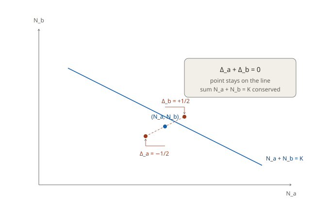
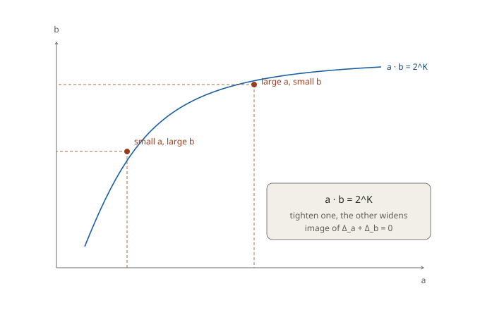

# Appendix: From the Sum-Zero of Fluctuations to Uncertainty
## — The Uncertainty Relation as the Allocation of a Half-Bit

**Author:** Noriaki Kihara (ORCID: 0009-0004-6753-4020)
**Date:** 18 June 2026
**DOI (this version):** 10.5281/zenodo.20742278
**Concept DOI (all versions):** 10.5281/zenodo.20742277
**Zenodo:** https://zenodo.org/records/20742278
**Related paper:** "On the Logarithmic Map of Scale and the Separation of Scale and Quantization in a High-Symmetry Limit," §6.3 (Concept DOI: [10.5281/zenodo.20740841](https://doi.org/10.5281/zenodo.20740841))

---

## Purpose

This appendix develops independently a single point compressed into a few lines in §6.3 ("the conservation law of the fluctuation") of the related paper — namely that **the uncertainty relation in the observable space (constant product) is derived from the sum-zero of fluctuations in the fundamental-quantity N-space**. It adds no new claim to the parent paper; its aim is to make explicit a derivation whose direction is easily misread.

What is emphasized in particular is the **direction** of the derivation. Ordinarily the uncertainty relation δ_a·δ_b = constant (constant product) is given as a fundamental law. In this system it is a derived quantity, and what is placed as a definition is rather the **sum-zero** Δ_a+Δ_b=0 in N-space. Sum-zero is the definition, constant product is the consequence — this direction is the heart of the matter.

This appendix is not a rigorous proof but an observation that makes explicit the structure of §6.3 of the parent paper. The magnitude of the fluctuation ±1/2 is treated as a posit, not a derivation (parent paper §6.2). No identification with physical quantities (position, momentum, etc.) is made. "Uncertainty" here is not in the sense of Bell's theorem; it is limited to the formal structure of the conservation of a quantity allocated to a conjugate pair.

---

## 1. Setup: the fundamental quantity and the fluctuation

Following the related paper, the fundamental quantity is set as the logarithm of a squared quantity,

$$N \equiv \tfrac{1}{2}\log_2(\nu^2) = \log_2\nu \qquad (N\in\mathbb{Z}),$$

and the observable ν is restored by the inverse map ν=2^{N}.

The conjugate pair a, b (corresponding to observables ν, λ) has its product conserved:

$$ab = k \quad\xrightarrow{\ \log_2\ }\quad N_a + N_b = K \qquad (K\equiv\log_2 k,\ \text{constant}).$$

That is, in N-space the conjugate pair satisfies the **conservation of the sum** N_a+N_b=K. This is an additive identity and by itself generates no structure (note in §5 of the parent paper). Structure arises from the fluctuation riding on top of this sum.

---

## 2. The posit of the fluctuation: the half-bit ±1/2

Each fundamental quantity N has a fluctuation Δ. In this system we set it as

$$\Delta = \pm\tfrac{1}{2} \qquad (\text{a half-bit; a posit; scale-invariant}).$$

This ±1/2 is a posit, not a derivation (parent paper §6.2: this system has no basis for constructing a standard deviation — individuation of observations, temporal order, persistence of value — and any computation smuggles in a hidden premise). Placing the fluctuation on the side of the fundamental quantity N rather than the observable ν is because, when the fluctuation is held constant in N-space, it becomes scale-dependent in the observable space, which is natural as a fluctuation of integer counting.

It is called a "half-bit" because ±1/2 in the base-2 logarithmic space is half of one bit (the integer step of N). The base being 2 is by §3 and §4 of the parent paper (the binarity of the system).

---

## 3. Definition: the sum-zero of fluctuations

The sum of the conjugate pair is conserved (N_a+N_b=K, §1). Since K is a constant, the fluctuations Δ_a, Δ_b of the two fundamental quantities are constrained to preserve the sum. We place this as the **definition** of this system:

$$\boxed{\ \Delta_a + \Delta_b = 0\ }$$

That is, if one fluctuates by +1/2, the other necessarily fluctuates by −1/2. Which member of the conjugate pair the half-bit is allocated to is the degree of freedom of the fluctuation, and its total is always held at zero.

This sum-zero is a rephrasing of the requirement that the sum of the conjugate pair N_a+N_b=K be conserved even when fluctuations are included. Writing the fundamental quantities with fluctuations added as

$$\tilde N_a = N_a + \Delta_a, \qquad \tilde N_b = N_b + \Delta_b,$$

we have

$$\tilde N_a + \tilde N_b = (N_a+N_b) + (\Delta_a+\Delta_b) = K + 0 = K,$$

so the sum is held exactly at K even under fluctuations.

Geometrically, the conjugate pair (N_a, N_b) is a point on the line N_a+N_b=K, and the fluctuation Δ_a=−1/2, Δ_b=+1/2 (or vice versa) is a slide along this line. The point stays on the line and the sum is conserved (Figure 1).

---

## 4. Derivation: constant product (the uncertainty relation)

We map the sum-zero (§3) back to the observable space. The observables are restored by a=2^{\tilde N_a}, b=2^{\tilde N_b}:

$$ab = 2^{\tilde N_a + \tilde N_b} = 2^{K + 0} = 2^{K} \qquad (\text{constant}).$$

That is, under the sum-zero constraint, the product ab of the observables is held constant at 2^K regardless of the fluctuation.

Consider the fluctuation of each observable. Around the central value a_0=2^{N_a},

$$a = 2^{N_a + \Delta_a} = a_0\cdot 2^{\Delta_a}, \qquad b = b_0\cdot 2^{\Delta_b}.$$

Their product is

$$ab = a_0 b_0 \cdot 2^{\Delta_a + \Delta_b} = a_0 b_0 \cdot 2^{0} = a_0 b_0,$$

so however the fluctuations Δ_a, Δ_b are allocated, the product is fixed at the product of the central values a_0 b_0. Under sum-zero, the half-bit remains irreducibly as ±1/2 on each fundamental quantity, and its sign is anti-correlated (if one is +1/2 the other is −1/2). In the observables, if one is √2 times, the other is 1/√2 times, and the product is fixed at a_0 b_0.

This is the form of the **uncertainty relation** in the observable space: the half-bit remains on each observable as a floor that cannot be removed, and the product of the conjugate pair a·b is fixed at a_0 b_0 (=2^K). Note that what is preserved is the **product of the observables a·b**, not the **product of the fluctuations δ_a·δ_b** (the latter depends on the allocation Δ and is not constant). In the squeeze where Δ is taken continuous (next, Figure 2), this appears as the trade-off "tighten one and the other widens," and the fixed half-bit ±1/2 is its minimal unit. This constant product is a consequence derived from the sum-zero in N-space (§3, the definition), not a law posited independently.

The minimal unit of uncertainty corresponds to the posited half-bit ±1/2. Note that a single fluctuation ±1/2 and the conserved quantity appearing as the product of two fluctuations (δ₁δ₂=1/2, Axiom 4 of the parent paper) are not the same quantity, but they are placed in correspondence as quantities belonging to the same side — area / the symplectic form ω (the imaginary part of the complex inner product).

In the observable space, this conservation relation appears as the hyperbola a·b=2^K. Tightening one (making it small) widens the other, and the two move along the hyperbola while the product is held constant (Figure 2). The line in N-space (sum-zero) corresponds, via the inverse logarithmic map, to the hyperbola in the observable space (constant product).

---

## 5. Summary of the structure

| Space | Quantity | Fluctuation | Constraint |
|---|---|---|---|
| Fundamental N (definition side) | N=log₂ν (integer) | Δ=±1/2 (half-bit, posit) | **Δ_a+Δ_b=0 (sum-zero, definition)** |
| Observable ν (derived side) | ν=2^N | δ=ν₀(2^Δ−1) (scale-dependent) | **a·b=2^K (the product of observables is constant, derived)** |

The definition is the **sum-zero** in N-space; the derivation is the **constant product** in the observable space. The body of "uncertainty" is the allocation structure "to which member of the conjugate pair the half-bit ±1/2 is allocated, with the total conserved," and the constant product is its shadow in the observable space.

Multiplication (constant product) and addition (sum-zero) are connected by the logarithmic map N=log₂ν. Uncertainty, which appears as a product in the observable space, becomes the simple conservation law of sum-zero in the fundamental-quantity space — this is one consequence of taking the logarithm as the fundamental quantity.

---

## 6. Limitations (reading notes)

This appendix makes explicit the structure of §6.3 of the parent paper and adds no new claim. The following are stated.

1. **±1/2 is a posit, not a derivation.** As in §6.2 of the parent paper, this system has no basis for constructing a standard deviation. The derivation of this appendix (sum-zero → constant product) presupposes this posit. If the posit fails, the consequence changes.

2. **Sum-zero Δ_a+Δ_b=0 is placed as a definition.** It is a rephrasing of the requirement that the conservation of the sum of the conjugate pair (N_a+N_b=K) hold even under fluctuations, and is not derived from a more fundamental principle.

3. **Uncertainty here is not in the sense of Bell's theorem.** It is limited to the formal structure of the conservation of a quantity allocated to a conjugate pair, and is distinct from the EPR/Bell no-hidden-variables result.

4. **No physical identification is made.** The physical names of the conjugate pair a, b (observables ν, λ) — position, momentum, time, energy, etc. — are anonymous labels, and this appendix makes no identification with a particular physical quantity.

5. **It is distinct from the integer-step fluctuation of §6.1.** The "the interior integer quantity fluctuates in integer steps (±1)" of §6.1 of the parent paper and the half-bit fluctuation Δ=±1/2 placed in N-space here are separate posits, and no relation (identity, derivation, approximation) is claimed between them.

6. **What is conserved is the product of the observables, not the product of the fluctuations.** What sum-zero guarantees is the product of the observables a·b=2^K, not the product of the fluctuations δ_a·δ_b (the latter depends on the allocation and is not constant). Also, what the sum-zero of the fixed half-bit gives is "an irreducible ±1/2 floor remaining on each observable + anti-correlation of signs"; this is a different aspect from the squeeze where Δ is taken continuous (the trade-off on the hyperbola, "tighten one and the other widens"). The fixed half-bit ±1/2 is the minimal unit of that squeeze. The two are not identified.

---

## Reference

- Kihara, N. "On the Logarithmic Map of Scale and the Separation of Scale and Quantization in a High-Symmetry Limit — A Limited Verification Report from a Minimal Axiom System," §6.2, §6.3. Concept DOI: [10.5281/zenodo.20740841](https://doi.org/10.5281/zenodo.20740841).
