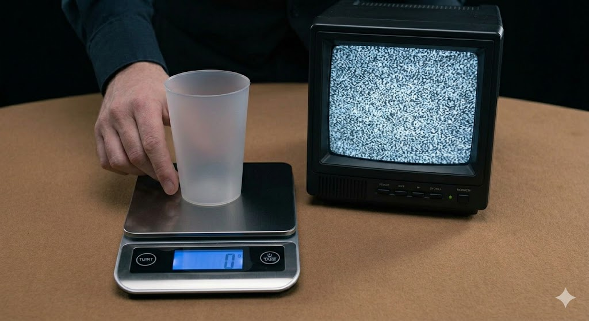
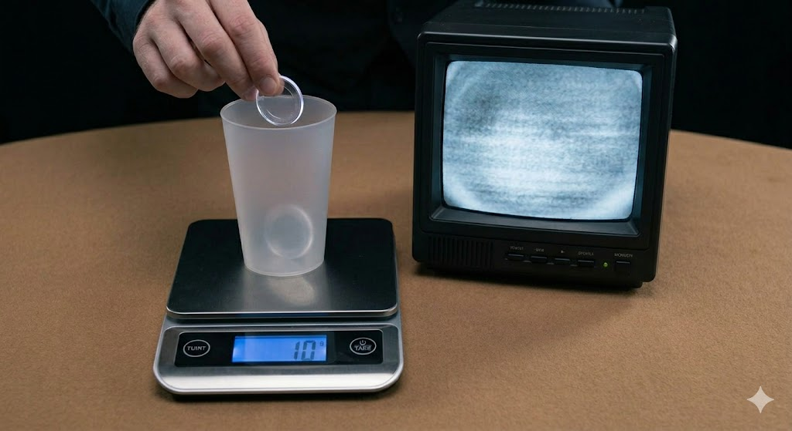
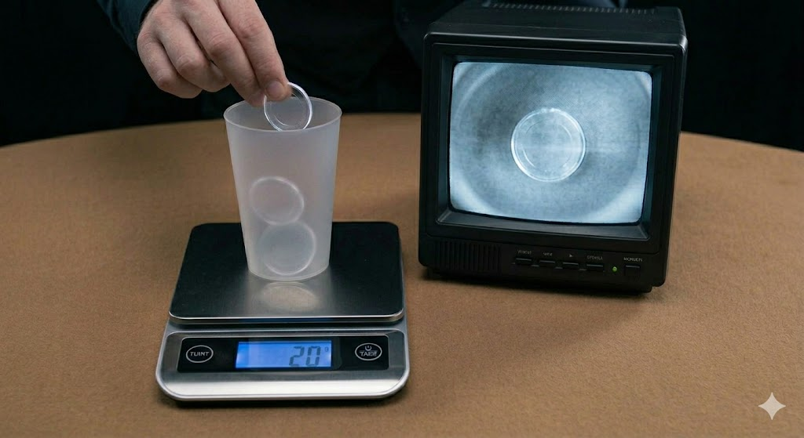
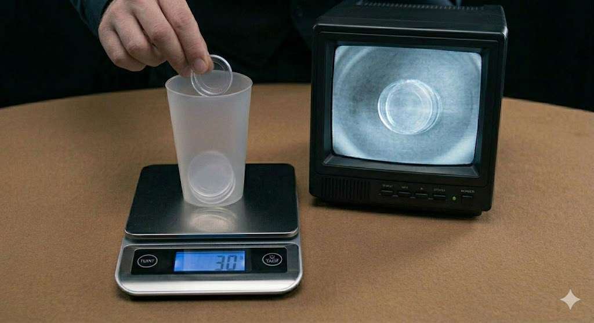

# A Magic-Coin Toy Model — Visualizing the Limit of Anonymity (0, 1, 2) and the Denial of Hidden Variables

**Author:** Noriaki Kihara (ORCID: 0009-0004-6753-4020)
**Date:** 18 June 2026
**DOI (this version):** 10.5281/zenodo.20741265
**Concept DOI (all versions):** 10.5281/zenodo.20741264
**Zenodo:** https://zenodo.org/records/20741265
**Related paper:** "On the Logarithmic Map of Scale and the Separation of Scale and Quantization in a High-Symmetry Limit," §0.5 (Concept DOI: [10.5281/zenodo.20740841](https://doi.org/10.5281/zenodo.20740841))

---

## Introduction

This note visualizes, as a tabletop magic toy model, two claims stated in §0.5 ("interior and exterior; the unknowable and invariants") of the related paper —

1. **The limit of anonymity = 2:** in the system-interior, 0 and 1 cannot be distinguished, and 2 and 2-or-more cannot be distinguished.
2. **Denial of hidden variables:** even when everything inside is shown, there is no clue to separate the count.

The aim is to let the reader feel the essence before reading the formulas. This is not a rigorous proof but an **intuitive entry point (an illustration)**.

---

## Apparatus

The same tabletop apparatus is used in every scene.

| Apparatus | Role | Corresponding concept |
|---|---|---|
| Semi-translucent frosted cup | container for coins (the inside is faintly visible) | the system itself |
| Digital scale | the objective quantity measured from outside; 1 coin = 10 g, additive | **exterior (observer) / conserved quantity** (an additive total) |
| CRT monitor | the image filmed by cameras attached to each coin. **A camera cannot film itself; it films only the other coins.** | **interior (the anonymous internal viewpoint)** |
| Magician's hand | operates the coins (tare / add / cheat) | the operator |

The key is to read the **monitor (interior) and the scale (exterior) separately**. The monitor shows, from the anonymous interior, "whether there is something other than oneself"; the scale measures, from outside, an additive total. This system is dual, and "which side is real" is not asked. The objective anchors are placed not on reality but on the additively conserved total (the scale reading) and on fixed points.

---

## Figure 1: Zeroing — 0 indistinguishable from null

- **System (monitor):** static. Nothing (null). Only the inner wall of the cup.
- **Observation (scale):** 0 g (the magician has zeroed / tared it).

**Mapping:** There is no subject to judge a state in the first place. Hence **0 cannot be distinguished from null**. The scale's zero, a concrete object, shows that "nothing" and "zero" look the same. This does not mean 0 does not exist; it means it cannot be distinguished from the interior.

---

## Figure 2: The first coin — 1 indistinguishable from 0

- **System (monitor):** almost no signal stands (only a faint blur). The sole coin's camera has **no "other than itself" to film**, and so cannot capture itself.
- **Observation (scale):** 10 g. One coin is faintly visible in the cup.

**Mapping:** With no counterpart for comparison, the interior cannot establish "I exist." Hence **in the interior, 1 cannot be distinguished from 0**. Meanwhile the scale (exterior) reads 10 g — **the exterior total has increased, yet no interior image stands**. This discrepancy is the separation of interior and exterior itself.

---

## Figure 3: The second coin — difference stands at 2

- **System (monitor):** for the first time, **ONE** clear transparent coin appears. One coin's camera has captured the other.
- **Observation (scale):** 20 g. Two coins in the cup.

**Mapping:** For the first time "an other than oneself" appears, and through it "I exist" stands. **Two is the minimum at which anything can be known from the interior.** The "one coin" on the monitor — i.e., the first occurrence of "1 (one other)" in the interior — is the very birth of difference. Exterior (scale): 20 g; interior (monitor): "one other."

---

## Figure 4: The third coin — 2 and 2-or-more indistinguishable (denial of hidden variables)

- **System (monitor):** still **ONE**. But on close inspection a **double edge (a doubled outline)** appears, the image slightly blurred. This is the trace of the magician's "cheat" — stacking with a slight offset.
- **Observation (scale):** 30 g. In the cup, an offset stack of coin shapes (a thick stack).

**Mapping:** The interior camera can film only up to "an other is present," and cannot separate whether that is 2 or 3. Hence **in the interior, 2 and 2-or-more cannot be distinguished**. The double edge is the only clue, but it is not information that fixes the count — **even shown everything from inside, it cannot be told**. This is the **denial of hidden variables**: it is not that there is a hidden variable "the true count" inside that is invisible due to observational precision; rather, the interior viewpoint simply has no structure to separate the count.

(The scale reads 30 g; as an additive conserved quantity, three units stand. This is the objective exterior anchor and does not negate the interior unknowability. **The exterior total can be read, but the interior image cannot be counted** — this asymmetry is the core of the toy model.)

---

## Summary — in one table

| Fig | Scale (exterior / conserved) | Monitor (interior / unknowable) | What it shows |
|---|---|---|---|
| 1 | 0 g | null (static) | 0 and null cannot be distinguished |
| 2 | 10 g | does not stand | 1 cannot be distinguished from 0 |
| 3 | 20 g | one other, clear | difference stands at 2 (birth of "1" in the interior) |
| 4 | 30 g | one other (double edge) | 2 and 2-or-more cannot be distinguished (denial of hidden variables) |

While the exterior (scale) conserves and increases the quantity additively as 0, 10, 20, 30, the interior (monitor) image saturates with 2 as its ceiling: **null → does not stand → one other → one other (inseparable)**. The conserved total (exterior) can be counted; the anonymous interior image cannot. The "limit of anonymity = 2" and "interior unknowability does not negate the exterior integer structure" of §0.5 are reproduced right there on the table.

---

## Limitations of this model (reading notes)

This note is not a rigorous proof but an **illustration** for feeling the ontology of §0.5. As a toy model it involves simplifications, and pushing for rigor only makes it harder to follow. The following are notes to avoid misreading, not refinements of the model.

1. **The monitor is "the first-person view of one anonymous element,"** not a god's-eye total. That is why, even with 2 coins, the screen shows only "one other" (from any one coin, only the single other is visible). The "ONE" in Figs. 3–4 is the image of "an other has become present," not the interior starting to count.

2. **The scale reads only an additive total (a scalar), not "the count."** Obtaining "3 coins" from 30 g requires an **external assumption** that "1 coin = 10 g and all are identical." That very identity is what anonymity does not license in the interior, so even the scale does not directly "see" the count. What stands objectively on the scale is the additive total, which does not contradict interior unknowability. The point of the toy model is the **asymmetry between interior unknowability and exterior total.**

3. **"Denial of hidden variables" here is not in the sense of Bell's theorem.** It is distinct from the EPR/Bell no-hidden-variables result and is limited to the weak sense that "the interior viewpoint simply has no structure to separate the count."

4. **This toy model covers only part of §0.5.** It visualizes "indistinguishability of 0, 1, 2" and "the absence of count separation"; the duality / conjugacy ("which of ν and λ is real cannot be asked") is not included in the figures.

5. **No physical identification is made.** What the coins represent is not addressed.

---

## Reference

- Kihara, N. "On the Logarithmic Map of Scale and the Separation of Scale and Quantization in a High-Symmetry Limit — A Limited Verification Report from a Minimal Axiom System," §0.5. Concept DOI: [10.5281/zenodo.20740841](https://doi.org/10.5281/zenodo.20740841); v1 DOI: [10.5281/zenodo.20740842](https://doi.org/10.5281/zenodo.20740842).
