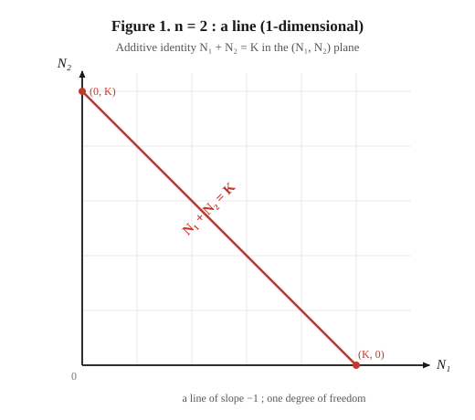
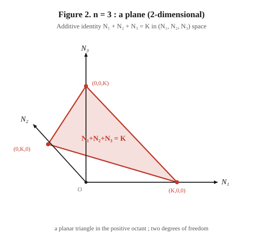
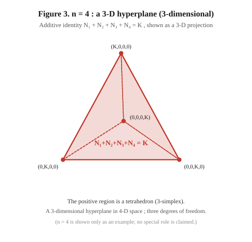
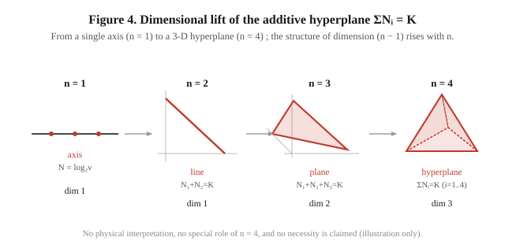

# 補遺：対数基本量からの多次元構造の立ち上がりについて
## ——加法的恒等式が定める超平面の次元に関する形式的観察

**著者：** 木原 範昭（ORCID: 0009-0004-6753-4020）
**日付：** 2026年6月18日
**関連論文：** 「高い対称性の極限におけるスケールの対数写像とスケール・量子化の分離について」§3・§5・§7（Concept DOI: [10.5281/zenodo.20740841](https://doi.org/10.5281/zenodo.20740841)）

---

## 趣旨

関連論文は、高い対称性と無名性という強い拘束の下で構造が立ち上がる、と述べた。しかし本文中では、その「立ち上がる構造」を具体的な形で示していない。本補遺は、その不足を補うための**形式的観察**である。

すなわち、基本量 N=log₂ν という最小の出発点と、共役関係の加法的恒等式のみから、変数の数を増やすと多次元の超平面構造が形式的に立ち上がること——これを、例として変数を四つまで増やして示す。

**本補遺が主張しないこと（先に明示する）：**

- これが物理の時空・次元と接続すること。一切主張しない。
- 四次元が特別であること、四次元で安定すること。主張しない。四は単なる例示であり、それ以上の意味を持たせない。なぜ特定の次元かを問えば議論は急速に難解になるため、本補遺はそこに踏み込まない。
- 次元創発の機構であること。主張しない。

本補遺はあくまで「最小の対数構造から、変数の数に応じて多次元の超平面が形式的に導出されうる」という、構造の例示に留まる。

---

## 1. 出発点：基本量 N（一変数）

関連論文 §4 の通り、基本量を二乗量の対数として導入する：

$$N \equiv \tfrac{1}{2}\log_2(\nu^2) = \log_2\nu .$$

ν=2ⁿ のとき N=n（整数）。N は一本の軸（整数全体 ℤ）として現れる。これは見かけ上、一次元の構造である。

本補遺の問いは、この基本量を複数（n 個）置いたとき、変数の本数に応じてより高い次元の超平面構造が形式的に立ち上がるか、である。多次元性は「一本の軸から無から湧く」のではなく、置いた変数の本数 n から来る——この点を先に明示しておく。

---

## 2. 加法的恒等式が定める超平面

関連論文 §5 の通り、共役関係 νλ=k に底 2 の対数を取ると、積が和になる：

$$\nu\lambda=k \;\xrightarrow{\ \log_2\ }\; N_\nu + N_\lambda = K \quad(K\equiv\log_2 k).$$

ここで一般化する。基本量を n 個 $N_1, N_2, \dots, N_n$ とり、その和が一定値 K に保たれるとする：

$$\sum_{i=1}^{n} N_i = K .$$

これは n 個の変数に対する一本の一次方程式であり、n 次元の座標空間 $(N_1,\dots,N_n)$ の中で、**(n−1) 次元の超平面**を定める。

すなわち、加法的恒等式は、変数の数 n に応じて (n−1) 次元の平坦な構造（超平面）を立ち上げる。以下、n=2,3,4 を具体的に見る。

**公理系内の位置づけ（重要）：** 変数を複数（n≥3）立てること自体は、関連論文 §2 の公理2「系の中で区別できるのは 2 まで」を超える操作であり、§3 の**次元生成（有界化による離散モード番号 n の発生＝無名性の破れ）を前提とする**。すなわち本補遺は、無名性が破れて次元が立ち上がった後の領域で、加法的恒等式が (n−1) 次元の超平面を定めることを示すものである。§3（次元の生成）と本補遺（n 変数 → (n−1) 次元超平面）は、上流・下流の関係にある。

---

## 3. n=2：直線（一次元）

二変数 $N_1, N_2$ の和が一定：

$$N_1 + N_2 = K .$$

これは $(N_1, N_2)$ 平面における、傾き −1 の**直線**である（一次元）。共役対の和が一定、という関係が、平面内の一本の直線として現れる（図1）。

---

## 4. n=3：平面（二次元）

三変数 $N_1, N_2, N_3$ の和が一定：

$$N_1 + N_2 + N_3 = K .$$

これは三次元座標空間 $(N_1, N_2, N_3)$ における**平面**である（二次元）。三つの軸の正領域では、この平面は三角形の領域として現れる（図2）。

---

## 5. n=4：三次元超平面（三次元）

四変数 $N_1, N_2, N_3, N_4$ の和が一定：

$$N_1 + N_2 + N_3 + N_4 = K .$$

これは四次元座標空間における**三次元超平面**である。四次元は直接には描けないため、三次元への射影として示す。四つの軸の正領域では、この超平面は四面体（単体）の領域として現れる（図3・図4）。

ここで変数を四つまで増やしたのは、単なる例示である。四という数に特別な意味は与えない。変数をさらに増やせば、同じ仕方で (n−1) 次元の超平面が立ち上がる。

---

## 6. まとめ

最小の対数基本量 N=log₂ν と、加法的恒等式 ΣNᵢ=K のみから、変数の数 n に応じて次の構造が形式的に立ち上がる：

| 変数の数 n | 加法的恒等式 | 立ち上がる構造 | 次元 |
|---|---|---|---|
| 1 | （単一の軸） | 軸 | 1 |
| 2 | N₁+N₂=K | 直線 | 1 |
| 3 | N₁+N₂+N₃=K | 平面 | 2 |
| 4 | N₁+N₂+N₃+N₄=K | 三次元超平面 | 3 |
| n | ΣNᵢ=K | 超平面 | n−1 |

基本量 N=log₂ν を複数（n 個）置き、その和を一定に保つ加法的恒等式 ΣNᵢ=K のみから、変数の本数 n に応じて (n−1) 次元の超平面が形式的に立ち上がる。多次元性は一本の軸から湧くのではなく、置いた変数の本数から来る。これが、関連論文が「構造が立ち上がる」と述べたことの、最小の具体例である。

これらの超平面はいずれも平坦（曲率を持たない）である。これは関連論文 §7 の「対数写像が二乗和を平坦な一乗和（超平面）に写す」という観察と整合する。

---

## 7. 限界

1. **四は単なる例示である。** 変数を四つまで増やしたことに、特別な意味はない。四次元が安定する・特別である、といった主張は一切しない。なぜ特定の次元かという問いには、本補遺は踏み込まない（踏み込めば議論は急速に難解になる）。

2. **物理的接続を主張しない。** 立ち上がる超平面が、物理の時空・次元・幾何と接続することは、主張しない。本補遺は純粋に形式的な構造の例示であり、物理理論との同型は扱わない。

3. **全対称による縮約は扱わない。** 全対称（全 Nᵢ が等しい）の下で超平面が一点（対角線上）に縮約することは、それ自体が別の議論を要するため、本補遺では扱わない（別補遺に委ねる）。本補遺は超平面が立ち上がることのみを示す。

4. **これは導出の可能性の例示であって、必然性の証明ではない。** 「多次元構造が立ち上がりうる」ことを一例で示すに留まり、「立ち上がらねばならない」ことは示さない。

---

*本補遺は、関連論文の主張（強い拘束下で構造が立ち上がる）に対する形式的な例示であり、物理的接続・特定次元の必然性・安定性のいずれについても確定的主張を含まない。*
