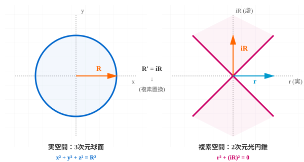

# 複素旋回波の面積交差項による曲率振動の読出し

## ―― 重力波への最小適用

木原範昭 (Noriaki Kihara)\
WF System Co., Ltd.\
ORCID: 0009-0004-6753-4020

種別: Research Note / 仮説・観察論文\
日付: 2026年9月1日

------------------------------------------------------------------------

## 要旨

既報 \[1\]
では、正曲率定曲率空間に置いた測地的単位セルについて、一辺の測地線長は曲率半径に依存せず保存される一方、曲率歪みは二方向が張る面積から初めて現れることを示した。本稿では、この結果を複素旋回波

z=a+ib

に適用する。二乗すると

z^2=(a^2-b^2)+2iab

であり、交差項 (2iab) は二つの独立成分 (a,b)
の積からなる面積型量である。さらに

$$a=A\cos\theta,\qquad b=A\sin\theta$$

とすれば、

$$2ab=A^2\sin 2\theta$$

となり、この面積型量は静的ではなく二倍角で振動する。

本稿では、曲率の影響が一次元測地線ではなく二次元面積から現れるという既報の幾何学的結果と、この複素波の面積交差項を組み合わせ、複素旋回波の虚数方向の面積振動が、曲率との結合によって外部から実数振動として読み出され、その一候補が重力波であるという最小仮説を提示する。代表例として
GW150914 を用い、Schwarzschild
半径を外部から与える曲率スケールとして採用すると、自然な周波数尺度
$$c/(2\pi r_s) は約 2.5 \times 10^2 Hz$$
となり、観測された 35--250 Hz の周波数帯と同一オーダーに入る。また
$$r_s/D は約 1.5 \times 10^{-20} で、観測ピーク strain$$
$$1.0 \times 10^{-21} との差は無次元係数約$$
$$6.5 \times 10^{-2}$$
である。ただし後者の係数は本稿から導出されておらず、振幅予言ではなく次元的整合性の確認に限る。

------------------------------------------------------------------------

## 1. 動機――曲率歪みは長さではなく面積から始まる

既報 \[1\] では、曲率半径 R の正曲率定曲率空間 S^d(R) に、一辺 1
の正則測地セルを置いた場合の歪みを、一辺・角・面積・体積に分けて評価した。

その最も単純な結果は、一辺の測地線長が構成により厳密に 1
のままであることである。一方、二方向が張る測地正方形では角度と面積に曲率依存性が現れる。頂点角は

$$\theta(R)=\arccos\left[-\tan^2\left(\frac{1}{2R}\right)\right],$$

面積は

$$A(R) = R^2\left[4\theta(R)-2\pi\right]$$

であり、平坦極限では

$$A(R) = 1+\frac{1}{6R^2}+O(R^{-4}).$$

さらに d 次元体積について、

$$V_d(R) = 1+\frac{d(d-1)}{12R^2}+O(R^{-4})$$

が得られ、

$$\frac{d(d-1)}{12} = \frac{1}{6}\binom{d}{2}$$

であることから、最低次の体積歪みは独立な二方向の組が作る面積歪みの和として整理できる
\[1\]。

したがって既報から得られる本稿の出発点は、

$$\boxed{\text{曲率歪みの最初の幾何学的入口は、一次元長さではなく二方向が張る面積である}}$$

という一点である。

本稿では、この結果を複素数で表された旋回波に適用したとき何が起こるかを考える。

------------------------------------------------------------------------

## 2. 複素旋回波の二乗と面積交差項

複素波を

$$z=a+ib$$

とする。ここで $(a,b)$ は実数成分である。振幅 $A$、位相 $\theta$ を用いれば、

$$a=A\cos\theta,\qquad b=A\sin\theta$$

と書ける。

この波を二乗すると、

$$z^2 = (a+ib)^2 = (a^2-b^2)+2iab. \tag{1}$$

実部は

$$a^2-b^2 = A^2(\cos^2\theta-\sin^2\theta) = A^2\cos2\theta, \tag{2}$$

虚部の係数は

$$2ab = 2A^2\cos\theta\sin\theta = A^2\sin2\theta. \tag{3}$$

したがって、

$$\boxed{z^2=A^2(\cos2\theta+i\sin2\theta)} \tag{4}$$

となる。

ここで本稿が注目するのは式 (3) である。

$a^2$ と $b^2$ はそれぞれ一方向成分の平方であるのに対し、$ab$ は二つの独立成分 $(a,b)$ の積である。既報 \[1\] の「曲率歪みは二方向が張る面積から現れる」という整理に従えば、$2ab$ は複素旋回波の中で曲率と結合しうる最小の面積型交差量として自然に選ばれる。

しかもこれは静的な面積量ではない。式 (3) より、

$$2ab=A^2\sin2\theta$$

であり、元の位相 $\theta$ に対して二倍角で符号反転を繰り返す実数振動である。

この事実は、単なる複素表記の便宜とは別に、次の幾何学的読みを許す。

------------------------------------------------------------------------

## 3. 曲率方向への読出し仮説

一次元の実数波

$$x=A\cos\theta$$

は、一つの測地線方向に沿った振動として表せる。この場合、既報 \[1\]
の意味で二方向が張る面積セルは生じない。

これに対し、

$$z=A(\cos\theta+i\sin\theta)$$

は複素面上で旋回し、二つの直交成分を同時に持つ。その二乗には必ず面積型交差項

$$2iab=iA^2\sin2\theta$$

が現れる。

### 3.1 虚数軸と曲率方向の幾何学的対応

3次元球面の基本方程式から出発しよう。

$$x^2 + y^2 + z^2 = R^2$$

これを書き直すと、

$$x^2 + y^2 + z^2 - R^2 = 0$$

ここで、放射状方向 $r^2 := x^2 + y^2 + z^2$ で整理すると、

$$r^2 - R^2 = 0$$

となる。ここで複素置換 $R' = iR$ を施すと、

$$r^2 - (iR)^2 = 0 \quad \Rightarrow \quad r^2 + R^2 = 0$$

この式は **光円錐** (null surface / light cone) の方程式である。

つまり：
- **実数軸** $R$：球面（正曲率を規定）
- **虚数軸** $iR$：光円錐（ヌル測地線）

虚数方向が曲率方向であることは、単なる形式的な読み替えではなく、**球面座標と光円錐座標の間の幾何学的必然**である。光円錐は、曲率が時空構造を規定する場所の特性的な表現であり、その生成元方向がまさに虚数軸 $iR$ なのである。

**図1：** 左図は実空間の3次元球面 $x^2 + y^2 + z^2 = R^2$ （正曲率）。右図は複素置換 $R' = iR$ を施した後の2次元光円錐 $r^2 + (iR)^2 = 0$ （ヌル面）。虚数軸 $iR$ が曲率方向であることが幾何学的に自明になる。

この対応を踏まえて、次の仮説を置く。

### 3.2 曲率読出し仮説

> 仮説（曲率読出し仮説）\
> 複素旋回波が曲率を持つ空間に存在するとき、二方向が張る面積型交差項
> (2iab)
> は曲率と結合しうる。曲率方向が内部の実数測地線方向から直接は読めない方向として表現される場合、この虚数方向の交差項は、外部観測では実数の周期振動として読み出されうる。

虚数単位による方向変換だけを形式的に書けば、

$$i(2iab)=-2ab=-A^2\sin2\theta. \tag{5}$$

したがって、読み出される候補振動は実数値を持つ。

重要なのは、式 (5)
自体を新しい力学方程式と主張しているのではないことである。式 (1)--(4)
は恒等式であるが、その虚数方向を曲率方向として物理的に読むことが本稿の仮説である。

既報 \[1\] の面積補正を用いれば、正曲率の場合の最小候補は概念的には

$$h_\text{curv} \propto (k_s(R)-1)(-2ab), \tag{6}$$

$$k_s(R) = R^2 \left[4\arccos\left(-\tan^2\frac{1}{2R}\right)-2\pi\right]. \tag{7}$$

弱曲率では、

$$k_s(R)-1 = \frac{1}{6R^2}+O(R^{-4})$$

なので、

$$h_\text{curv} \propto -\frac{A^2}{6R^2}\sin2\theta +O(R^{-4}). \tag{8}$$

式 (6)--(8) は候補結合であり、その比例係数、正規化、測度として k_s
を用いるか逆量を用いるかは本稿では決定しない。ここで確定しているのは、平坦極限
$$R\to\infty$$
ではこの曲率由来成分が消えること、および最低次の曲率依存性が既報の面積歪みと同じ
R^{-2} 型になることである。

この読みが正しければ、重力波は「複素旋回波そのもの」ではなく、

$$\boxed{\text{複素旋回波} \to \text{面積交差項} \to \text{曲率方向との結合} \to \text{外部から読める実数振動}}$$

として理解できる可能性がある。

また式 (4)
から二倍角構造が自動的に現れる点は、重力波が通常のベクトル波とは異なる二倍角的な偏極構造を持つこととの形式的対応を示唆する。ただし、本稿は一般相対論のテンソル摂動
$$h_{\mu\nu} や spin-2 表現を式 (4)$$
から導出したとは主張しない。

------------------------------------------------------------------------

## 4. 観測スケールの非一意性と Schwarzschild 半径

ここで一つの問題がある。

複素波だけから曲率半径 (R)
を一意に決めることはできない。同じ局所波を、分子スケールの系として読むのか、恒星系として読むのか、宇宙全体として読むのかによって、観測上採用すべき曲率スケールは異なりうる。

これは本稿では欠陥として隠さず、読出しの観測依存性として明示する。

ブラックホールは、この曖昧さを最小化できる対象である。質量 M
が与えられれば、外部から借用する自然な長さ尺度として Schwarzschild 半径

$$r_s=\frac{2GM}{c^2} \tag{9}$$

を採用できる。

本稿では、これを複素波から導出された量とはみなさない。ブラックホールという観測対象を指定したことによって与えられる外部読出しスケールとして用いる。

すると自然な時間尺度は

$$t_s=\frac{r_s}{c},$$

周波数尺度は

$$f_s=\frac{1}{2\pi t_s} = \frac{c}{2\pi r_s}. \tag{10}$$

式 (3) の交差項は位相に対して二倍角を持つため、内部位相 \theta
の定義によっては 2f_s が読出し周波数となる可能性もある。この因子 2
は本稿では固定せず、観測写像を定めるべき将来課題とする。

------------------------------------------------------------------------

## 5. GW150914 による一例のオーダー検算

LIGO による GW150914
の初期解析では、二つのブラックホールの源質量はおよそ

$$M_1=36_{-4}^{+5}M_\odot,\qquad M_2=29_{-4}^{+4}M_\odot,$$

光度距離は

$$D_L=410_{-180}^{+160} \text{ Mpc},$$

信号は約 35 Hz から 250 Hz へ上昇し、ピーク strain は

$$h_\text{peak}\simeq1.0\times10^{-21}$$

であった $$2,3$$。

オーダー検算として合体前の総質量を

$$M=M_1+M_2\simeq65M_\odot$$

とすると、式 (9) から

$$r_s \simeq 1.92\times10^5 \text{ m} \simeq 192 \text{ km}. \tag{11}$$

したがって式 (10) は

$$f_s = \frac{c}{2\pi r_s} \simeq 2.49\times10^2 \text{ Hz}. \tag{12}$$

これは GW150914 で観測された 35--250 Hz
の上端と同一オーダーにあり、代表的な強重力時間尺度として直ちに破綻しない。

次に、遠方で振幅が $(1/D)$ で減衰する放射場について、Schwarzschild
半径から作れる最も単純な無次元比を調べると、

$$\frac{r_s}{D_L} \simeq \frac{1.92\times10^5}{410\times10^6\times3.0857\times10^{16}} \simeq 1.52\times10^{-20}. \tag{13}$$

観測されたピーク strain との比は

$$C_\text{obs} \equiv \frac{h_\text{peak}}{r_s/D_L} \simeq 6.6\times10^{-2}. \tag{14}$$

すなわち、

$$h_\text{peak} \simeq 0.066 \cdot \frac{r_s}{D_L}$$

ただし、式 (14) の (0.066)
は本稿の複素波モデルから導出された定数ではない。したがって、これは予言値ではなく、観測値から逆算した無次元係数である。標準的な重力波理論でも、強重力源の
strain が源の重力半径と距離の比に関係することは次元解析から自然に現れる
\[4\]。本稿が検証したのは、提案した曲率読出しの自然スケールが代表的実イベントに対して何桁も外れてはいない、という限定された事実である。

本稿でより直接的に興味深いのは周波数側である。外部から (r_s)
だけを与えて得た

$$f_s\simeq249 \text{Hz}$$

が観測帯 35--250 Hz
に入ることは、少なくとも本仮説を即座に棄却する結果ではない。

------------------------------------------------------------------------

## 6. 議論

本稿の構造は意図的に単純である。

第一に、既報 \[1\] の結果として、

$$\text{1D length: no curvature distortion},$$

$$\text{2D area: first curvature distortion}$$

がある。

第二に、複素旋回波を二乗するだけで、

$$(a+ib)^2=(a^2-b^2)+2iab$$

となり、二方向の積である (2ab) が必ず現れる。

第三に、

$$2ab=A^2\sin2\theta$$

なので、その面積型交差項は実数値の周期振動である。

この三点を組み合わせると、

$$\boxed{\text{曲率が最初に結合できる波動量の候補として }2iab\text{ が選ばれる}}$$

という極めて単純な仮説が得られる。

この見方では、平坦空間あるいは一次元測地線に沿う波では効果は消え、複素旋回によって面積を掃く波が曲率を持つ場合にのみ、曲率方向への振動成分が生じる。

この機構は原理上ブラックホールに限定されない。局所的な重力曲率が存在する場所では同型の効果がありうる。ただし微視的領域では位相の離散化・量子化その他の拘束が支配的となり、この効果が直接観測されにくい可能性がある。この点は本稿では仮説に留める。

また、本稿の (z^2) は

$$z\rightarrow e^{i\alpha}z$$

に対して

$$z^2\rightarrow e^{2i\alpha}z^2$$

と変換される。この二倍角構造は重力波の偏極に現れる spin-2 的な角度依存性と形式的に似ている。式 (4) の複素平面上の二倍角変換から、一般相対論のテンソル摂動 $h_{\mu\nu}$ および spin-2 表現を導出できるかどうかは、本論文の目的外の今後の課題とする。その厳密な対応を確立するには、時空テンソル構造、ゲージ自由度、二偏極、伝播方程式およびエネルギーフラックスの理論的検討が必要である。

------------------------------------------------------------------------

## 7. 主張範囲と結論

本稿が主張する内容は次の範囲に限られる。

1.  既報 \[1\]
    では、測地線長そのものは曲率で歪まず、曲率歪みは二方向が張る面積から初めて現れる。
2.  複素旋回波 (z=a+ib) の二乗には、二方向の積からなる面積型交差項
    (2iab) が必ず現れる。
$$3.  (a=A\cos\theta, b=A\sin\theta)$$
    なら、その係数は $$2ab=A^2\sin2\theta$$
    であり、実数値を持つ二倍角振動である。
4.  この交差項を曲率方向との結合成分として読むと、虚数方向の面積振動が外部から実数の曲率振動として読み出される、という最小仮説が得られる。
5.  ブラックホールについて外部読出し尺度として Schwarzschild
    半径を採用すると、GW150914 では $$c/(2\pi r_s)\sim2.5\times10^2 \text{Hz}$$ となり、観測された重力波周波数帯と同一オーダーに入る。
$$6.  (r_s/D_L\sim1.5\times10^{-20}) も観測 strain$$
    (10^{-21})
    から巨大な桁差を持たないが、その比例係数は本稿では導出されていないため、振幅予言とはみなさない。

本稿が提示するのは、

$$\boxed{\text{「曲率歪みは面積から始まる」という既報の幾何学的結果} + \text{「複素波の二乗には振動する面積交差項がある」という数学的恒等式}}$$

から導かれる、**複素旋回波と曲率の結合機構**である。

具体的には、複素旋回波が曲率空間に存在するとき、その虚数方向の面積交差項が曲率と結合することで、外部から観測可能な実数振動として読み出されるという機構を提案する。GW150914 の周波数スケール（≈250 Hz）と振幅スケール（≈10^{-21}）が、Schwarzschild 半径から構成される自然な曲率スケールと同一オーダーにあることは、この仮説が単なる形式的な読み替えではなく、重力波現象の本質に関わる可能性を示唆する。

完全な検証には、式 (6)
の結合則、振幅正規化、偏極テンソル、伝播則およびエネルギーフラックスを同一の波動モデルから導出する必要がある。本稿は、その検討に先立つ最小研究ノートとして位置づける。

------------------------------------------------------------------------

## 参考文献

\[1\] 木原範昭, 「論文0:
正曲率定曲率空間における測地的単位セルの歪み――一辺・角・面積・体積の厳密評価」,
v1.4, Zenodo, Version DOI: 10.5281/zenodo.20684135; Concept DOI:
10.5281/zenodo.20680269 (2026).

\[2\] B. P. Abbott et al. (LIGO Scientific Collaboration and Virgo
Collaboration), "Observation of Gravitational Waves from a Binary
Black Hole Merger," Physical Review Letters 116, 061102 (2016).
DOI: 10.1103/PhysRevLett.116.061102.

\[3\] B. P. Abbott et al. (LIGO Scientific Collaboration and Virgo
Collaboration), "Properties of the Binary Black Hole Merger
GW150914," Physical Review Letters 116, 241102 (2016). DOI:
10.1103/PhysRevLett.116.241102.

\[4\] LIGO Scientific Collaboration and Virgo Collaboration, "The
basic physics of the binary black hole merger GW150914," Annalen der
Physik 529, 1600209 (2017). DOI: 10.1002/andp.201600209.

------------------------------------------------------------------------

### 注記

本稿の式 (1)--(4) は複素数の恒等式である。式 (5)
以降の「虚数方向＝曲率方向」「面積交差項の曲率読出し」は物理解釈・仮説であり、数学的恒等式から必然的に導かれるものではない。この区別を本稿全体の主張範囲とする。
